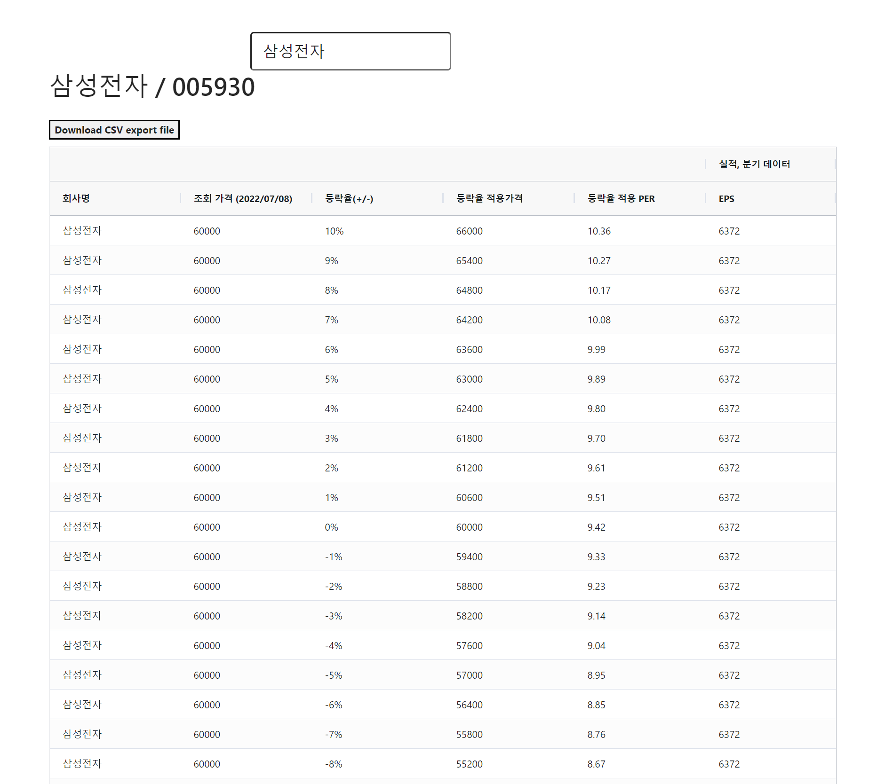

# 7월 둘째주 노력했던 내용들

> **시간분배 방식 중단 후 토이프로젝트 화면 개발 올인** 

월요일 \~ 화요일 까지는 코딩테스트 + 트랜잭션 개념정리 + 사이드 프로젝트 이렇게 시간을 분할해서 했었다. 그런데 이렇게 하는게 점점 힘에 부치더라. 사실 이렇게 시간을 분할해서 하는 것은 시간이 여유가 있을 때 어느것 하나에 비중을 싣기에 조금 위험하다는 생각이 들어서 시간분배를 했던 것 같다. 

 

그래서 취준을 하고 있는 시점이지만, 겁이 나긴 했지만, 시간분배를 잠시 중단하고 뭔가 결단을 내려야겠다는 생각이 들었었다. 그렇게 해서 수요일부터는 리액트, 리덕스 공부 + 토이프로젝트 완성에 공을 들였다. 어떻게든 이번주 안에 화면개발은 끝을 보겠다는 생각이었다. 

 

시간을 분배해서 하는 것은 시간을 분배하는 것으로 인해 특정 계획이 다 안끝나면 멘붕이 왔었고, 시간 자체가 타이트 했었다. 그런데, 단기 목표를 확실히 정해두고, 해커톤을 하듯이 매일 밤샘 코딩작업을 했는데, 어느정도 결과물이 나왔다. 

 

7월 16일자 새벽 (금요일에서 토요일로 넘어가는 새벽) 5시 22분.. 지금까지 만든 결과물은 아래와 같다. 아직 부트스트랩 테마를 입혀야 하고, 인풋태그도 부트스트랩에 맞게끔 사이즈 조절을 해야 한다. 오늘 부트스트랩을 React에 적용하는 예제들을 보고 적용해둘까 한다. 

- 오늘 삼성전자가 6만원을 터치했다.(참고로 나는 삼성전자 주주가 아니다.) 

 

 

> **리덕스 공부**

삽질과 방향전환, 기존 방식 폐기 후 새로운 방식채택 하는 과정을 어마어마하게 했다. 진짜...  

그래도 이번 기회에 리덕스를 정복한건 다행이다 하고 생각했다ㅋㅋ. 

 

**함수형 컴포넌트** 

클래스형 컴포넌트를 쓰던 시절에 리엑트를 배웠던 나는 함수형 컴포넌트 방식을 배워야 했다. 어려운 거라고 착각했었다. 막상 스터디 해보니, 오히려 쓰기 편리한 컴포넌트 방식이라고 생각이 들었다.

 

**react-redux - 단순 store 사용방식** 

단순 store 사용방식이라 함은 dispatch, subscribe 를 react-redux 에서 사용하는 방식으로만 사용하는 것이다.(물론 내가 정한 단어임) 

이거를 배우면서, 개념정리를 했었다. 결과적으로는 이 방식을 사용하지는 않았다. 

 

**react-redux - reducer, action 기반** 

아주 기초적인 redux 공식 예제를 보고 개발을 시작했다. 어느정도 개념을 알고 있는 상태에서 예제를 접하니, 적용이 쉬웠다. 물론 소스를 파악할 때 한번에 파악이 어려웠다. 화면 개발 특성상 여러 곳에 파일을 띄워놓고 작업해야 하고, 이벤트 기반의 개발을 하는 것이기에, 서버 개발을 하다가 화면개발을 다시하면 헷갈리고 혼동하는 경우가 많다. 

첫 학습을 다시해야 할때 부담감도 있었고 언제 다 스터디해야하지? 했었는데, 결국 해냈다ㅋㅋㅋ. 요즘 파워포인트에 정리하면서 학습하는 방식으로 바꿨다. 그게 유효했던 것 같다. 태블릿을 몇년전에 사둔게 있었는데, 이게 있으니까 스터디에 꽤 유용한것 같다. 마이크로 소프트의 One Drive 에 파워포인트를 저장해서 쉴때마다 태블릿에서 파워포인트를 열어서 보는게 꽤 이득이다. 마이크로소프트에 사티아나델라 아저씨가 오면서 제품의 방향성과 품질들이 확실히 달라지고 있다는 점은 무시할 수 없는 것 같다. 

 