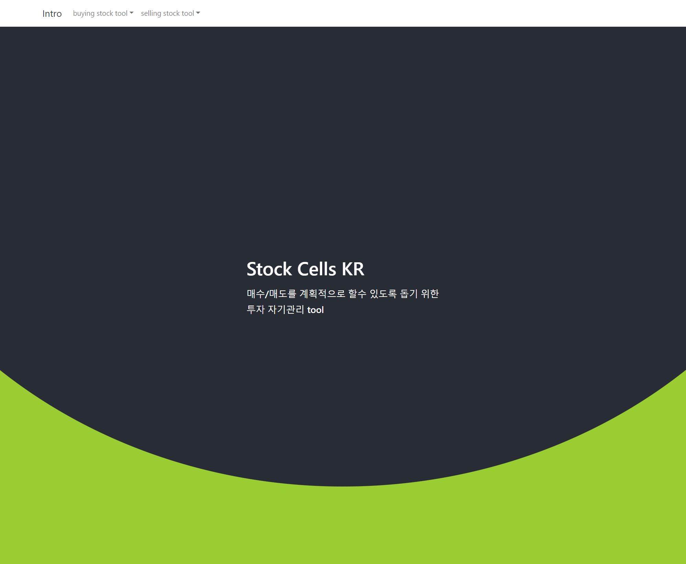
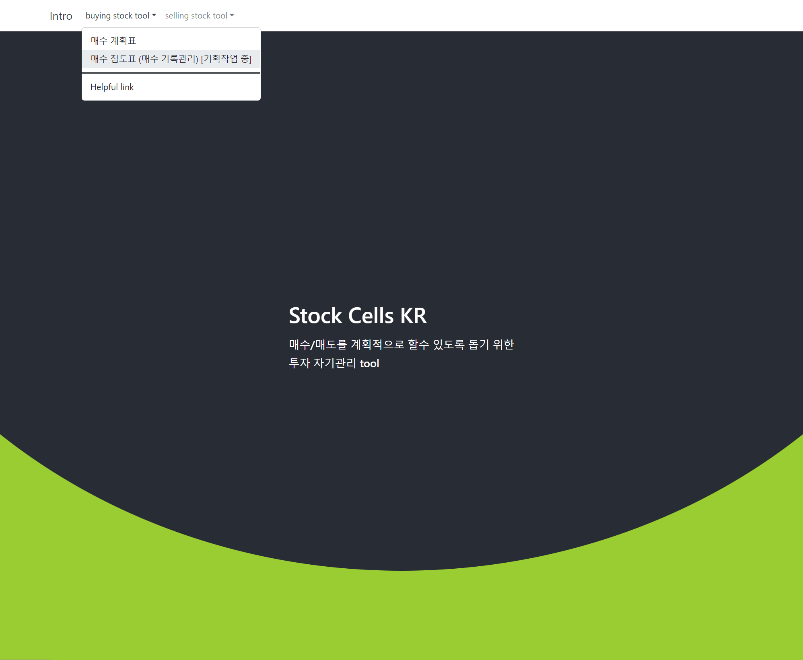
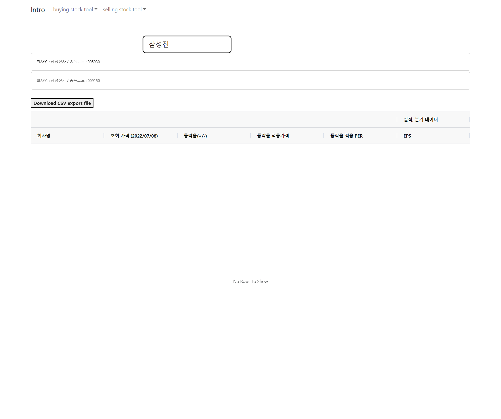

# 7월 셋째주 노력했던 내용들

**메인페이지, Intro 페이지 작업, 네비게이션 추가, 리액트 라우터 적용** 

코딩테스트를 준비 와중에 30 분 \~ 2시간 정도는 시간을 내려 했는데, 그 중 시간을 낸 적도 있고 뻗어버린 적도 있었다ㅋㅋ 

오늘 새벽에는 잠깐 시간을 내서 메인페이지과 네비게이션, 리액트 라우터 작업을 했다. 

디자인은 일단 여기까지만 해두고 이제부터는 뒷단에서 뭘할 지 틈날때마다 결정을 해야할 듯 하다. 

여기서 디자인을 더 예쁘게 하라고 하면 나는 못한다 ㅋㅋㅋ  

 

잠깐 추가해둔 레이아웃은 아래와 같다. 

 

네비게이션

 

 

