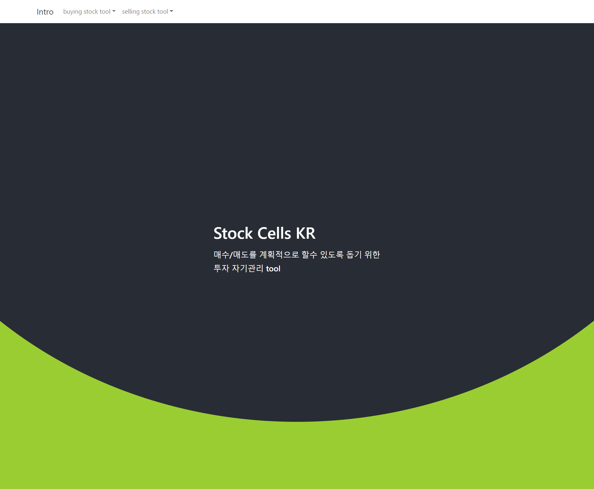
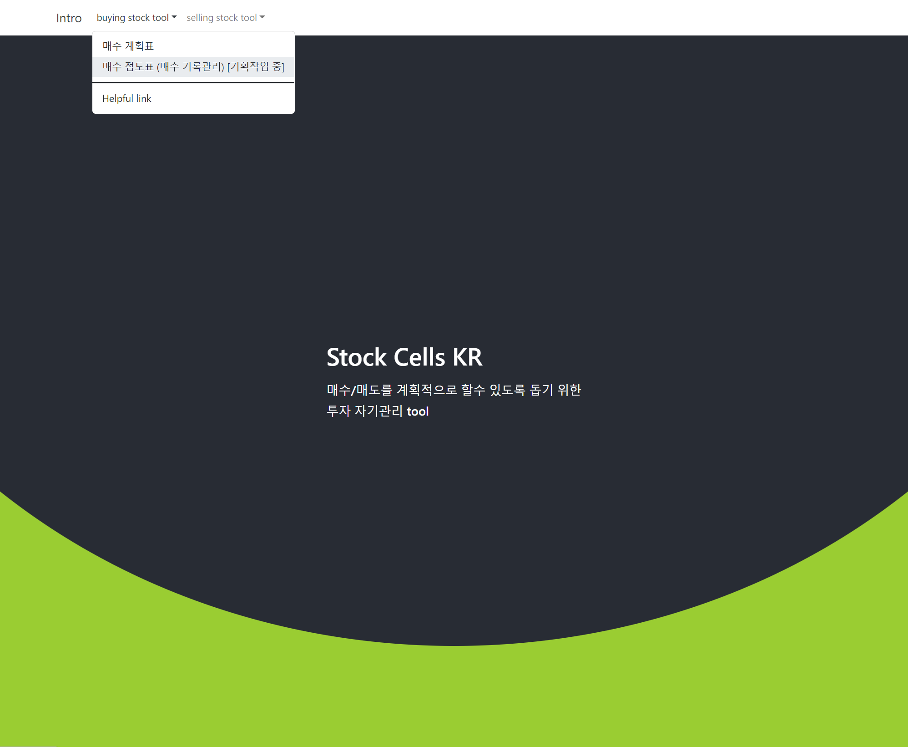
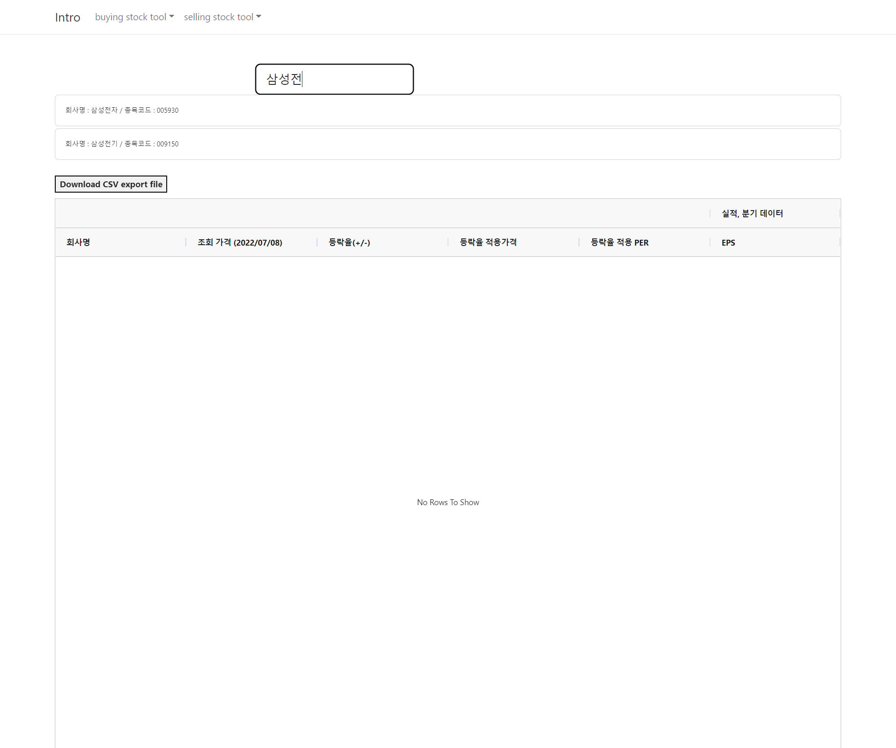
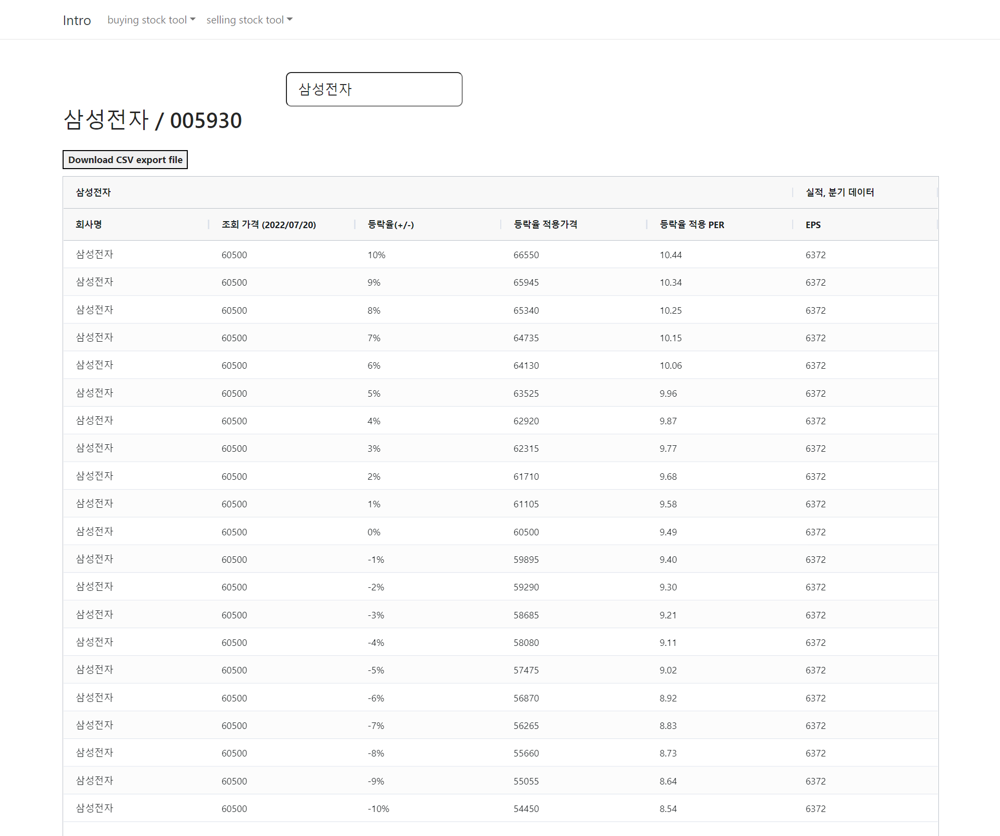

# 7월 셋째주

**메인페이지, Intro 페이지 작업, 네비게이션 추가, 리액트 라우터 적용** 

코딩테스트를 준비 와중에 30 분 \~ 2시간 정도는 시간을 내려 했는데, 그 중 시간을 낸 적도 있고 뻗어버린 적도 있었다ㅋㅋ 

오늘 새벽에는 잠깐 시간을 내서 메인페이지과 네비게이션, 리액트 라우터 작업을 했다. 

디자인은 일단 여기까지만 해두고 이제부터는 뒷단에서 뭘할 지 틈날때마다 결정을 해야할 듯 하다. 

여기서 디자인을 더 예쁘게 하라고 하면 나는 못한다 ㅋㅋㅋ  

 

잠깐 추가해둔 레이아웃은 아래와 같다. 

 

네비게이션

 

 

 

**백엔드** 

시간이 많지 않아서 일단 소스코드의 패키지 명을 바꾸거나, 리포지터리 정리 작업만을 해두었다. 

 

이번주에 시간을 많이 두어했던것들 

- 리액트 라우터 적용 및 토이프로젝트 부트스트랩 테마 적용
- 코딩테스트 공부

이번 주는 코딩테스트 기출문제의 유형들을 계속 다시 보고 정리하고, 풀어보고, 파워포인트에 문제풀이 아이디어를 정리해서 원드라이브에 올려두고 그랬었다. 이후에는 뭔가 커리큘럼을 따라서 공부를 해야 한다는 생각이 들었었다. 코딩테스트에 필요한 다른 개념들을 처음부터 공부할 그런 커리큘럼이 필요했는데, 인강하나를 신청해둔 것이 있어서 이것을 정주행했다. 이게 꽤 괜찮았다. 다른 곳에도 응용이 가능한 개념들을 연습해볼 수 있어서 좋았다. 

 

