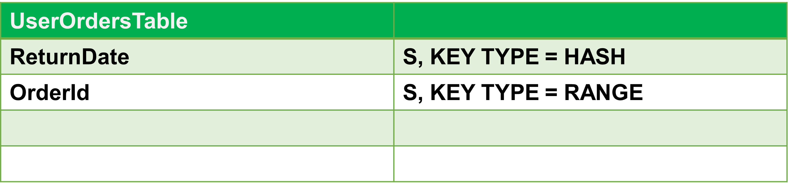
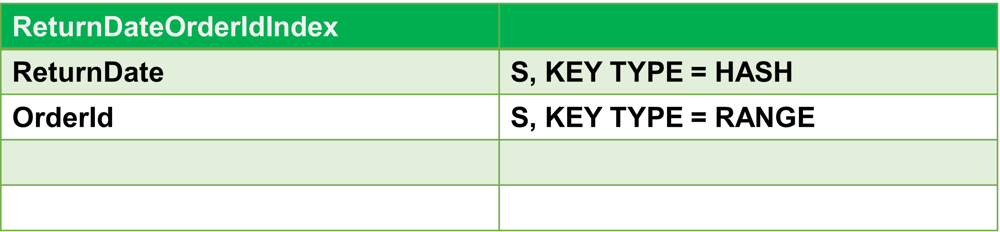

# DynamoDB GSI (Global Secondary Index)

실제 사용은 Spring Data DynamoDB로 예제를 한번 더 작성해볼 예정이다.<br>

요즘 왜 이렇게 나도 모르게 CouchBase, HBase 이런 것들에 집착하게 되는지 참..ㅋㅋ<br>

<br>

# 참고자료

> - [Global Secondary Indexes | DynamoDB, explained. (dynamodbguide.com)](https://www.dynamodbguide.com/global-secondary-indexes/) 
> - [DynamoDB에서 글로벌 보조 인덱스 사용 - Amazon DynamoDB](https://docs.aws.amazon.com/ko_kr/amazondynamodb/latest/developerguide/GSI.html)

<br>

# Global Secondary Index 의 특징

Global Secondary Index 는 Global Secondary Index를 생성할 때 단순 기본키, 복합기본키를 사용하는 것이 모두 가능하다. (Local Secondary Index 는 복합기본키만 사용가능했었다)<br>

또한 간단한 키 스키마를 만드는 것 역시 가능하다.<br>

Global Secondary Index 가 Local Secondary Index와 다른 점들은 아래와 같다.<br>

<br>

**Separate throughput**<br>

- 처리량이 분리된다.
- Global Separate Index에 대한 읽기/쓰기 용량 단위는 기본테이블과 분리된다.
- 이런 점은 복잡성/비용을 증가시킬 수 있다는 단점도 있다.
- 하지만 워크로드에 맞게끔 용량을 조정할 수 있다는 점은 장점이다.

<br>

**Eventual Consistency**<br>

- 일관성이 임시적이다. 높은 일관성을 지정하는 것이 불가능하다.
- 테이블에 데이터를 쓰고 있을 때, Global Secondary Index 에도 해당 데이터가 쓰여야 하는데, 이때 데이터를 비동기식으로 복제해서 Global Secondary Index 내에 데이터를 쓴다.
- 따라서, 경우에 따라서 테이블과 Global Secondar Index를 동시에 조회하면, 다른 결과를 얻을 수 있다.

<br>

**No Partition Key Size Limit**<br>

- Local Secondary Index 의 경우 파티션 키는 10GB로 제한되었었다.
- 하지만, Global Secondary Index는 이 제한에 해당되지 않는다.

<br>

**Use on any table**<br>

- 어느 테이블에서든 사용할 수 있다.
- Local Secondary Index 는 복합키가 있는 테이블에서만 사용할 수 있었다.
- 하지만, Global Secondary Index 는 이런 제약이 없다.
- 단순키 이든, 복합키 이든 어느 테이블에서든 사용할 수 있다.

<br>

**Use with any key schema**<br>

- 키 스키마와 함께 사용한다. Global Secondary Index 의 키 스키마를 지정할 때 단순키 스키마, 복합키 스키마를 사용하면 된다.

<br>

# Creating a Global Secondary Index

Global Secondary Index는 Local Secondary Index 처럼 테이블 생성시에 함께 생성할수 있다. 그리고 테이블 생성 후에 새로 추가하는 것 역시 가능하다. 이렇게 테이블 생성 후에 Global Secondary Index를 생성하면, 기존 데이터 기반으로 Global Secondary Index를 다시 채운다.<br>

인덱스를 추가하려는 테이블인 `UserOrdersTable` 의 스키마는 아래와 같은 형태이다.<br>



<br>

그리고 새로 추가하려는 Global Secondary Index의 모습은 아래와 같다. 테이블이 가지고 있는 복합키가 가지고 있는 키를 모두 인덱스로 지정해줬다.<br>



<br>

**예제) 테이블을 수정하면서 Local Secondary Index 인 ReturnDateOrderIdIndex 를 추가하기**

```bash
$ aws dynamodb update-table \
    --table-name UserOrdersTable \
    --attribute-definitions '[
      {
          "AttributeName": "ReturnDate",
          "AttributeType": "S"
      },
      {
          "AttributeName": "OrderId",
          "AttributeType": "S"
      }
    ]' \
    --global-secondary-index-updates '[
        {
            "Create": {
                "IndexName": "ReturnDateOrderIdIndex",
                "KeySchema": [
                    {
                        "AttributeName": "ReturnDate",
                        "KeyType": "HASH"
                    },
                    {
                        "AttributeName": "OrderId",
                        "KeyType": "RANGE"
                    }
                ],
                "Projection": {
                    "ProjectionType": "ALL"
                },
                "ProvisionedThroughput": {
                    "ReadCapacityUnits": 1,
                    "WriteCapacityUnits": 1
                }
            }
        }
    ]' \
    $LOCAL
```

<br>

# Global Secondary Index 로 조회하기

Global Secondary Index를 사용해 쿼리를 날리는 것은 Local Secondary Index를 사용하는 것과 비슷하게, Query, Scan 명령어로 조회 가능하고 사용하려는 인덱스의 이름을 직접 지정할 수 있다.<br>

조회하려는 데이터들의 모양은 아래와 같다. 데이터를 INSERT 하는 CLI 이다.<br>

<br>

```bash
$ aws dynamodb batch-write-item \
    --request-items '{
        "UserOrdersTable": [
            {
                "PutRequest": {
                    "Item": {
                        "Username": {"S": "alexdebrie"},
                        "OrderId": {"S": "20160630-12928"},
                        "Amount": {"N": "142.23"},
                        "ReturnDate": {"S": "20160705"}
                    }
                }
            },
            {
                "PutRequest": {
                    "Item": {
                        "Username": {"S": "daffyduck"},
                        "OrderId": {"S": "20170608-10171"},
                        "Amount": {"N": "18.95"},
                        "ReturnDate": {"S": "20170628"}
                    }
                }
            },
            {
                "PutRequest": {
                    "Item": {
                        "Username": {"S": "daffyduck"},
                        "OrderId": {"S": "20170609-25875"},
                        "Amount": {"N": "116.86"},
                        "ReturnDate": {"S": "20170628"}
                    }
                }
            },
            {
                "PutRequest": {
                    "Item": {
                        "Username": {"S": "yosemitesam"},
                        "OrderId": {"S": "20170609-18618"},
                        "Amount": {"N": "122.45"},
                        "ReturnDate": {"S": "20170615"}
                    }
                }
            }
        ]
    }' \
    $LOCAL
```

<br>

그리고 이 값들을 `Global Secondary Index` 를 활용해서 데이터를 조회하는 쿼리는 아래와 같다.

```bash
$ aws dynamodb scan \
    --table-name UserOrdersTable \
    --index-name ReturnDateOrderIdIndex \
    $LOCAL
```

<br>

결과값은 아래와 같이 잘 나온 것을 확인 가능하다.<br>

```bash
{
    "Count": 4,
    "Items": [
        {
            "OrderId": {
                "S": "20160630-12928"
            },
            "Username": {
                "S": "alexdebrie"
            },
            "Amount": {
                "N": "142.23"
            },
            "ReturnDate": {
                "S": "20160705"
            }
        },
        {
            "OrderId": {
                "S": "20170609-18618"
            },
            "Username": {
                "S": "yosemitesam"
            },
            "Amount": {
                "N": "122.45"
            },
            "ReturnDate": {
                "S": "20170615"
            }
        },
        {
            "OrderId": {
                "S": "20170608-10171"
            },
            "Username": {
                "S": "daffyduck"
            },
            "Amount": {
                "N": "18.95"
            },
            "ReturnDate": {
                "S": "20170628"
            }
        },
        {
            "OrderId": {
                "S": "20170609-25875"
            },
            "Username": {
                "S": "daffyduck"
            },
            "Amount": {
                "N": "116.86"
            },
            "ReturnDate": {
                "S": "20170628"
            }
        }
    ],
    "ScannedCount": 4,
    "ConsumedCapacity": null
}
```

<br>

filter, scan 등등 여러가지 명령어들도 정리할까 했는데, 아직 까지는 지금 하려는 토이프로젝트의 범위에는 맞지 않겠다는 판단이 들어서, 일단은 DynamoDB의 Index의 종류들, 어노테이션까지만 정리해둘 예정이다.<br>

얼추 목표로 했던 스터디 주제들은 다 훑어보기 직전이다.!!! DynamoDB의 어노테이션만 정리하고나면, 본격적으로 백엔드 모델링 작업을 발전시켜나갈 예정이다. 얼른 끝내야지!!!<br>

<br>
