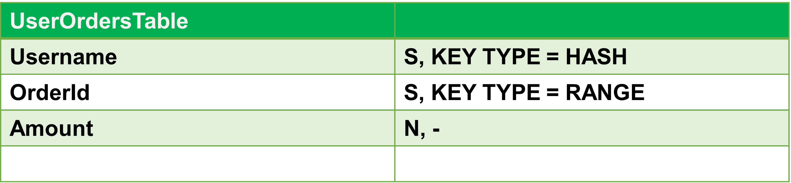

# DynamoDB Secondary Indexes

> 복합키, 주키 외의 특정 컬럼에 조건값 검색이 필요한 경우에 해당 컬럼에 Secondary Index를 걸어준다. 

<br>

# 참고자료

> - [Secondary Indexes | DynamoDB, explained. (dynamodbguide.com)](https://www.dynamodbguide.com/secondary-indexes) 
> - 이전 자료에서도 정리를 한번 했지만, 이번 자료에서도 한번 더 정리한다. 개인적인 의견은, 이번 자료에서 참고하는 자료가 더 명확하게 설명하고 있는 것 같다.
> - 공식문서 자료가 조금은 무슨말을 하는지 도저히 파악이 어려운 점이 있어서 개인적으로 해외 youtube 자료도 봤었고, 해외 블로그 글도 봤었다. 그 와중에 찾은 자료가 위의 자료다.
> - 위 자료를 만드신 분은 AWS Data Hero 라고 한다. 그래서인지 설명이 꽤 명확하고 간결한 것 같기도 하다.

<br>

# 예제 스키마

이번 예제에서 사용하는 테이블의 구조를 간략하게 요약해보면 아래와 같은 구조다.<br>



<br>

# Secondary Index란?

> 복합키, 주키 외의 특정 컬럼에 조건값 검색이 필요한 경우에 해당 컬럼에 부가적으로 인덱스를 걸어준다. 이렇게 주키나 정렬키가 아닌 어트리뷰트(컬럼)에 인덱스를 걸어주는 것을 `Secondary Index` 라고 한다.<br>

아래의 예제는 `UserOrdersTable` 이라는 테이블을 조회하는 쿼리다.<br>

```bash
$ aws dynamodb query \
    --table-name UserOrdersTable \
    --key-condition-expression "Username = :username" \
    --filter-expression "Amount > :amount" \
    --expression-attribute-values '{
        ":username": { "S": "daffyduck" },
        ":amount": { "N": "100" }
    }' \
    $LOCAL
```

<br>

`--filter-expression` 에 `Amount > :amount` 라는 조건에 맞는 행을 검색하려는 예제다.<br>

이때 `Amount` 라는 키에 인덱스가 걸려있지 않으면, 모든 아이템(행)들의 `Amount` 를 순차적으로 스캔하게 된다. 하지만, 인덱스가 걸려있으면 `Binary Tree` 탐색 등을 통해 특정 조건값을 다이나모 디비가 효율적으로 검색하게 된다.<br>

이렇게 주키나 정렬키가 아닌 어트리뷰트(컬럼)에 인덱스를 걸어주는데, 이렇게 주키나 정렬키, 복합키에 속하지 않는 어트리뷰트(컬럼)에 걸린 인덱스를 `Secondary Index` 라고 부른다.<br>

<br>

# Secondary Index 의 종류들

**Local Secondary Index**<br>

테이블 내에서 복합키(Composite Primary Key) 와 함께 정의한다. 보통 테이블을 생성하면서 함께 생성해야 한다.  테이블이 생성된 후에 새로 추가하는 것은 불가능하다. 새로운 문서에서 따로 정리할 예정이다.<br>

<br>

**Global Secondary Index**<br>

Global Secondary Index는 테이블 생성 후에 새로 추가해주는 것이 가능하다. 자세한 내용은 새로운 문서에서 정리 예정이다.<br>

<br>

# Secondary Index 의 주요 특징

**Secondary Index로 지정할 어트리뷰트(컬럼)이 가지는 값이 고유하지 않아도 된다.**<br>

- Primary Key 는 유일하게 식별될 수 있는 값이어야 한다. 하지만, Secondary Index로 지정하는 어트리뷰트(컬럼)은 반드시 고유한 값을 가지지 않아도 된다.

<br>

**Secondary Index는 필수적으로 지정해야 하는 것은 아니다.**<br>

- Secondary Index 지정은 필수사항은 아니다.

<br>

**Secondary Index는 테이블마다 선언할 수 있는 갯수가 제한되어 있다.**<br>

- Global Secondary Index는 한 테이블에 최대 20개까지 선언할 수 있다.
- Local Secondary Index는 한 테이블에 최대 5개까지 선언할 수 있다.

<br>

# Projection

`Global Secondary Index` , `Local Secondary Index` 를 지정할 때, 프로젝션(Projection)이라는 항목을 따로 지정할 수 있다. <br>

뜬금없이 `Projection` 을 이야기하면 이해가 쉽지 않다. 실제로 사용하는 예제를 아래에 정리해두었다. 나중에 다시 볼때 이 예제를 보고 Projection 이 뭔지 이해해보자.<br>

`Projection` 에 지정될 수 있는 값들은 아래의 3가지다. 각각에 대한 설명은 아래와 같다.<br>

- `KEYS_ONLY` 
  - 인덱스의 `Projection` 타입을  `KEYS_ONLY` 로 선언하면 이 인덱스에는 Partition and Sort Key 에 속하는 어트리뷰트(컬럼)과, 인덱스의 키들만을 포함하게 된다.
- `ALL`
  - 인덱스의 `Projection` 타입을 `ALL` 로 선언하면, 이 인덱스는 모든 어트리뷰트(컬럼)에 대한 모든 아이템(로우)에 대한 키들을 포함하게 된다.
- `INCLUDE` 
  - 특정 어트리뷰트(컬럼)을 선택해서, 세컨더리 인덱스가 인덱싱하도록 하는 Projection 옵션이다.

<br>

## ex) Local Secondary Index

Local Secondary Index 를 선언하는 예제다. Projectin 속성을 유의해서 살펴보자.

```bash
$ aws dynamodb create-table \
    --table-name UserOrdersTable \
    --attribute-definitions '[
      {
          "AttributeName": "Username",
          "AttributeType": "S"
      },
      {
          "AttributeName": "OrderId",
          "AttributeType": "S"
      },
      {
          "AttributeName": "Amount",
          "AttributeType": "N"
      }
    ]' \
    --key-schema '[
      {
          "AttributeName": "Username",
          "KeyType": "HASH"
      },
      {
          "AttributeName": "OrderId",
          "KeyType": "RANGE"
      }
    ]' \
    --local-secondary-indexes '[
      {
          "IndexName": "UserAmountIndex",
          "KeySchema": [
              {
                  "AttributeName": "Username",
                  "KeyType": "HASH"
              },
              {
                  "AttributeName": "Amount",
                  "KeyType": "RANGE"
              }
          ],
          "Projection": {
              "ProjectionType": "KEYS_ONLY"
          }
      }
    ]' \
    --provisioned-throughput '{
      "ReadCapacityUnits": 1,
      "WriteCapacityUnits": 1
    }' \
    $LOCAL
```

자세히 살펴보면, 아래와 같이 선언되어 있다. Projection.ProjectionType = "KEYS_ONLY" 라고 선언되어 있다.

```bash
$ aws dynamodb create-table \
    --table-name UserOrdersTable \
    
    // ...
    
    --local-secondary-indexes '[
      {
          "IndexName": "UserAmountIndex",
          "KeySchema": [
              {
                  "AttributeName": "Username",
                  "KeyType": "HASH"
              },
              {
                  "AttributeName": "Amount",
                  "KeyType": "RANGE"
              }
          ],
          "Projection": {
              "ProjectionType": "KEYS_ONLY"
          }
      }
    ]' \
    --provisioned-throughput '{
      "ReadCapacityUnits": 1,
      "WriteCapacityUnits": 1
    }' \
    $LOCAL
```


## ex) Global Secondary Index 

Global Secondary Index 를 선언하는 예제다. Projection 항목을 유의해서 살펴보자.

```bash
$ aws dynamodb update-table \
    --table-name UserOrdersTable \
    --attribute-definitions '[
      {
          "AttributeName": "ReturnDate",
          "AttributeType": "S"
      },
      {
          "AttributeName": "OrderId",
          "AttributeType": "S"
      }
    ]' \
    --global-secondary-index-updates '[
        {
            "Create": {
                "IndexName": "ReturnDateOrderIdIndex",
                "KeySchema": [
                    {
                        "AttributeName": "ReturnDate",
                        "KeyType": "HASH"
                    },
                    {
                        "AttributeName": "OrderId",
                        "KeyType": "RANGE"
                    }
                ],
                "Projection": {
                    "ProjectionType": "ALL"
                },
                "ProvisionedThroughput": {
                    "ReadCapacityUnits": 1,
                    "WriteCapacityUnits": 1
                }
            }
        }
    ]' \
    $LOCAL
```

자세히 살펴보면 아래와 같이 Projection.ProjectionType = "ALL" 과 지정하고 있는 부분을 확인 가능하다.

```BASH
$ aws dynamodb update-table \
    --table-name UserOrdersTable \
    
    // ...
    
	--global-secondary-index-updates '[
        {
            "Create": {
                "IndexName": "ReturnDateOrderIdIndex",
                "KeySchema": [
                    {
                        "AttributeName": "ReturnDate",
                        "KeyType": "HASH"
                    },
                    {
                        "AttributeName": "OrderId",
                        "KeyType": "RANGE"
                    }
                ],
                "Projection": {
                    "ProjectionType": "ALL"
                },
                // ...
			}
		}
```

