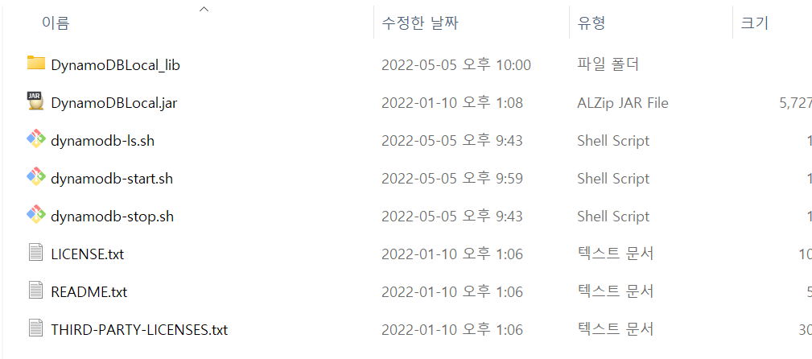
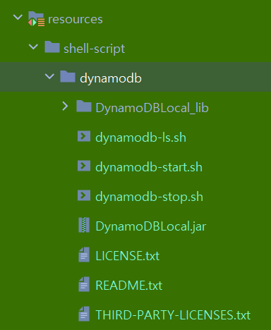

# DynamoDB local docker 환경 세팅

일단 내가 가지고 있는 AWS에 접속해서 사용하는 것 말고 로컬에서 내 마음대로 아무때나 기동해서 테스트하는 환경이 필요했다. 그래서 이것 저것 찾아보다보니, 제일 유용했던 자료는 아래의 자료였다.<br>

(물론 이 자료 저 자료 찾아보면서 헤맨시간이 꽤 된다. 대부분의 자료들이 production에 바로 붙어서 테스트해보는 자료들이다. 또는 Local에서 Spring 내부에서 Embedded 방식으로 띄우는 방식이 있는데, 이 방식은 추후 시간이 되면 정리해보려 한다.)<br>

<br>

# 유용했던 자료들

Integrate Spring Boot with AWS Dynamo Db local (downloadable version)<br>

[Integrate Spring Boot with AWS Dynamo Db local(Downloadable version) | by Shanjeevan Mukunthan | Medium](https://medium.com/@shanjeevanmukunthan/integrate-spring-boot-with-aws-dynamo-db-local-downloadable-version-6da6c0f432a6)<br>

Deploying DynamoDB Locally on Your Computer<br>

https://docs.aws.amazon.com/amazondynamodb/latest/developerguide/DynamoDBLocal.DownloadingAndRunning.html<br>

<br>

# 도커이미지 다운로드

**amazon/dynamodb-local 페이지를 방문**<br>

[amazon/dynamodb-local - Docker Image | Docker Hub](https://hub.docker.com/r/amazon/dynamodb-local)<br>

<br>

**터미널에서 아래의 명령어를 수행**<br>

docker pull amazon/dynamodb-local<br>

<br>

# AWS 제공 DynamoDBLocal.jar 다운로드

`DynamoDBLocal.jar` 라는 이름의 java 프로그램을 아래 AWS 링크에서 다운로드 받아야 한다. 도커 컨테이너가 구동될때 이 jar 파일을 옵션으로 주어야 하기 때문이다.<br>

[Deploying DynamoDB Locally on Your Computer - Amazon DynamoDB](https://docs.aws.amazon.com/amazondynamodb/latest/developerguide/DynamoDBLocal.DownloadingAndRunning.html)<br>

<br>

다운로드 링크는 아직 서울 리전에 대해서는 zip/tar.gz 파일이 아직 없다. 하지만, 직접 테스트해보니 그냥 일본 리전을 사용해도 잘 동작한다. (일본리전을 선택한 이유는 지리적으로 가까와서 선택했다.)<br>

압축을 풀고나면 아래와 같은 파일들이 생성되어 있다.<br>



<br>

위의 파일 들 중에 `[dynamodb-ls.sh](<http://dynamodb-ls.sh>)` , `[dynamodb-start.sh](<http://dynamodb-start.sh>)` , `[dynamodb-stop.sh](<http://dynamodb-stop.sh>)` 파일은 내가 직접 작성한 도커 컨테이너 구동 스크립트이다.<br>

도커 컨테이너 구동 명령어를 실행할 디렉터리 내에는 꼭 DynamoDBLocal.jar 라는 이름의 파일과, 내부적으로 사용될 라이브러리들인 `/DynamoDBLocal_lib` 이라는 이름의 디렉터리가 꼭 있어야 한다.<br>

나는 이것을 프로젝트에서는 `src/test/resources/shell-script/dynamodb` 에 따로 두었고, 개발용도의 개인 PC에서는 `[홈디렉터리]/env/dynamodb` 라는 곳에 따로 두었다.<br>

(캡처화면이 초록색으로 녹조현상처럼 초록초록하게 된 이유는 머티리얼 테마 들 중에서 테스트 패키지를 초록색배경으로 표시되게끔 하는 테마를 사용했기 때문이다.)<br>

<br>




<br>

## 도커 컨테이너 구동하기

**구동**

```bash
docker container run --rm -d -p 5555:8000 --name dynamodb-test -d amazon/dynamodb-local:latest -jar .\\DynamoDBLocal.jar -inMemory -sharedDb
```

<br>

**정지**

```bash
docker container stop dynamodb-test
```

<br>

**컨테이너 상태 조회**

```bash
docker container ls --filter name=dynamodb-test
```

<br>

