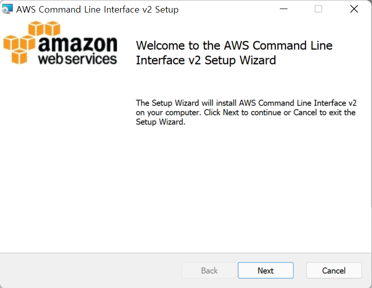
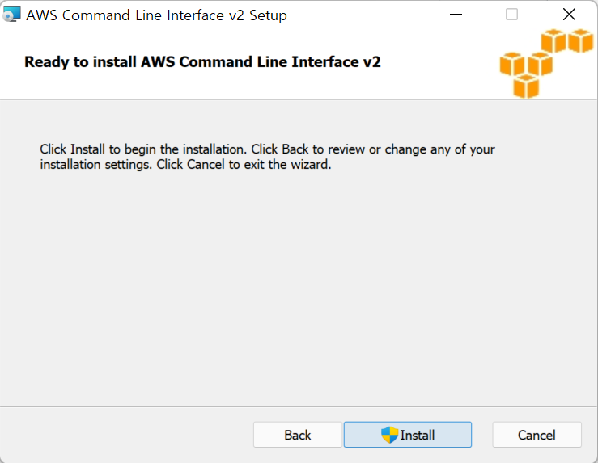
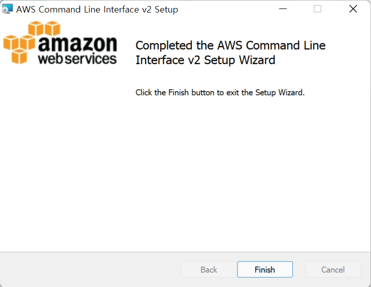
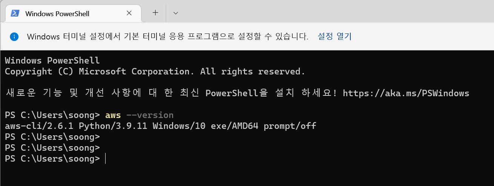
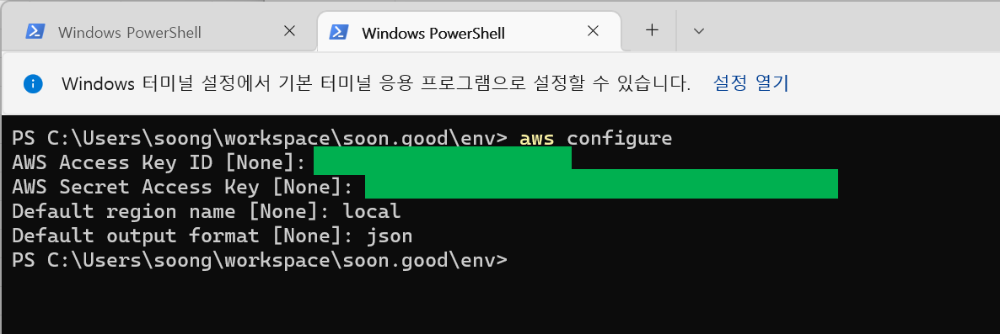
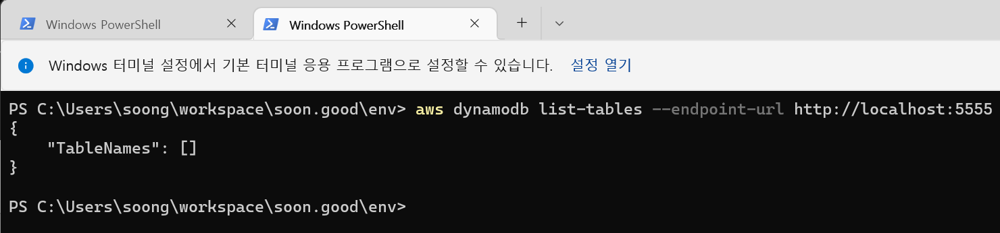

# DynamoDB 로컬 개발 환경 용도의 AWS CLI 설치 및 설정

설명이나 이런건 공식사이트에서 그냥 복사해왔다... 나중에 정리해야지.. 시간이 부족... 

 

# 참고자료

# AWS CLI 설치/업데이트

Windows에서 AWS CLI의 현재 설치를 업데이트하려면 업데이트할 때마다 새 설치 관리자를 다운로드하여 이전 버전을 덮어씁니다. AWS CLI는 정기적으로 업데이트됩니다. 최신 버전이 언제 릴리스되었는지 알아보려면 *[GitHub*에서 AWS CLI changelog](https://github.com/aws/aws-cli/blob/v2/CHANGELOG.rst)를 참조하세요. 

 

1 . Windows용 AWS CLI MSI 설치 관리자(64비트)를 다운로드하여 실행합니다. https://awscli.amazonaws.com/AWSCLIV2.msi 또는 `msiexec` 명령을 실행하여 MSI 설치 관리자를 실행할 수 있습니다. 

`C:\> msiexec.exe /i https://awscli.amazonaws.com/AWSCLIV2.msi` 

`msiexec` 에서 사용할 수 있는 다양한 파라미터는 *Microsoft Docs* 웹 사이트에서 [msiexec](https://docs.microsoft.com/en-us/windows-server/administration/windows-commands/msiexec)을 참조하세요. 2. 설치를 확인하려면 **시작** 메뉴를 열고, `cmd`를 검색하여 명령 프롬프트 창을 열고, 명령 프롬프트에서 `aws --version` 명령을 사용합니다. 

 

`C:\\> **aws --version** aws-cli/2.4.5 Python/3.8.8 Windows/10 exe/AMD64 prompt/off`  

Windows에서 프로그램을 찾을 수 없는 경우 명령 프롬프트 창을 닫고 다시 열어 경로를 새로 고치거나 [경로에 AWS CLI 추가](https://docs.aws.amazon.com/ko_kr/cli/latest/userguide/getting-started-path.html)의 단계를 수행해야 할 수 있습니다. 

 

 

계속 Next 를 눌러서 마지막으로 Install 버튼을 클릭

 

Finish 버튼 클릭

 

설치 확인

 

aws cli 사용을 위한 설정 

 

aws cli 로 로컬 dynamodb 의 연결 확인 

`--endpoint-url` 을 입력해서 로컬환경에 접속하는 것을 꼭 명시해주자. 

만약 연결이 안되고 오류를 출력하면 ~/.env/config 내의 설정 값을 확인한다. 

 

