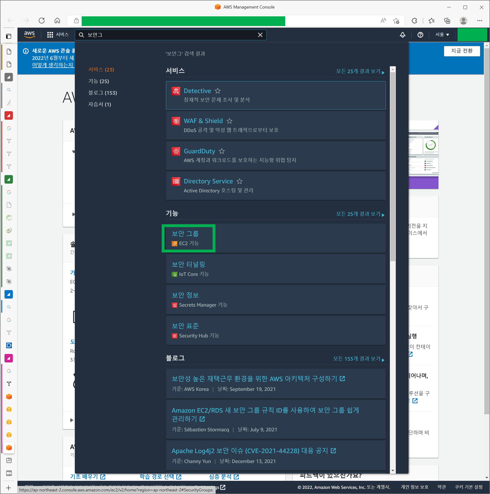

# Elastic Cache Redis개설

> Elastic Cache 는 처음 개설해본다....!! 
>
> 막상 Elastic Cache를 개설하고나니, 로컬에서는 사실 `docker-compose` 로만 돌려야 한다. 왜냐하면 `Elastic Cache` 는 특정 VPC에서만 접속이 가능하기 때문이다. 즉, VPC 안에 들어가있는 EC2 를 통해서 접속해야 실제 운영중인 Elastic Cache에 접속이 가능하다. 
>
> 따라서!!! 로컬에서 코드를 돌려보거나, 테스트환경을 구축하는 것이라면 도커에서 redis 를 구축해야한다. 

 

Elastic Cache Redis 를 개설할 때 부수적으로 아래의 그룹들을 생성해야 한다.

- 서브넷 그룹 생성
- 보안 그룹 생성

 

서브넷 그룹은 클러스터를 생성하면서 생성하는 입력폼이 있기에 크게 신경쓰지 않아도 된다. 

다만, 보안 그룹은 기본 보안그룹을 사용해도 되고, 6379 포트를 사용하는 Redis 용도로 따로 개설해서 사용하는 것도 괜찮다. 

 

# 보안그룹 생성

>  보안 그룹 검색

 

 

> '보안 그룹 생성' 버튼 클릭

 

 

> - 보안그룹 이름 : `security-group-redis` 
> - 인바운드 규칙
>   - 포트 범위 : 6379
>   - 소스 : 0.0.0.0/0
> - 아웃바운드 규칙
>   - 포트범위 : 6379
>   - 소스 : 0.0.0.0/0

 

 

# Elastic Cache Redis 개설

> **지금 시작** 클릭

 

> '클러스터 생성' 클릭 -> 'Redis 클러스터 생성' 버튼 클릭

 

> 새 클러스터 구성 및 생성 클릭 
>
> 이 외에는 모두 대부분 그냥 기본 설정대로 그대로 두었다. 
>
> 클러스터 정보는 'redis-normal'을 입력해주었다. 

 

> - 위치
>   - AWS 클라우드 선택
> - 노드 유형
>   - 반드시 cache.t2.micro 를 선택하자.
>   - 안그러면 기본선택된 것을 선택하면, 비용이 과금될 수 있다.
> - 이 외에 모든 옵션은 그냥 기본 선택된 상태로 그냥 사용

 

 

> 서브넷 그룹은 기본으로 새로 생성한다면서 입력폼이 채워져 있는데 새로 생성할 거면, 그대로 둬도 된다.
>
> 레디스가 사용할 서브넷이름은 `redis-subnet` 으로 지정해줬다.

 

 

> 다음버튼을 클릭하고 나면 고급 설정 페이지로 넘어가게 된다. 
>
> 보안그룹을 선택해야 한다. '관리' 버튼 클릭 

 

 

> 새로고침 버튼을 클릭한다. 
>
> 보안그룹 중 미리 생성해뒀던 보안 그룹인 `security-group-redis` 를 선택하자. 

 

 

> 그 다음 화면에서는 태그에 키/값을 입력해준다.
>
> 나는 elastic-cache : redis-normal 을 입력해줬다.

 

 

