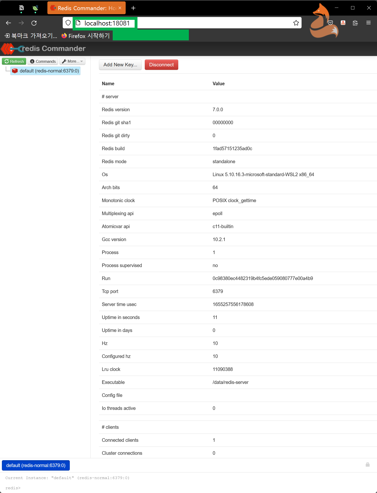

# 로컬 Redis 구동시 Redis admin 툴도 함께 구동

redis admin 이라기 보다는 Client Tool 같은 느낌의 프로그램이 있다. 도커 이미지로도 제공된다. 그래서 오늘 문서에서는 도커 컴포즈로 redis 를 구동할 때, redis commander 라는 프로그램을 띄워서 로컬 레디스의 상태와 insert 된 키/밸류 들을 확인할 수 있도록 해보려고 한다.<br>

<br>

# 참고자료

- [docker-compose redis and redis commander - Stack Overflow](https://stackoverflow.com/questions/52102475/docker-compose-redis-and-redis-commander)

<br>

# docker-compose.yml

> yaml 파일의 내용은 아래와 같다.

```yaml
version: '3'
services:
  redis:
    image: redis:latest
    command: redis-server --port 6379
#    container_name: redis-normal
    hostname: redis-normal
    labels:
      - "name=redis"
      - "mode=standalone"
    ports:
      - 16379:6379
    links:
      - redis-commander
  redis-commander:
    image: rediscommander/redis-commander:latest
#    container_name: redis-commander
    hostname: redis-commander
    restart: always
    environment:
      - REDIS_HOSTS=redis-normal
#      - REDIS_HOST=redis-normal:redis:16379
    ports:
      - 18081:8081

```

redis를 로컬에서 접속할 때는 16379 라는 포트를 사용하도록 해두었고, redis-commander 의 로컬 접속 포트는 18081 로 설정해두었다.<br>

이제 아래의 명령어로 구동시켜보자.<br>

```bash
docker-compose up -d
```

잘 된다.<br>

<br>

# redis 관리 툴 - redis-commander

로컬 PC에서 localhost:18081 주소를 브라우저에 입력해서 이동하면 아래와 같은 화면이 나타나는 것을 볼 수 있다.<br>



<br>