# 터널링을 이용해 Elastic Cache 접속 + Spring Boot 에서의 접속

예전에 토이프로젝트( [stock-data](https://github.com/soon-good/stock-data), [chartnomy](https://github.com/soon-good/chartnomy), [lognomy](https://github.com/soon-good/lognomy)) 를 진행할 때는 일반 관계형 DB 기반으로 할때는 모든 운영에 관련된 것들이 꽤 단순했었다. 모든 개발 과정이 한큐에 갔었다.<br>

DynamoDB를 선택하면서 운영/인프라측면에서 꽤 여러가지 변수들이 생겼고, 트러블슈팅 및 어떻게 할지 고민을 하느라 시간을 자주 보냈었다. IAM 생성, subnet 생성 및 포함, `docker-compose` 를 활용한 `dynamodb` 로컬 구동, 테스트 환경에서의 멱등성 확보를 위한 `testcontainers` 적용 등의 작업을 하면서 실제 코딩보다는 인프라작업을 많이 하게 됬던듯 하다.<br>

DynamoDB를 사용하기로 결정하면서 Redis Repository 를 조회용도로 사용하기로 결정했는데, Elastic Cache 에는 로컬 PC에서 접속이 불가능하기에, 같은 네트워크 대역에 존재하는 ec2 를 거쳐서 가게끔 해줘야 한다. 그래서 현재 개설해둔 ec2 를 터널링을 하기 위한 인스턴스로 임시로 사용하기로 결정했다. <br>

오늘은 이 과정에서 로컬 PC로부터 Elastic Cache 로 접속하기 위한 SSH터널링을 하는 과정에 대해서 정리하려고 한다. 오늘 정리하기로 한 `로컬 PC로부터 Elastic Cache 로 접속하기 위한 SSH터널링을 하는 과정` 역시 초반에 여러가지 변수로 인해 하루 정도 땅 파는 작업을 조금 했었다.<br>

이 외에도 과거 주가 데이터 이력들을 어떤 방식으로 한번에 밀어넣을지도 꽤 고민을 많이했다. 생각해보면 간단한 것인데 초창기 셋업때는 합리적인 판단이 쉽지 않았다. (결론적으로는 개인 프로젝트에 품을 너무 많이 팔지 말고 초기 셋업때는 가급적 테스트 코드로 모두 밀어넣자 하는 생각으로 결론이 도달됐다.)<br>

<br>

**DynamoDB 비용**<br>

주식 데이터, 재무 데이터들을 DynamoDB에서 바로 접속하기에는 비용적인 측면에서 감당이 안될 것으로 추측됬었다. 그래서 Redis 를 조회를 위한 용도의 리포지터리로 적용하기로 했다. (실제로 INSERT 작업을 이틀 정도만 한 두번씩 돌렸는데 1만원의 비용이 발생했었다.)<br>

<br>

**Redis 를 리포지터리로**<br>

그래서 생각한 것은 하루치 모든 종목 데이터를 넣어주는 것은 그리 흔하게 발생하는 작업이 아니고 하루에 한번만 수행하면 되기에, 로컬에서 DynamoDB로 인서트하는 작업을 구현하기로 했다.<br>

나중에 WAS를 배포하거나 운영 레벨로 넘어가면 Spring Batch 기반의 INSERT 로 변환 예정이다.<br>

그리고 이렇게 INSERT 된 데이터는 특정 규칙에 따라 Redis Repository 에 넣어두고 사용하기로 했다. 이렇게 선택하게 된 계기는 아래의 계산으로부터 실제로 합당한 선택이라는 생각이 들었다.<br>

- 365(day) x 10(year) x 4000(종목수) = 14600000(건)

이 정도의 데이터를 레디스에 저장하게 될것이라는 추측이 들었다. 이정도 용량이면, 개인이 운영하는 무료 레디스로도 충분히 커버가 되는 용량인 것 같다는 생각이 들었다.

<br>

**Elastic Cache Redis**<br>

AWS 프리티어 계정을 최근에 생성해두었기에 별 고민 없이 Elastic Cache Redis 를 선택했다.

<br>

**Live 레디스**<br>

라이브레디스 테스트 코드는 가급적 접속 확인 코드만 작성하고, CRUD 코드를 라이브 레디스에 수행하면 안된다. 굉장히 당연한 이야기다. 하지만, 테스트 코드가 뭔지 몰라서 라이브 레디스에 CRUD 하는 사람도 본적이 있기에, 적어봤다.<br>

<br>

# 참고자료

- [POC\] Tunneling을 이용한 AWS Elastic Cache(redis) 로컬 테스트 :: 뚠뚜니의 블로그](https://hw-kang.tistory.com/9)

<br>

# redis 의 주소를 ec2 내에 nslookup 으로 등록해준다.

주의할점은 뒤에 6379 포트를 붙이면 안된다는 점이다. (그냥 복사해서 붙여넣으면 6379포트가 붙어있기 때문에 유의할것)<br>

```plain
nslookup redis-[주소주소].apn2.cache.amazonaws.com
```

<br>

결과화면

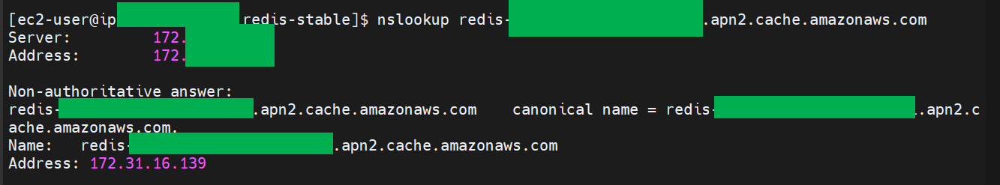

<br>

위의 화면에서 Address: [아이피주소] 로 나타난 문구를 확인해두자.<br>

위에서 나타난 주소 172.31.16.139 는 터널링할 때 사용되는 주소다.<br>

<br>

# (MS-Windows) 방화벽 설정

제어판을 연다.

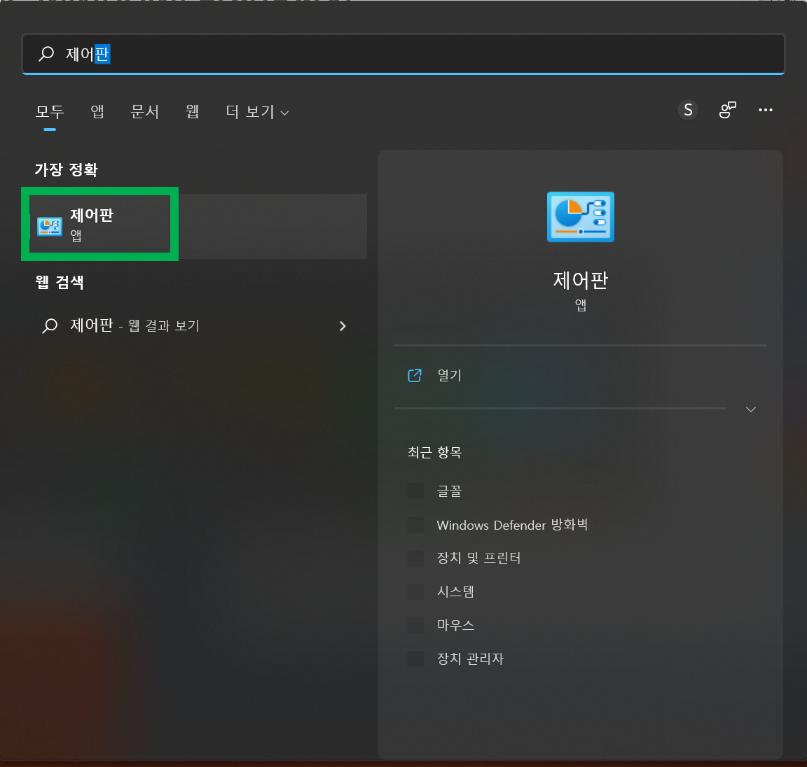

<br>

시스템 및 보안 클릭

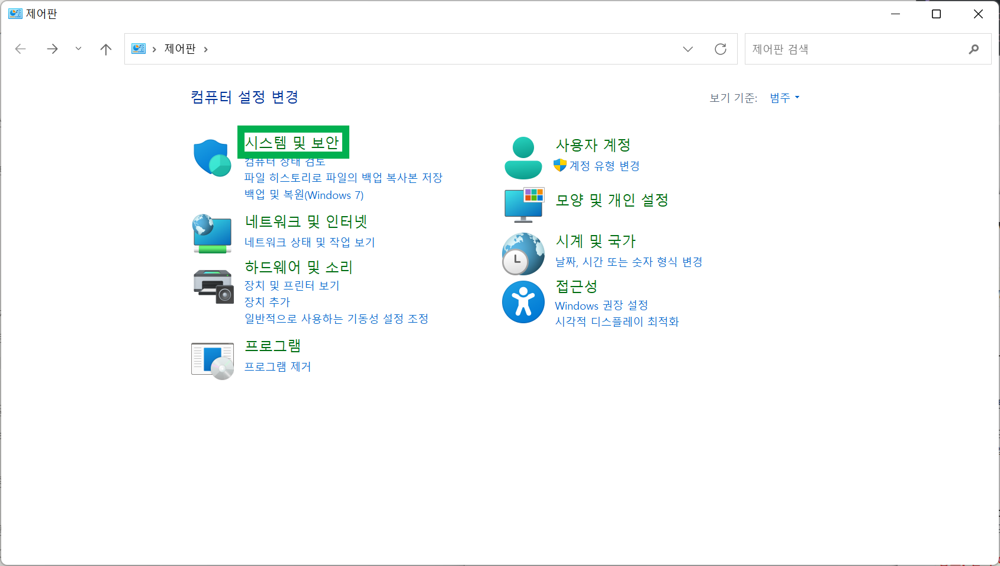

<br>

Windows Defender 방화벽 클릭

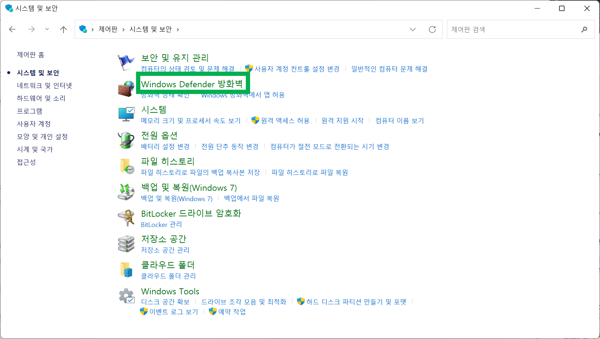

<br>

고급설정 클릭

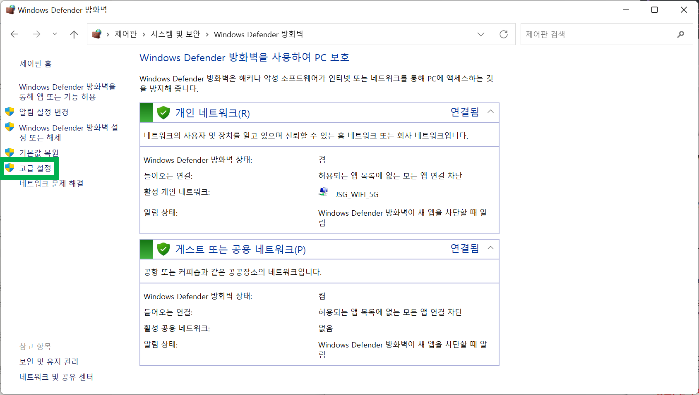

<br>

인바운드 규칙 → 새규칙 선택

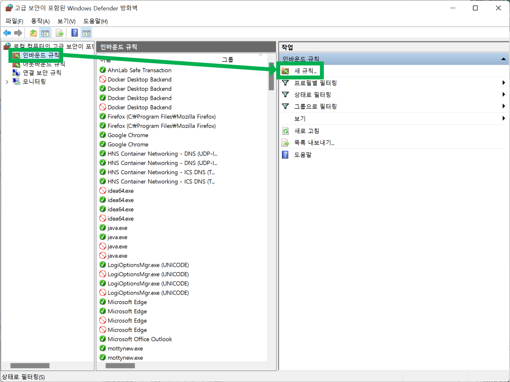

<br>

아래에서부터는 계속 캡처로 표시한대로 따라가면된다. 방화벽을 여는 과정이다.<br>

포트 선택<br>

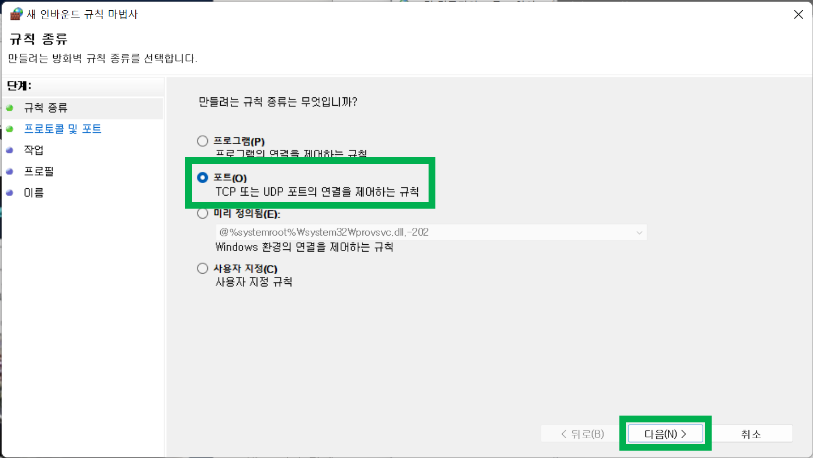

<br>

프로토콜 및 포트 에서는 아래와 같이 6379 를 입력

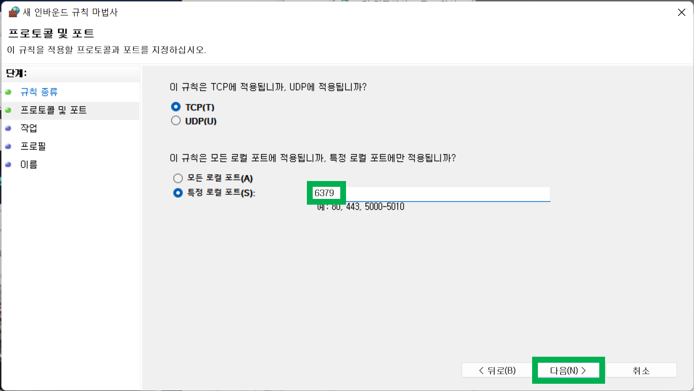

<br>

기본으로 설정된것을 그대로 두고 다음버튼 클릭

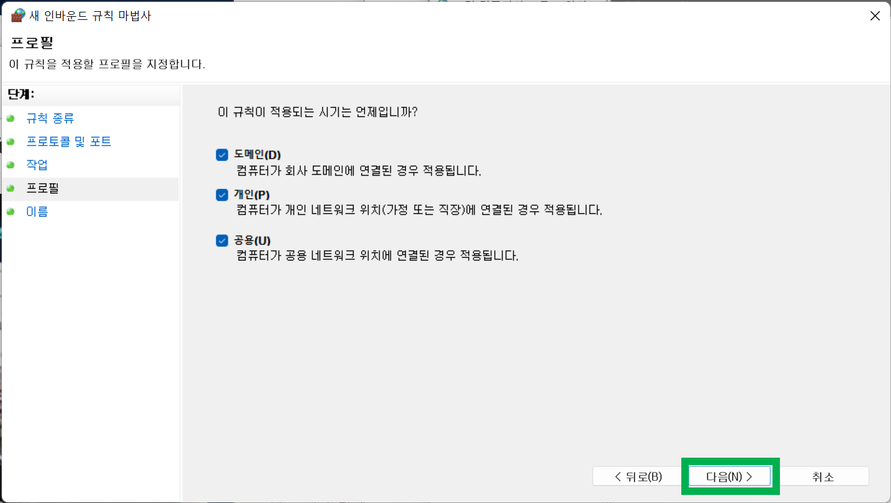

<br>

마지막으로 인바운드 규칙에 대한 이름을 지정해주고 마침 버튼을 클릭해주자.

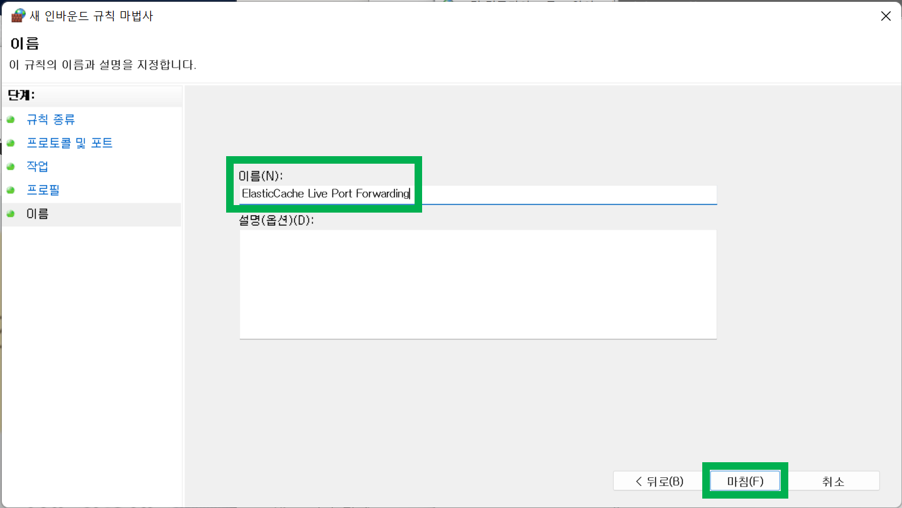

<br>

# mobaterm 에서의 설정

nslookup 시 가장 마지막에 나타났던 라인의 Address 에 나타났던 주소를 입력해준다.

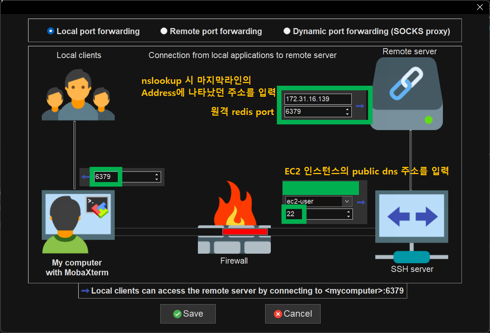

<br>

결과적으로 보면 이런 모양의 터널링이다.<br>

- 로컬 6379 포트 → EC2 22 포트 → 원격 AWS 레디스 6379 포트

로컬 6379 → EC2 22 포트 로의 매핑은 로컬 컴퓨터에서 6379 포트로 접속하려고 할때에만 EC2 서버의 22포트로 점프한다. 그리고 점프하면서 레디스 6379로 터널링된다.<br>

최종 터널링되는 결과화면은 아래와 같다.<br>

정지 버튼이 활성화되면 정상적으로 터널링 된 것이다.<br>

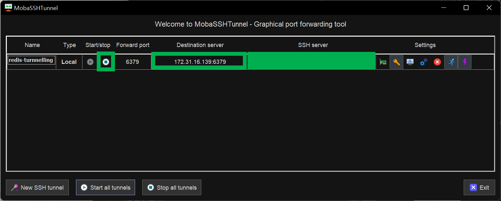

<br>

# mobaterm 에서 터널링이 안될때

자물쇠 버튼을 클릭하고, pem 키 또는 ppk 파일을 올바르게 선택해준다.<br>

이것 때문에 시간이 좀 걸렸었다.<br>

(맥에서는 터미널 명령어로 한큐에 되지만, 윈도우는 GUI에서 방화벽도 열고 여러가지 할 일들이 많았다.)<br>

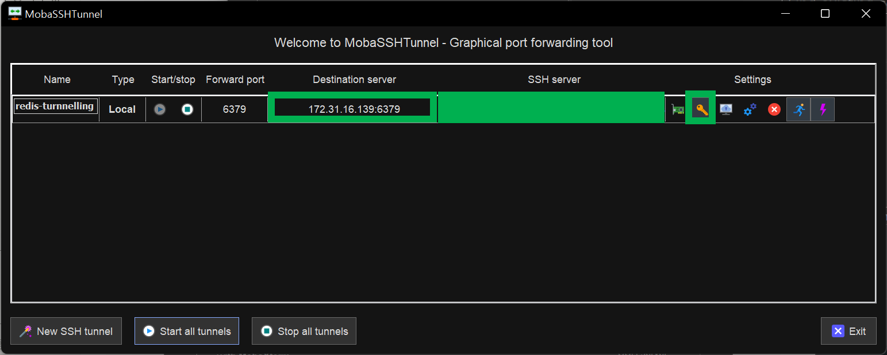

<br>

# Spring Boot 에서의 접속

접속 profile 의 이름은 “test-live” 다. 로컬에서 6379로 접속을 하는 것은 위의 포트포워딩이 로컬에 설정되어 있어야 한다. 나중에 젠킨스에서 테스트 돌릴때 이 부분 확인해야한다.<br>

(test-live 프로필의 목적은 대부분 현재 머신에서 라이브로 접속만 가능한지를 테스트하는 것이 목적이다.)<br>

<br>

```java
package io.stock.kr.calculator.config;

import org.springframework.context.annotation.Bean;
import org.springframework.context.annotation.Configuration;
import org.springframework.context.annotation.Profile;
import org.springframework.data.redis.connection.RedisConnectionFactory;
import org.springframework.data.redis.connection.lettuce.LettuceConnectionFactory;
import org.springframework.data.redis.core.RedisTemplate;
import org.springframework.data.redis.serializer.StringRedisSerializer;

@Profile("test-live")
@Configuration
public class TestLiveRedisConfig {
    @Bean
    public RedisConnectionFactory redisConnectionFactory(){
        final String host = "127.0.0.1";
        final int port = 6379;
        return new LettuceConnectionFactory(host, port);
    }

    @Bean
    public RedisTemplate<?, ?> redisTemplate(){
        RedisTemplate<?, ?> redisTemplate = new RedisTemplate<>();
        redisTemplate.setConnectionFactory(redisConnectionFactory());
        redisTemplate.setKeySerializer(new StringRedisSerializer());
        redisTemplate.setValueSerializer(new StringRedisSerializer());
        return redisTemplate;
    }
}
```

<br>

# 테스트 코드

```java
package io.stock.kr.calculator.config.connections;

import io.stock.kr.calculator.stock.price.repository.redis.StockPriceRedis;
import io.stock.kr.calculator.stock.price.repository.redis.StockPriceRedisRepository;
import org.junit.jupiter.api.Test;
import org.springframework.beans.factory.annotation.Autowired;
import org.springframework.boot.test.context.SpringBootTest;
import org.springframework.test.context.ActiveProfiles;

@SpringBootTest
@ActiveProfiles("test-live")
public class LiveRedisConnectTest {
    @Autowired
    private StockPriceRedisRepository repository;

    @Test
    public void test(){
        StockPriceRedis data = StockPriceRedis.builder()
                .ticker("MSFT")
                .open("11111")
                .high("22222")
                .low("111")
                .close("22222")
                .build();

        repository.save(data);

        repository.findById(data.getTicker());

        repository.count();

    }

}
```


초록불이 뜨면서 잘 된다. 다음은 접속설정이다.<br>

<br>

# application.yml

- 경로 : `src/test/resources/application.yml`
- 접속을 테스트하기 위한 용도이기에 `src/test/resources/application.yml` 을 수정했다.
- 만약 live와 test 구분 없이 육안으로 테스트하는 구조라면, `src/main/resources/application.yml` 에 모두 작성하면 된다.

전체 application.yml 은 아래와 같다. 이 중에서 필요한 부분만 이 코드 다음 코드에 적어두었다.

```yaml
spring:
  profiles:
    active: test-docker
---
spring:
  config:
    activate:
      on-profile:
      - test-docker
      - test-in-memory
      - test-containers
  redis:
    host: localhost
    port: 6379
amazon:
  dynamodb:
    endpoint: "http://localhost:5555"
    region: "local"
  aws:
    accessKey: "key"
    secretKey: "key"
---
spring:
  config:
    activate:
      on-profile: test-in-memory
---
spring:
  config:
    activate:
      on-profile: test-containers
---
spring:
  config:
    activate:
      on-profile:
        - test-live
amazon:
  dynamodb:
    endpoint: "http://localhost:5555"
    region: "local"
  aws:
    accessKey: "key"
    secretKey: "key"
```

<br>

라이브를 테스트하는데에 사용한 프로필은 아래와 같다.<br>

별내용은 없다. 어차피 TestRedisConfig에서 하드코딩으로 지정하고 있는 부분을 따라가면 된다.<br>

<br>

```yaml
spring:
  config:
    activate:
      on-profile:
        - test-live
amazon:
  dynamodb:
    endpoint: "http://localhost:5555"
    region: "local"
  aws:
    accessKey: "key"
    secretKey: "key"
```

