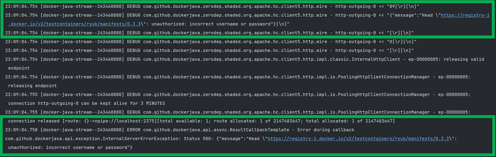

# testcontainers 트러블슈팅 - incorrect username or password


`gradle` 의존성은 아래와 같다.

```groovy
dependencies {
	// ...
	testImplementation 'org.testcontainers:testcontainers:1.17.1'
	testImplementation 'org.testcontainers:junit-jupiter:1.17.1'
}
```

<br>

테스트 코드는 아래와 같이 작성했다고 해보자. 큰 내용은 없고, 그냥 `DockerComposeContainer` 인스턴스를 테스트 환경에서 구동한다.

```java
package io.study.transaction.transaction_study.connection;

import org.junit.jupiter.api.Test;
import org.springframework.boot.test.context.SpringBootTest;
import org.springframework.test.context.ActiveProfiles;
import org.testcontainers.containers.DockerComposeContainer;
import org.testcontainers.junit.jupiter.Testcontainers;

import java.io.File;

@Testcontainers
@ActiveProfiles("test-docker")
@SpringBootTest
public class TestContainerConnectionTest {

    static final DockerComposeContainer container;

    static{
        container = new DockerComposeContainer(new File("src/test/resources/docker/docker-compose/docker-compose.yml"));
        container.start();
    }

    @Test
    public void TEST_DOCKER_COMPOSE_CONTAINER_LOADING(){

    }
}
```

<br>

그런데 가끔씩 아래와 같은 에러문구를 접하게 되는 경우가 있다.<br>



<br>

이 경우 해결책은 이렇다.

- docker login, docker desktop login
- 아래의 도커 이미지를 pull 한다.
  - testcontainers/ryuk:0.3.3
  - docker/compose:1.29.2

<br>

이 이슈는 ["No such image: testcontainers/ryuk:0.3.0" · Issue #3574 · testcontainers/testcontainers-java (github.com)](https://github.com/testcontainers/testcontainers-java/issues/3574) 에서 언급하고 있는 이슈다. 현재 이 오픈소스를 관리하는 주체들도 모두 본업이 있기 때문에, 지금 당장에 해결하기가 쉽지 않은가보다. 당분간은 이미지를 직접 다운받아 달라고 이야기하고 있다.<br>

내 경우는 초반에 `testcontainer:1.17.0`, `junit-jupiter:1.17.0` 기반으로 하느라 0.3.0 버전의 에러가 나타났었다.<br>

<br>

어떤 의존성을 사용하든 로그에 나타난 버전을 따라서 위의 도커이미지들을 다운로드 하면 된다.<br>

<br>

**문제 원인 파악 단서를 어떻게 찾았는지?**<br>

최종 로그에서는 로그인이 안된다는 로그나, toomanyrequest 같은 문구만 나타났다. 단편적으로 구글링으로는 해결이 안됬다. 실무에서 보통 30분 \~ 3시간 내에 구글링으로 해결되지 않는 경우가 가끔 있다. 이런 경우는 로그를 처음부터 끝까지 훑어보면서 어떤 과정에서 예외가 발생했는지 봐야 한다.<br>

이번에 해결하게 된 계기도 로그의 추이를 모두 처음부터 끝까지 읽어보면서 해결하게 됬다.<br>

이렇게 해결하는 습관을 들이게 된건 아마도 2년 전 쯤부터였던 것 같다. 프로젝트를 새로 세팅하거나 하다보면, 직접 해결해야 하는 이슈들에 자주 부딪히는데, 항상 그때마다 이런 식으로 해결해왔는데 내가 기억을 못하게 된것 같다.<br>

<br>