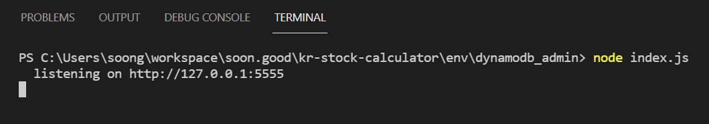
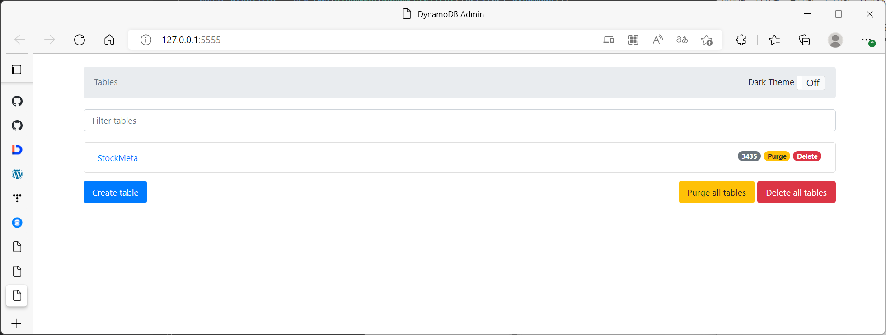

# Dynamodb-admin 을 이용해 DynamoDB 관리하기

DynamoDB를 관리하는 도구는 대표적으로 3가지가 있다.

- Dynabase : 유료
- NoSQL Workbench (AWS에서 만든 NoSQL Workbench)
  - Data Modeling 등에 있어서는 편하지만, 그 외의 기능은 불편.
- dynamodb-admin (Node.js 기반 오픈소스 관리툴)
  - 소스코드를 직접 작성해야 한다는 불편함은 있지만, 소스코드가 그렇게 어려운 것은 아니어서 금방 작성할 수 있다.

<br>

# 참고자료

- [aaronshaf/dynamodb-admin: GUI for DynamoDB Local or dynalite (github.com)](https://github.com/aaronshaf/dynamodb-admin)
- [dynamodb-admin - npm (npmjs.com)](https://www.npmjs.com/package/dynamodb-admin) 
- [DynamoDB + GUI 로컬 개발환경 세팅하기 (aerocode.net)](https://aerocode.net/317)

<br>

# 디렉터리 생성, npm init

`dynamodb_admin` 디렉터리를 생성하고 해당 디렉터리를 `npm init` 한다.

```bash
 mkdir dynamodb_admin
 cd dynamodb_admin
 npm init
 # vscode 를 환경변수로 등록해두었다면, 현재 디렉터리를 vscode로 연다
 code . 
```

<br>

# 패키지 설치

```bash
# 방금 만들어둔 디렉터리로 이동
cd dynamodb_admin
npm install aws-sdk
npm install dynamodb-admin
```

<br>

# 어드민 프로그램 작성 & 구동

`index.js` 파일에 아래의 소스코드를 입력해주자.<br>

내 경우는 로컬에 도커로 띄워둔 DynamoDB의 port가 5555 이기에 아래와 같이 5555 를 포트번호로 지정해두었다.<br>

```bash
const AWS = require('aws-sdk');
const {createServer} = require('dynamodb-admin');

const dynamodb = new AWS.DynamoDB({
	region: 'ap-northeast-2'
});
const dynClient = new AWS.DynamoDB.DocumentClient({service: dynamodb});

const app = createServer(dynamodb, dynClient);

const host = 'localhost';
const port = 5555;
const server = app.listen(port, host);
server.on('listening', () => {
  const address = server.address();
  console.log(`  listening on http://${address.address}:${address.port}`);
});
```

<br>

# 어드민 페이지 접속

위와 같이 입력해두었다면, 터미널에 아래와 같은 문구가 나타난다.<br>



<br>

[http://127.0.0.1:5555/](http://127.0.0.1:5555/) 에 접속해보자.



<br>