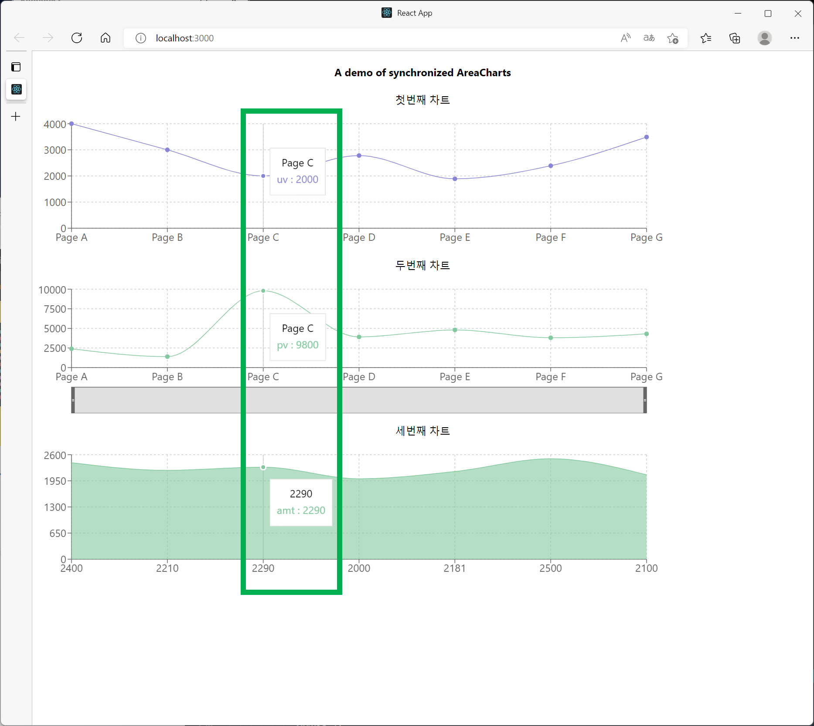
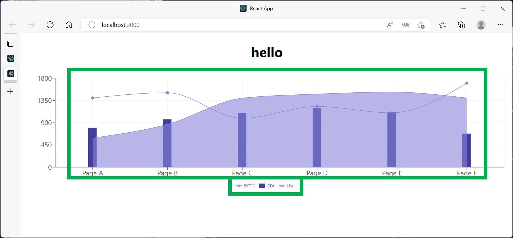

# [FRONTEND] 차트라이브러리 조사 - RECHART

RECHARTS를 써봤는데, 일단, 나중에 쓸지도 모르는 기능인 `Sychronized Chart` 기능이 제공된다는 점에서 괜찮다 싶었다. 제일 처음 적용해본 예제는 `Synchronized Chart`다. <br>

예제를 모두 react 프로젝트를 개설해서 손으로 직접 따라해보면서 작성해봤는데, 예전에 사용해봤었던 `highchart`, `amchart`, `morris` 차트에 비해 비교적 직관적으로 차트를 조합한다는 점이 마음에 들었다. <br>

물론, 여기에 더해 개발자 기능이 좋아서, 프로젝트를 생성하거나, 파일을 만들지 않고도 공식 페이지에서 직접 수정해보며 테스트해볼 수 있었다.<br>

신기한 점은 일반적인 React 컴포넌트가 아닌 `PureComponent` 라는 것을 사용한다는 것인데, 그리드 등의 컴포넌트와 사용할때 충돌되는 것은 없는지 확인이 필요하겠다 싶었다.<br>

<br>

## 설치

`recharts` 는 기본으로 다운받아져 있는 `node_modules` 와 충돌되는 게 있다. (리액트 내부에 내장으로 `recharts` 를 지원하는 부분들이 있어서일까? 하고 생각했는데, 역시 시간이 없기에 거기까지는 결론이 다다르지는 못했다.)<br>

이런 이유로 아래와 같이 `recharts` 라이브러리로 기존 라이브러리들을 모두 덮어쓰게끔 해서 다운로드 받았다. 그리고 `--save-dev` 옵션을 주어서, 개발 버전에서만 사용하게끔 다운로드 받아두었다... 빌드 관련해서도 나중에 건드려야 하는데, 여기에 대해서는 나중에 정리해야 하겠다 싶다.

```bash
npm install --force --save-dev recharts
```

<br>

## SynchronizedLineChart

> 예제 링크 : 
>
> - [SynchronizedLine Chart](https://recharts.org/en-US/examples/SynchronizedLineChart)
> - 직접 작성한 예제의 링크 : [https://github.com/soon-good/kr-stock-calculator/tree/main/study/FRONTEND/demo-try1-rechart](github.com/soon-good/kr-stock-calculator/tree/main/study/FRONTEND/demo-try1-rechart) <br>

<br>

작성이 완료된 모습은 아래와 같다. `SynchronizedLineChart` 는 여러개의 차트가 `syncId` 라는 `props`에 넘겨지는 아이디값으로 같은 x축을 가지면서 공유할수 있도록 되어 있는 차트다.<br>

만약 가장 마지막의 컴포넌트에서 `syncId` 를 누락하면?<br>

- 가장 마지막의 차트만 `tooltip` 으로 표시되는 차트가 된다. 
- syncId가 깨졌으니, 모든 설정을 가장 마지막 차트가 덮어쓰는 것으로 보인다.

<br>



<br>

## LineBarAreaComposedChart

> 예제 링크 : 
>
> - [LineBarAreaComposedChart](https://recharts.org/en-US/examples/LineBarAreaComposedChart)
>   - 공식 페이지의 예제는 새로 돌려보거나, 로컬에서 테스트해보면 실패한다. 그래서 아래의 ComposedResponsiveContainer 를 돌려보고 차이점을 파악했는데, ResponsiveContainer 에 witdh 속성을 지정해서 생긴 문제였던 것을 파악했다. 결론은, ResponsiveContainer 에는 width, height 를 지정하면 안된다. 
> - [ComposedResponsiveContainer](https://recharts.org/en-US/examples/ComposedResponsiveContainer)
> - [Code SandBox | Recharts - LineBarAreaComposedChart ](https://codesandbox.io/s/simple-composed-chart-h9zif)
> - [Code SandBox | Recharts - ComposedResponsiveContainer](https://recharts.org/en-US/examples/ComposedResponsiveContainer)
> - 직접 작성한 예제의 링크 : [https://github.com/soon-good/kr-stock-calculator/tree/main/study/FRONTEND/demo-try2-rechart-line-bar-composed-chart](https://github.com/soon-good/kr-stock-calculator/tree/main/study/FRONTEND/demo-try2-rechart-line-bar-composed-chart)

<br>

이번 예제는 예제 코드를 남겨놔야 나중에 실수를 안하겠다 싶어서 남겨본다.<br>

ResponsiveContainer 안에 ComposedChart를 두어서 표현했고, 이것을 Responsive 하게 보이기 위해 div 로 감쌌다.<br>

```jsx
import React, { Component, PureComponent } from 'react';
import {
	Area,
	Bar,
	CartesianGrid,
	ComposedChart,
	Legend,
	Line,
	ResponsiveContainer,
	Tooltip,
	XAxis,
	YAxis,
} from 'recharts';

const data = [
	{
	  name: 'Page A',
	  uv: 590,
	  pv: 800,
	  amt: 1400,
	  cnt: 490,
	},
	{
	  name: 'Page B',
	  uv: 868,
	  pv: 967,
	  amt: 1506,
	  cnt: 590,
	},
	{
	  name: 'Page C',
	  uv: 1397,
	  pv: 1098,
	  amt: 989,
	  cnt: 350,
	},
	{
	  name: 'Page D',
	  uv: 1480,
	  pv: 1200,
	  amt: 1228,
	  cnt: 480,
	},
	{
	  name: 'Page E',
	  uv: 1520,
	  pv: 1108,
	  amt: 1100,
	  cnt: 460,
	},
	{
	  name: 'Page F',
	  uv: 1400,
	  pv: 680,
	  amt: 1700,
	  cnt: 380,
	},
  ];

class SampleDemoChart2 extends Component {
	render() {
		return (
			<div style={{width: "100%", height: 300}}>
				<h1> hello </h1>
				<ResponsiveContainer>
					<ComposedChart width={500} height={400} data={data}
						margin={{top : 20, right: 20, bottom: 20, left: 20}}>
						<CartesianGrid stroke='#f5f5f5'/>
						<XAxis dataKey="name" scale="band"/>
						<YAxis/>
						<Tooltip/>
						<Legend/>
						<Line type="monotone" dataKey="amt" fill="#8884d8" stroke="#8884d8"/>
						<Bar dataKey="pv" barSize={20} fill="#413ea0"/>
						<Area type="monotone" dataKey = "uv" fill="#8884d8" stroke="#8884d8"/>
						{/* <Area></Area> */}
					</ComposedChart>
				</ResponsiveContainer>
			</div>
		);
	}
}

export default SampleDemoChart2;
```

<br>

실행결과



<br>

## ComposedResponsiveContainer

> 예제 링크 : [https://recharts.org/en-US/examples/ComposedResponsiveContainer](https://recharts.org/en-US/examples/ComposedResponsiveContainer)<br>

이 예제는 기본 컨셉은 위의 LineBarAreaComposedChart와 비슷하다. 다만 `ResponsiveContainer` 대신 `ComposedResponsiveContainer` 를 사용한다.<br>

(참고로 위의 예제에서는 ResponsiveContainer 안에 ComposedChart를 두어서 표현했고, 이것을 Responsive 하게 보이기 위해 div 로 감쌌었다.)<br>

<br>

예제와 설명은 나중에 정리해야 할 것 같다<br>

<br>

