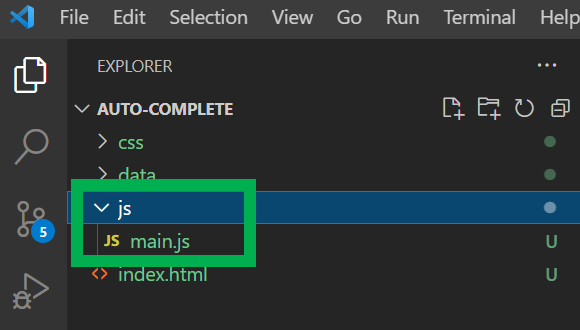

# (목업) 검색어 자동완성 기능 구현

보통 이렇게 UI 기능만 구현된 페이지를 목업페이지라고 불렀던것 같은데, 내가 잘못 기억하고 있는 거일수도 있다.<br>

<br>

# 참고자료

[Quick Autocomplete App With JS & JSON - YouTube](https://www.youtube.com/watch?v=1iysNUrI3lw)<br>

<br>

# 프로젝트 셋업

**json 데이터파일 세팅**<br>

데이터로 사용할 json 파일을 아래 링크에서 다운로드한다.<br>

프로젝트에서는 data 디렉터리에 저장해두었다.<br>

- [JSON array of states and capitals · GitHub](https://gist.github.com/bradtraversy/20dee7787486d10db3bd1f55fae5fdf4)

<br>

**css 세팅**

- [Bootswatch: Free themes for Bootstrap](https://bootswatch.com/)

Cyborg 를 다운받았다.


<br>

css 폴더에 다운로드 받아둔다.


<br>

**js 파일 세팅**<br>

js 폴더를 만들고 그 아래에 main.js 파일을 생성해주자.



<br>

font 세팅 (flag icon 사용을 위해 필요)<br>

- https://fontawesome.com/


<br>

fontawesome 은 이전에는 무료 cdn 링크가 첫 페이지에 바로 보였다고 한다. 지금은 회원 가입을 하고 별도로 생성된 kit 링크로 이동해야 한다. (회원가입을 하면 무료로 주어지는 kit가 있는데, 이 kit에는 개인용도의 CDN이 부여된다. 이걸 알게 될 때까지 2시간 걸렸다… 와… 서버개발자가 이런것도 알아야돼? 하는 억울한 감정이 ㅠㅠ)<br>

fontawesome 회원가입후에는 개인 페이지로 넘어가면 아래와 같은 화면이 나타난다.<br>


<br>

스크롤을 쭉 내리면 아래와 같이 Manage Kits 라는 버튼이 보인다.


<br>

이동한 페이지에는 아래와 같은 페이지가 나타나는데, 개인 Kit에 대한 번호를 클릭하자.


<br>

이것의 링크를 아래와 같이 복사하자.


<br>

# Mockup 코드

html 코드를 아래와 같이 입력해주자.

```html
<!DOCTYPE html>
<html lang="en">
	<head>
		<meta charset="UTF-8">
		<meta name="viewport" content="width=device-width, initial-scale=1.0">
		<meta http-equiv="X-UA-Compatible" content="ie=edge">
		<script src="https://kit.fontawesome.com/866b738c46.js" crossorigin="anonymous"></script>
		<link rel="stylesheet" href="css/bootstrap.min.css">
		<title>검색어 자동완성</title>
	</head>
	<body>
		<div class="container mt-5">
			<div class="row">
				<div class="col-md-6 m-auto">
					<h3 class="text-center mb-3">
						<i class="fa-solid fa-car-tunnel"></i> Search Anything !! 
					</h3>
					<input 
						type="text" 
						id="search" 
						class="form-control form-control-lg" 
						placeholder="Enter state name or Abbreviation..."
					/>
				</div>
				<div id="match-list"></div>
			</div>
		</div>
		<script src="js/main.js"></script>
	</body>
</html>
```

<br>

위 목업파일을 VSCode 의 Live Server 익스텐션으로 열어본 화면은 아래와 같다.


<br>

# input 이벤트 리스너 코드 작성

```javascript
const search = document.getElementById('search');
const matchList = document.getElementById('match-list');

const searchStates = async searchText => {
	const res = await fetch('../data/state_capitals.json');
	const states = await res.json();

	console.log(states);
}

search.addEventListener('input', () => searchStates(search.value));
```

<br>

이 코드의 출력결과는 아래와 같다. 아직까지는 input 이벤트 발생했을 때 ajax 호출을 하고 이것을 받아오는 단순한 기능이다.<br>

> 문자 'a'를 입력했을 때의 모습


<br>

# searchStates() :: 정규표현식을 활용한 필터링 기능

내가 사용할 프로젝트에서는 이 기능이 필요없다. Redis 와 Spring을 이용해서 검색어 자동완성을 미리 구현해두어서 이 기능은 필요가 없긴 한데, 그냥 추가로 정리해봤다.

```javascript
const search = document.getElementById('search');
const matchList = document.getElementById('match-list');

const searchStates = async searchText => {
	const res = await fetch('../data/state_capitals.json');
	const states = await res.json();

	let matches = states.filter(state => {
		// gi : 'g' = global, 'i' = case insensitive 
		const regex = new RegExp(`^${searchText}`, 'gi');
		return state.name.match(regex) || state.abbr.match(regex);
	});

	if(searchText.length === 0){
		matches = [];
	}
}


search.addEventListener('input', () => searchStates(search.value));
```

<br>


<br>

# renderHtml() :: (1) 검색결과를 엘리먼트 문자열로 동적 생성

renderHtml 함수를 추가해줬다. 결과문자열의 배열을 받아서 \` (백틱) 으로 감싸서 문자열로 생성했다.

```javascript
const search = document.getElementById('search');
const matchList = document.getElementById('match-list');

const searchStates = async searchText => {
const res = await fetch('../data/state_capitals.json');
	const states = await res.json();

	let matches = states.filter(state => {
		// gi : 'g' = global, 'i' = case insensitive 
		const regex = new RegExp(`^${searchText}`, 'gi');
		return state.name.match(regex) || state.abbr.match(regex);
	});

	if(searchText.length === 0){
		matches = [];
	}
}

const renderHtml = matches => {
	if(matches.length > 0){
		const html = matches.map(match => `
			<div class="card card-body mb-1">
				<h4>${match.name} (${match.abbr})
					<span class="text-primary"> ${match.capital} </span>
				</h4>
				<small> Lat: ${match.lat} / Long: ${match.long} </small>
			</div>
		`);

		console.log(html);
	}
}

search.addEventListener('input', () => searchStates(search.value));
```

<br>

지금까지의 결과물은 아래와 같다.


<br>

이제 위의 코드를 아래와 같이 결과문자열에 .join(’’) 을 호출하도록 수정해서, 이상한 `\n\t` 같은 문자들이 없도록 만들어줬다.

```javascript
const search = document.getElementById('search');
const matchList = document.getElementById('match-list');

const searchStates = async searchText => {
// 중략
}

const renderHtml = matches => {
	if(matches.length > 0){
		const html = matches.map(match => `
			<div class="card card-body mb-1">
				<h4>${match.name} (${match.abbr})
					<span class="text-primary"> ${match.capital} </span>
				</h4>
				<small> Lat: ${match.lat} / Long: ${match.long} </small>
			</div>
		`).join(''); // 여기에 추가해줬다.

		console.log(html);
	}
}

search.addEventListener('input', () => searchStates(search.value));
```

<br>

이렇게 한 다음의 결과물은 아래와 같다.


<br>

# renderHtml() :: (2) 동적으로 만들어진 엘리먼트 문자열을 html 로 생성

<br>

`matchList.innerHtml = html;` 과 같은 구문을 추가해주어 생성된 앨리먼트 문자열을 html 로 저장해준다.

```javascript
const search = document.getElementById('search');
const matchList = document.getElementById('match-list');

const searchStates = async searchText => {
	// 중략
}

const renderHtml = matches => {
	if(matches.length > 0){
		const html = matches.map(match => `
			<div class="card card-body mb-1">
				<h4>${match.name} (${match.abbr})
					<span class="text-primary"> ${match.capital} </span>
				</h4>
				<small> Lat: ${match.lat} / Long: ${match.long} </small>
			</div>
		`).join('');

		matchList.innerHTML = html; // 이부분을 추가해줬다.
	}
}

search.addEventListener('input', () => searchStates(search.value));
```

<br>

결과물은 아래와 같이 나타난다.


<br>

이제 이걸 리액트로 잘 써먹을 수 있겠군... <br>

<br>