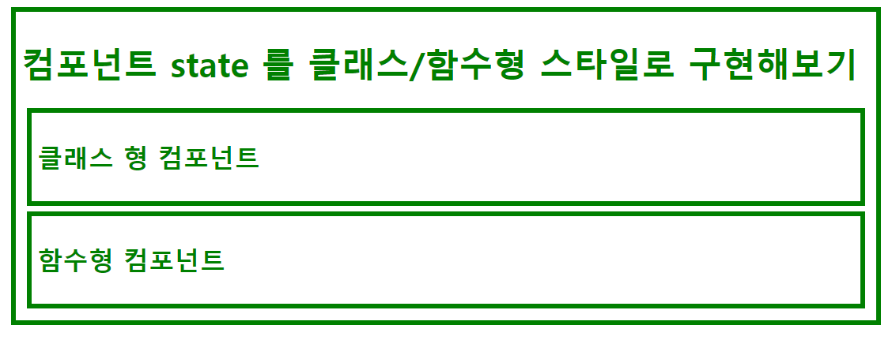
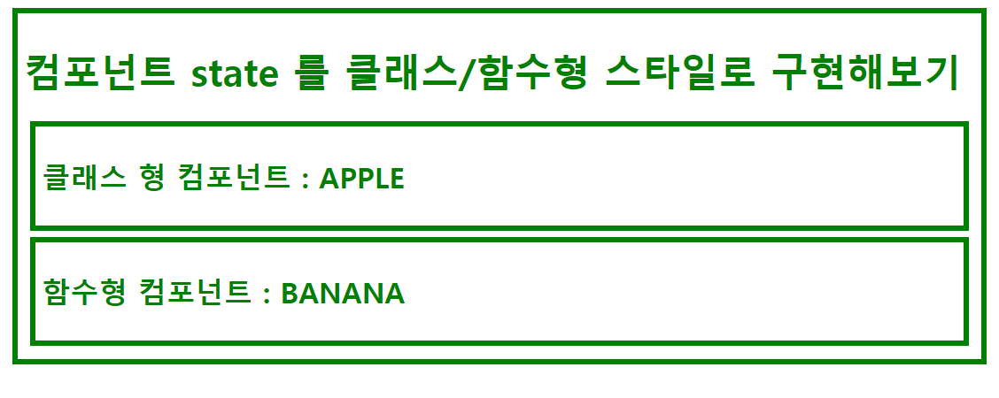
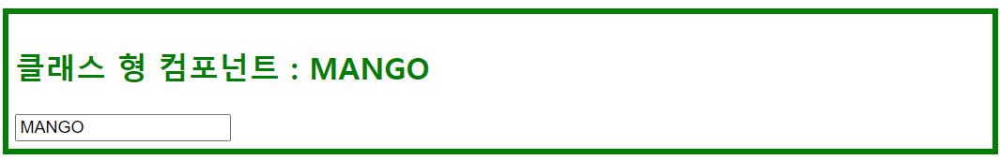
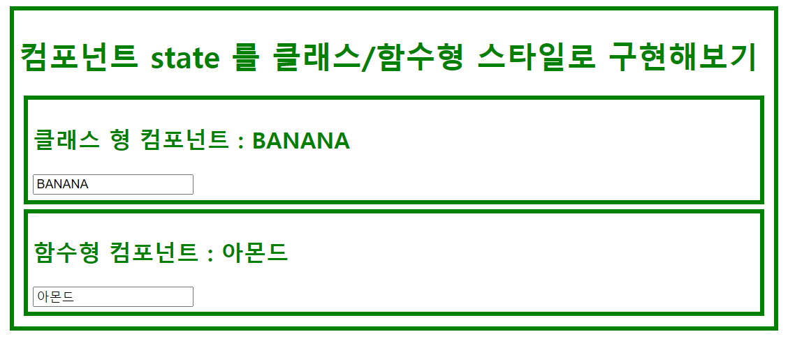

# React 함수형 컴포넌트

> 초창기에 함수형 컴포넌트는 기능이 부족했었다. state 와 라이프사이클 API 를 사용할 수 없었기 때문이다. 그런데 몇 년 전부터 리액트에 hook 이라는 개념이 도입되면서 함수형 컴포넌트에서도 상태를 다룰 수 있게 됐고, 컴포넌트의 라이프 사이클에 따라서 해야 할 작업도 정의할 수 있게 됐다.<br>
>
> hook 의 특징은 use 로 이름이 시작된다는 점이다. 페이스북에서 공식적으로 제공하는 대표적으로 state 를 관리하는 함수형 컴포넌트를 위한 hook 의 이름은 useState 이다.

<br>

리액트에서 컴포넌트를 만드는 방법은 아래의 두가지 방법이 있다.

- 클래스형 컴포넌트 : 클래스 문법 형식으로 컴포넌트를 만드는 방법
- 함수형 컴포넌트 : 함수 문법 형식으로 컴포넌트를 만드는 방법

나는 몇년 전에 리액트를 처음으로 공부했었기 때문에, 아직 클래스 문법형식으로 컴포넌트를 만드는 방법만 익숙하다. 그런데 현재는 함수형 컴포넌트 위주의 예제가 많아서 나도 이제는 함수형 컴포넌트 사용방법을 공부해야하게 되었다.<br>

<br>

## 클래스형 컴포넌트 vs 함수형 컴포넌트

**클래스형 컴포넌트**<br>

`class` 기반의 컴포넌트를 구성하는 방식이다. 비교적 알아야 하는 문법이 존재한다는 것이 조금 단점이다.<br>

<br>

**함수형 컴포넌트**<br>

`function` 기반으로 컴포넌트를 구성하는 방식이다. 첫번째 인자로 `props` 를 받고, 이것을 `useState` API 를 이용하면 state 로 이용가능하다.<br>

<br>

## 차이점

개인적인 경험으로 결국 그냥 매우 자주 반복해서 코드를 작성해보다보면, 외울 필요는 없어지긴 한것 같았다. 다소 암기식으로 정리하는 것 같아서 조금 이상하지만 그래도 정리를 해보려 한다. 나중에 결국 다른일을 하다가 까먹고 다시 이 문서를 보게 되는 날이 있겠지 싶다.<br>

<br>

### props 를 사용할때의 구문선언의 차이점

props를 사용할때 사용하는 구문에도 차이가 존재한다.

<br>

**클래스형 컴포넌트를 사용할 때**

클래스형 컴포넌트를 사용할 때는 props를 this 키워드로 접근이 가능하다.

```jsx
// ..
<p> Fruit : {this.props.fruitType} </p>
// ...
```

<br>

**함수형 컴포넌트를 사용할 때**

- props 를 컴포넌트의 첫번째 인자로 주어서 받도록 컴포넌트를 정의한다.
- 사용할 때에는 `props.fruitType` 과 같은 방식으로 선언한다.
- 위의 클래스 스타일과 비교했을 때 `this` 가 빠져있음을 확인 할 수 있다.
- 이것을 통해 추측할수 있는 것은 함수형 컴포넌트의 this는 클래스 컴포넌트의 this는 서로 다르다는 것이다.

```jsx
function FunctionalComponent(props){
	// ...
	<p> Fruit : {props.fruitType} </p>
}
```

<br>

### state 를 사용할 때의 구문선언의 차이점

**클래스형 컴포넌트를 사용할 때**

- 항상 그렇든 `state = { ... }` 라는 변수를 선언한다.
- 그리고 이 state 를 활용하기 위해 `{this.state.fruitType}` 과 같은 구문을 사용한다.

```jsx
class ClassStyleComponent extends React.Component{
  state = {
    fruitType : this.props.fruitType
  };
    
  render(){
    return (
		// ...
        <h2>클래스 형 컴포넌트 : {this.state.fruitType}</h2>
		// ...
    );
  }
}
```

<br>

**함수형 컴포넌트를 사용할 때**

- useState 함수를 import 한다. 이 useState 는 facebook 에서 함수형 컴포넌트의 상태관리를 위해 기본제공하는 함수다.
- useState 함수는 props 의 변수를 인자로 전달해주어 호출해서 반환받는 결과값은 state 변수와 state 변수에 대한 setter 함수다.
- 예를 들면 아래와 같이 사용한다.

```jsx
import React, {useState} from 'react';
// ...

function FunctionalComponent(props){
  var fruitTypeProps = useState(props.fruitType);
  var fruitType = fruitTypeProps[0];    // 0 번째 요소는 state 변수
  var setFruitType = fruitTypeProps[1]; // 1 번째 요소는 setter 함수 

  return (
      // ...
      <h2>함수형 컴포넌트 : {fruitType}</h2>
	  // ...
  );
}

```

<br>

# 예제 생성

```jsx
mkdir demo_functional_component
cd demo_functional_component
npx create-react-app .
```

# app.css, index.css

index.css 에는 모든 내용을 지워두자.<br>

App.css 의 내용은 모두 지우고 아래의 내용을 입력해주자.<br>

```jsx
.container{
  border: 5px solid green;
  margin: 5px;
  padding: 5px;
}

h1, h2{
  color: green;
}
```

<br>

# index.js

```jsx
import React from 'react';
import ReactDOM from 'react-dom/client';
import './index.css';
import App from './App';
import reportWebVitals from './reportWebVitals';

const root = ReactDOM.createRoot(document.getElementById('root'));
root.render(
  <React.StrictMode>
    <App />
  </React.StrictMode>
);

// If you want to start measuring performance in your app, pass a function
// to log results (for example: reportWebVitals(console.log))
// or send to an analytics endpoint. Learn more: <https://bit.ly/CRA-vitals>
reportWebVitals();
```

<br>

# App.js

```jsx
import logo from './logo.svg';
import './App.css';
import React from 'react';

function App() {
  return (
    <div className="container">
      <h1>컴포넌트 state 를 클래스/함수형 스타일로 구현해보기</h1>
      <ClassStyleComponent fruitType={"APPLE"}></ClassStyleComponent>
      <FunctionalComponent fruitType={"BANANA"}></FunctionalComponent>
    </div>
  );
}

function FunctionalComponent(){
  return (
    <div className="container">
      <h2>함수형 컴포넌트</h2>
    </div>
  );
}

class ClassStyleComponent extends React.Component{
  render(){
    return (
      <div className="container">
        <h2>클래스 형 컴포넌트 </h2>
      </div>
    );
  }
}

export default App;
```

<br>

props 에 데이터를 전달하는 방법은 아래와 같이 `<컴포넌트명 [원하는변수명]={데이터}/>` 와 같은 형식으로 전달해주면 된다.

```jsx
function App() {
  return (
    <div className="container">
      <h1>컴포넌트 state 를 클래스/함수형 스타일로 구현해보기</h1>
      <ClassStyleComponent fruitType={"APPLE"}></ClassStyleComponent>
      <FunctionalComponent fruitType={"BANANA"}></FunctionalComponent>
    </div>
  );
}
```

<br>

지금까지의 결과물은 아래와 같아야 한다.



<br>

# props 처리 코드 비교

## 클래스형 컴포넌트

컴포넌트 외부인 App.js 에서 데이터를 props 로 전달받아서 처리하는 코드를 작성해보면 아래와 같다.

```jsx
// ...

function App() {
  return (
    <div className="container">
      <h1>컴포넌트 state 를 클래스/함수형 스타일로 구현해보기</h1>
      <ClassStyleComponent fruitType={"APPLE"}></ClassStyleComponent>
      <FunctionalComponent fruitType={"BANANA"}></FunctionalComponent>
    </div>
  );
}

// ...

class ClassStyleComponent extends React.Component{
  render(){
    return (
      <div className="container">
        <h2>클래스 형 컴포넌트 : {this.props.fruitType}</h2>
      </div>
    );
  }
}
```

<br>

클래스형 컴포넌트에서 props를 사용하는 것은 아래와 같은 코드로 단순하게 가능하다. 클래스형 컴포넌트는 props 를 this 키워드로 접근이 가능하다.

```jsx
// ..
<p> Fruit : {this.props.fruitType} </p>
// ...
```

<br>

## 함수형 컴포넌트

컴포넌트 외부인 App.js 에서 데이터를 props 로 전달받아 처리하는 예제를 작성해본 예제는 아래와 같다.

```jsx
// .. 

function App() {
  return (
    <div className="container">
      <h1>컴포넌트 state 를 클래스/함수형 스타일로 구현해보기</h1>
      <ClassStyleComponent fruitType={"APPLE"}></ClassStyleComponent>
      <FunctionalComponent fruitType={"BANANA"}></FunctionalComponent>
    </div>
  );
}

// ...

function FunctionalComponent(props){
  return (
    <div className="container">
      <h2>함수형 컴포넌트 : {props.fruitType}</h2>
    </div>
  );
}

export default App;
```

- props 를 함수형 컴포넌트 함수의 첫번째 인자로 주어서 받도록 컴포넌트를 정의한다.
- 사용할 때에는 `props.fruitType` 과 같은 방식으로 선언한다.
- 클래스 스타일의 props 사용 코드와 비교했을 때 `this` 가 빠져있음을 확인 할 수 있다.
- 이것을 통해 추측할수 있는 것은 함수형 컴포넌트의 this는 클래스 컴포넌트의 this는 서로 다르다는 것이다.

함수형 컴포넌트는 아래와 같은 구문으로 전달받은 props 데이터를 처리한다.

```jsx
function FunctionalComponent(props){
	// ...
	<p> Fruit : {props.fruitType} </p>
}
```

<br>

## 전체 코드

지금까지 작성한 전체코드는 App.js 에 한꺼번에 작성했고, 아래와 같다.

```jsx
import logo from './logo.svg';
import './App.css';
import React from 'react';

function App() {
  return (
    <div className="container">
      <h1>컴포넌트 state 를 클래스/함수형 스타일로 구현해보기</h1>
      <ClassStyleComponent fruitType={"APPLE"}></ClassStyleComponent>
      <FunctionalComponent fruitType={"BANANA"}></FunctionalComponent>
    </div>
  );
}

class ClassStyleComponent extends React.Component{
  render(){
    return (
      <div className="container">
        <h2>클래스 형 컴포넌트 : {this.props.fruitType}</h2>
      </div>
    );
  }
}

function FunctionalComponent(props){
  return (
    <div className="container">
      <h2>함수형 컴포넌트 : {props.fruitType}</h2>
    </div>
  );
}

export default App;
```

<br>

## ScreenShot

지금까지 작성한 코드의 결과물은 아래와 같다.



<br>

# state 처리 코드 비교

state 코드를 작성하고, 이벤트 핸들러를 연동해서 state 가 변하는 것에 따라서 component를 제대로 렌더링하는지 확인해보자.<br>

(참고로 state 는 state가 변할때 컴포넌트가 re-rendering 된다.)<br>

<br>

## 클래스 형 컴포넌트

예제의 시나리오는 이렇다.

- 인풋태그를 추가하고, onChange 이벤트에 대한 이벤트 핸들러를 등록한다.
- onChange 이벤트에 따라 state 값을 변화시킨다.

예를 들면 input 태그에 입력한 ‘MANGO’ 라는 문자열이 state 를 변화시키고, state가 변화되므로, 화면은 rerendering 되어 MANGO 를 H2에 출력한다.<br>

아래의 스크린 샷은 전체 스크린샷의 일부분이다.<br>

<br>



<br>

App.js 와 클래스형 컴포넌트의 코드는 아래와 같다.

```jsx
// ... 

function App() {
  return (
    <div className="container">
      <h1>컴포넌트 state 를 클래스/함수형 스타일로 구현해보기</h1>
      <ClassStyleComponent fruitType={"APPLE"}></ClassStyleComponent>
      <FunctionalComponent fruitType={"BANANA"}></FunctionalComponent>
    </div>
  );
}

class ClassStyleComponent extends React.Component{
  state = {
    fruitType : this.props.fruitType
  };

  render(){
    return (
      <div className="container">
        <h2>클래스 형 컴포넌트 : {this.state.fruitType}</h2>
        <input type="text" onChange={function(e){
          this.setState({
            fruitType: e.target.value
          });
        }.bind(this)}/>
      </div>
    );
  }
}

// ...

export default App;
```

<br>

위의 코드에서 state 를 처리하는 부분의 코드만을 추려보면 아래와 같다.<br>

state에 this.props.fruitType 을 연결하는 코드다.<br>

```jsx
  state = {
    fruitType : this.props.fruitType
  };
```

<br>

이벤트핸들러와 state 를 연결시킨 코드다.<br>

```jsx
// ...
      <div className="container">
        <h2>클래스 형 컴포넌트 : {this.state.fruitType}</h2>
        <input type="text" onChange={function(e){
          this.setState({
            fruitType: e.target.value
          });
        }.bind(this)}/>
      </div>
// ...
```

<br>

## 함수형 컴포넌트

예제의 시나리오는 이렇다.

- 인풋태그를 추가하고, onChange 이벤트에 대한 이벤트 핸들러를 등록한다.
- onChange 이벤트에 따라 state 값을 변화시킨다.

예를 들면 input 태그에 입력한 ‘MANGO’ 라는 문자열이 state 를 변화시키고, state가 변화되므로, 화면은 rerendering 되어 MANGO 를 H2에 출력한다.<br>

아래의 스크린 샷은 전체 스크린샷의 일부분이다.<br>


<br>

함수형 컴포넌트를 사용하려 할 때는 아래와 같이 `useState` 함수를 import 해준다.

```jsx
import React, {useState} from 'react';
```

<br>

그리고 state 변수를 function 내부의 변수에 바인딩하려면 아래와 같은 코드를 통해  `useState(props.[props명])` 함수를 사용해 state 변수를 받아온다.

```jsx
var fruitTypeProps = useState(props.fruitType);
var fruitType = fruitTypeProps[0];    // 0 번째 요소는 state 변수
var setFruitType = fruitTypeProps[1]; // 1 번째 요소는 setter 함수
```

<br>

useState(props.[프로퍼티명]) 의 인자값과 반환값을 정리해보면 아래와 같다.

- 인자값 : 

  ```
  props.[프로퍼티명]
  ```

  - props 내의 프로퍼티명을 지정해준다.

- 반환값: 배열

  - 반환되는 배열의 첫번째 요소 : `props.[프로퍼티명]` 에 해당하는 값이 반환된다.
  - 반환되는 배열의 두번째 요소 : `props.[프로퍼티명]` 을 관리하는 setter 함수가 반환된다.

<br>

함수형 컴포넌트를 사용하는 부분만을 추려놓은 예제는 아래와 같다.

```jsx
// ...

function App() {
  return (
    <div className="container">
      <h1>컴포넌트 state 를 클래스/함수형 스타일로 구현해보기</h1>
      <ClassStyleComponent fruitType={"APPLE"}></ClassStyleComponent>
      <FunctionalComponent fruitType={"BANANA"}></FunctionalComponent>
    </div>
  );
}

// ...

function FunctionalComponent(props){
  var fruitTypeProps = useState(props.fruitType);
  var fruitType = fruitTypeProps[0];    // 0 번째 요소는 state 변수
  var setFruitType = fruitTypeProps[1]; // 1 번째 요소는 setter 함수 

  return (
    <div className="container">
      <h2>함수형 컴포넌트 : {fruitType}</h2>
      <input type="text" onChange={function(e){
        setFruitType(e.target.value);
      }.bind(this)}/>
    </div>
  );
}

export default App;
```

<br>

지금까지 작성한 state 를 관리하는 클래스 컴포넌트, 함수형 컴포넌트의 코드를 모두 모은 예제 코드는 아래와 같다.

```jsx
import logo from './logo.svg';
import './App.css';
import React, {useState} from 'react';

function App() {
  return (
    <div className="container">
      <h1>컴포넌트 state 를 클래스/함수형 스타일로 구현해보기</h1>
      <ClassStyleComponent fruitType={"APPLE"}></ClassStyleComponent>
      <FunctionalComponent fruitType={"BANANA"}></FunctionalComponent>
    </div>
  );
}

class ClassStyleComponent extends React.Component{
  state = {
    fruitType : this.props.fruitType
  };

  render(){
    return (
      <div className="container">
        <h2>클래스 형 컴포넌트 : {this.state.fruitType}</h2>
        <input type="text" onChange={function(e){
          this.setState({
            fruitType: e.target.value
          });
        }.bind(this)}/>
      </div>
    );
  }
}

function FunctionalComponent(props){
  var fruitTypeProps = useState(props.fruitType);
  var fruitType = fruitTypeProps[0];    // 0 번째 요소는 state 변수
  var setFruitType = fruitTypeProps[1]; // 1 번째 요소는 setter 함수 

  return (
    <div className="container">
      <h2>함수형 컴포넌트 : {fruitType}</h2>
      <input type="text" onChange={function(e){
        setFruitType(e.target.value);
      }.bind(this)}/>
    </div>
  );
}

export default App;
```

<br>

이렇게 작성된 전체 코드의 결과화면은 아래와 같다.


