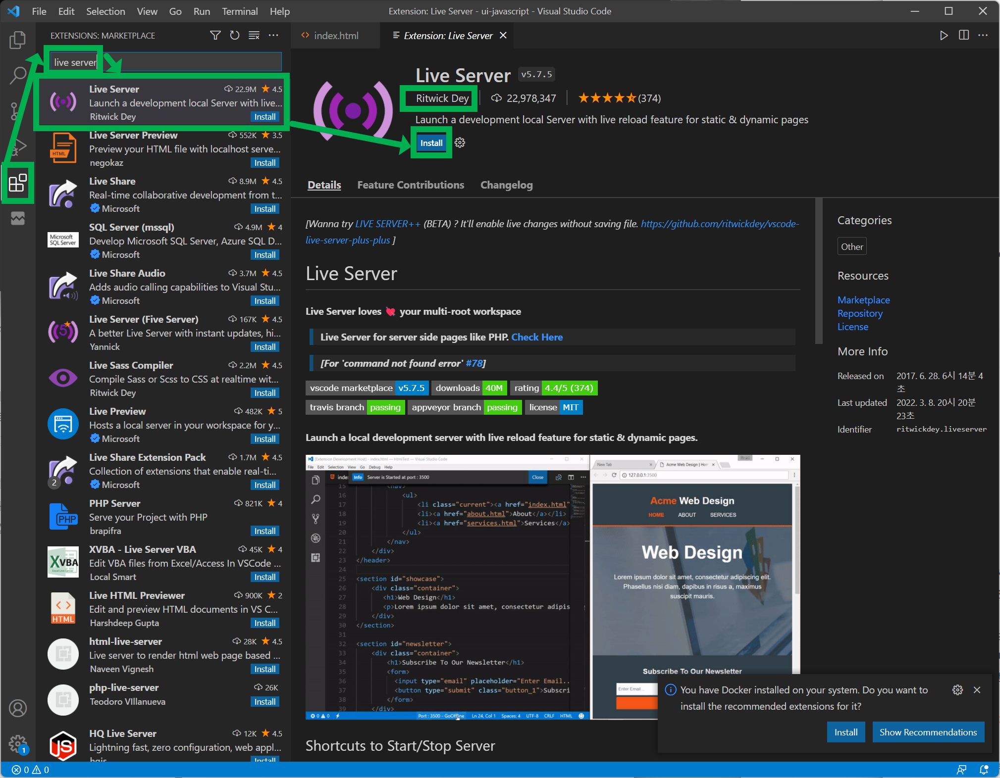
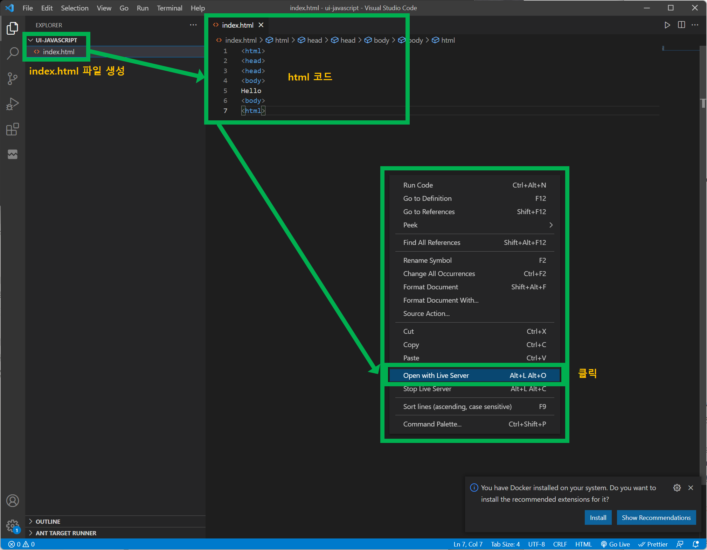
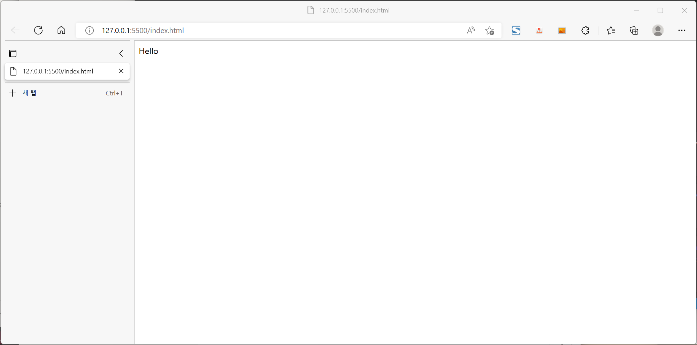

# VSCode의 Live Server로 HTML목업페이지를 실시간확인하기

이게 목업 페이지라고 부르는 것인지는 나도 잘 모른다. 그냥 어디서 목업페이지 이런말을 들은것 같아서 목업 페이지 만들기라고 제목을 정했다. 

 

우선 vscode 의 좌측 사이드바 메뉴에서 Extensions 를 클릭하고,  나타나는 창에서 Live server 라는 검색어를 입력한다. 그러면 여러가지 익스텐션이 뜨는데 그 중 가장 인기가 많은 Live server 익스텐션을 사용하자. Author 가 Ritwick Dey 인 익스텐션이 가장 인기가 많은 듯 하다.

 

테스트할 파일을 생성하고 그곳에 html 코드를 작성하자. 아래캡처에서는 index.html 파일을 생성해서 html 코드를 작성해줬다. 그리고 이 파일내의 에디터 창 내에서 오른쪽 버튼 클릭 -> Open with Live Server 버튼을 클릭한다.

 

그러면 아래 그림과 같이 작성했던 html 파일이 보인다. 

 
