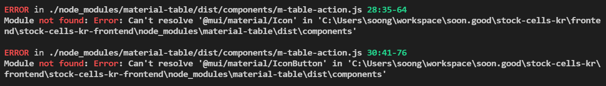
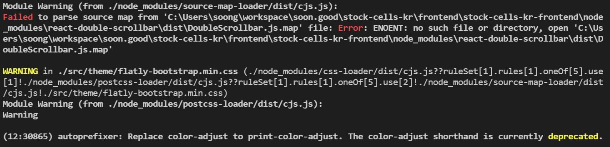

# material-table 을 이용한 export 기능, 스타일링

> react, node 를 처음 배웠던게 굉장히 오래전이라 기억이 안났었는데, npm 보다는 가급적이면 npx 또는 yarn 을 쓰는게 개발시간단축에 도움이 많이 된다.<br>
>
> npm 에는 관리되지 않는 레거시 버전의 패키지 관리자들이 있어서 의존성 처리시 에러가 나는게 많은 것으로 보인다. (대표적으로는 tar 관련 에러가 가장 킹받을때가 많다.)

<br>

# 참고자료

- https://github.com/mbrn/material-table

- https://material-table.com/#/docs/install

- [@mui/material - npm](https://www.npmjs.com/package/@mui/material)

- [webpack 5: Failed to parse source map from "@mswjs/interceptors" · Issue #1030 · mswjs/msw (github.com)](https://github.com/mswjs/msw/issues/1030#issuecomment-1004245791)

- [material-table, 필수 라이브러리 설치 & 기본 스타일 컴포넌트 적용](https://material-table.com/#/docs/install)

- [material-table/export](https://material-table.com/#/docs/features/export)

<br>

그 외의 참고자료<br>

- [Custom Row Export | @material-table/core](https://material-table-core.com/demos/export/custom/)

<br>

# 의존성 설치

> 참고 
>
> - https://github.com/mbrn/material-table
> - https://github.com/mbrn/material-table

<br>

## material-table, @material-ui/table 설치

material-table 은 2022/07/06 현재 최신버전 사용시 `[DoubleScrollbar.js.map](<http://DoubleScrollbar.js.map>)` 파일을 찾을수 없다는 에러가 난다.<br>

따라서 설치 전에 먼저 아래와 같이 package.json 에 비교적 이전 버전의 material-table 의 버전을 명시해주고 yarn install 명령어를 실행한다.<br>

**package.json**<br>

```json
{
	// ...
	"material-table": "^1.69.3",
}
```

<br>

그리고 `yarn install` 명령을 터미널에서 실행한다.

```json
yarn install
```

<br>

이제 `@material-ui/core` 를 설치한다.

```bash
yarn add @material-ui/core
```

<br>

## @material-ui/icons 설치

link 테그로 사용할 수도 있는데, 그냥 일단 설치해봤다.<br>

자세한 내용은 https://material-table.com/#/docs/install 을 참고<br>

```bash
yarn add @material-ui/icons
```

<br>

## @mui/material, @emotion 및 기타 의존성 설치

참고 : [@mui/material - npm](https://www.npmjs.com/package/@mui/material)<br>

@mui/material 을 설치하지 않으면 아래와 같은 에러가 나타난다.<br>



<br>

@mui/material 을 설치해주자

```bash
yarn add @mui/material

## 아래의 의존성을 설치하지 않으면 런타임에 에러가 발생한다.
## material ui 가 사용하는 라이브러리인 것으로 보인다.
yarn add @emotion/react @emotion/styled

## 아래 의존성들이 없어도 에러가 난다.
yarn add @mui/styles @mui/lab
```

<br>

# 스크립트 수정

> 참고 : [webpack 5: Failed to parse source map from "@mswjs/interceptors" · Issue #1030 · mswjs/msw (github.com)](https://github.com/mswjs/msw/issues/1030#issuecomment-1004245791)<br>

이 다음에는 아래와 같은 에러가 발생한다.<br>



<br>

아래의 의존성을 설치해준다.

```bash
yarn add @usedapp/core
```

<br>

# 테이블 export 기능 구현

## 테이블 style 로딩

> 참고 : [material-table/export](https://material-table.com/#/docs/features/export)

아래 예제에 적용한 style 컴포넌트들을 로딩하지 않으면, 기능은 동작하더라도 버튼이 모두 깨져보인다.

```jsx
import MaterialTable from 'material-table';
import { forwardRef } from 'react';

import AddBox from '@material-ui/icons/AddBox';
import ArrowDownward from '@material-ui/icons/ArrowDownward';
import Check from '@material-ui/icons/Check';
import ChevronLeft from '@material-ui/icons/ChevronLeft';
import ChevronRight from '@material-ui/icons/ChevronRight';
import Clear from '@material-ui/icons/Clear';
import DeleteOutline from '@material-ui/icons/DeleteOutline';
import Edit from '@material-ui/icons/Edit';
import FilterList from '@material-ui/icons/FilterList';
import FirstPage from '@material-ui/icons/FirstPage';
import LastPage from '@material-ui/icons/LastPage';
import Remove from '@material-ui/icons/Remove';
import SaveAlt from '@material-ui/icons/SaveAlt';
import Search from '@material-ui/icons/Search';
import ViewColumn from '@material-ui/icons/ViewColumn';

const tableIcons = {
    Add: forwardRef((props, ref) => <AddBox {...props} ref={ref} />),
    Check: forwardRef((props, ref) => <Check {...props} ref={ref} />),
    Clear: forwardRef((props, ref) => <Clear {...props} ref={ref} />),
    Delete: forwardRef((props, ref) => <DeleteOutline {...props} ref={ref} />),
    DetailPanel: forwardRef((props, ref) => <ChevronRight {...props} ref={ref} />),
    Edit: forwardRef((props, ref) => <Edit {...props} ref={ref} />),
    Export: forwardRef((props, ref) => <SaveAlt {...props} ref={ref} />),
    Filter: forwardRef((props, ref) => <FilterList {...props} ref={ref} />),
    FirstPage: forwardRef((props, ref) => <FirstPage {...props} ref={ref} />),
    LastPage: forwardRef((props, ref) => <LastPage {...props} ref={ref} />),
    NextPage: forwardRef((props, ref) => <ChevronRight {...props} ref={ref} />),
    PreviousPage: forwardRef((props, ref) => <ChevronLeft {...props} ref={ref} />),
    ResetSearch: forwardRef((props, ref) => <Clear {...props} ref={ref} />),
    Search: forwardRef((props, ref) => <Search {...props} ref={ref} />),
    SortArrow: forwardRef((props, ref) => <ArrowDownward {...props} ref={ref} />),
    ThirdStateCheck: forwardRef((props, ref) => <Remove {...props} ref={ref} />),
    ViewColumn: forwardRef((props, ref) => <ViewColumn {...props} ref={ref} />)
  };

class PriceCells extends Component {
	render() {
		return (
			<MaterialTable 
				icons={tableIcons}
				// ...
			>
			</MaterialTable>
		);
	}
}

export default PriceCells;
```

<br>

## 테이블 UI 구현

> 참고 : [material-table, 필수 라이브러리 설치 & 기본 스타일 컴포넌트 적용](https://material-table.com/#/docs/install)

스타일 로딩 구문은 위에서 이미 했으므로, 스타일 로딩 구문은 중략했다.

```jsx
import React, { Component } from 'react';
import MaterialTable from 'material-table';
import { forwardRef } from 'react';

// ...

const tableIcons = {
  // .. 중략 ..
  };

class PriceCells extends Component {
	render() {
		return (
			<MaterialTable 
				icons={tableIcons}
				title="Basic Export Preview" 
				columns={[
					{title: 'Name', field: 'name'},
					{title: 'Surname', field: 'surname'},
					{title: 'Birth Year', field: 'birthYear', type: 'numeric'},
					{title: 'BirthPlace', field: 'birthCity', lookup: {34: 'Istanbul', 63: '오사카'}}
				]}
				data={[
					{name: "Mehmemt", surname: "Baran", birthYear: 1987, birthCity: 63},
					{name: "마츠다", surname: "오사카", birthYear: 2017, birthCity: 34}
				]}
				options={{exportButton: true}}>
			</MaterialTable>
		);
	}
}

export default PriceCells;
```

<br>

## 전체 코드

```jsx
import React, { Component } from 'react';
import MaterialTable from 'material-table';
import { forwardRef } from 'react';

import AddBox from '@material-ui/icons/AddBox';
import ArrowDownward from '@material-ui/icons/ArrowDownward';
import Check from '@material-ui/icons/Check';
import ChevronLeft from '@material-ui/icons/ChevronLeft';
import ChevronRight from '@material-ui/icons/ChevronRight';
import Clear from '@material-ui/icons/Clear';
import DeleteOutline from '@material-ui/icons/DeleteOutline';
import Edit from '@material-ui/icons/Edit';
import FilterList from '@material-ui/icons/FilterList';
import FirstPage from '@material-ui/icons/FirstPage';
import LastPage from '@material-ui/icons/LastPage';
import Remove from '@material-ui/icons/Remove';
import SaveAlt from '@material-ui/icons/SaveAlt';
import Search from '@material-ui/icons/Search';
import ViewColumn from '@material-ui/icons/ViewColumn';

const tableIcons = {
    Add: forwardRef((props, ref) => <AddBox {...props} ref={ref} />),
    Check: forwardRef((props, ref) => <Check {...props} ref={ref} />),
    Clear: forwardRef((props, ref) => <Clear {...props} ref={ref} />),
    Delete: forwardRef((props, ref) => <DeleteOutline {...props} ref={ref} />),
    DetailPanel: forwardRef((props, ref) => <ChevronRight {...props} ref={ref} />),
    Edit: forwardRef((props, ref) => <Edit {...props} ref={ref} />),
    Export: forwardRef((props, ref) => <SaveAlt {...props} ref={ref} />),
    Filter: forwardRef((props, ref) => <FilterList {...props} ref={ref} />),
    FirstPage: forwardRef((props, ref) => <FirstPage {...props} ref={ref} />),
    LastPage: forwardRef((props, ref) => <LastPage {...props} ref={ref} />),
    NextPage: forwardRef((props, ref) => <ChevronRight {...props} ref={ref} />),
    PreviousPage: forwardRef((props, ref) => <ChevronLeft {...props} ref={ref} />),
    ResetSearch: forwardRef((props, ref) => <Clear {...props} ref={ref} />),
    Search: forwardRef((props, ref) => <Search {...props} ref={ref} />),
    SortArrow: forwardRef((props, ref) => <ArrowDownward {...props} ref={ref} />),
    ThirdStateCheck: forwardRef((props, ref) => <Remove {...props} ref={ref} />),
    ViewColumn: forwardRef((props, ref) => <ViewColumn {...props} ref={ref} />)
  };

class PriceCells extends Component {
	render() {
		return (
			<MaterialTable 
				icons={tableIcons}
				title="Basic Export Preview" 
				columns={[
					{title: 'Name', field: 'name'},
					{title: 'Surname', field: 'surname'},
					{title: 'Birth Year', field: 'birthYear', type: 'numeric'},
					{title: 'BirthPlace', field: 'birthCity', lookup: {34: 'Istanbul', 63: '오사카'}}
				]}
				data={[
					{name: "Mehmemt", surname: "Baran", birthYear: 1987, birthCity: 63},
					{name: "마츠다", surname: "오사카", birthYear: 2017, birthCity: 34}
				]}
				options={{exportButton: true}}>
			</MaterialTable>
		);
	}
}

export default PriceCells;
```

<br>

# 스타일링

> 참고 : [material-table](https://material-table.com/#/docs/features/styling) , https://material-table.com/#/docs/features/styling<br>

<br>

