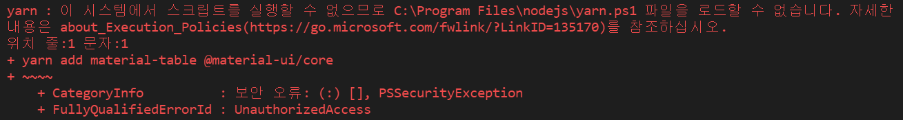

# yarn 설치

# 참고자료

[Installation | Yarn - Package Manager](https://yarnpkg.com/getting-started/install)

[PowerShell 환경에서 yarn 작업 시 보안 오류: UnauthorizedAccess 발생 현상 :: Simple is Beautiful. (tistory.com)](https://smoh.tistory.com/446)<br>

<br>

# yarn 설치

윈도우의 경우 관리자 권한으로 실행하기 버튼을 눌러서 터미널을 실행한다.

```bash
corepack enable
npm i -g corepack
```

<br>

또는 아래와 깉이 설치를 해도 된다.

```bash
npm install --global yarn
```

<br>

# yarn 설치시 에러 발생하면?

>  참고: [[Yarn\] PowerShell 환경에서 yarn 작업 시 보안 오류: UnauthorizedAccess 발생 현상 :: Simple is Beautiful. (tistory.com)](https://smoh.tistory.com/446)<br>

<br>

윈도우에서 yarn 사용시 아래와 같이 에러가 발생한다.



<br>

파워쉘을 열어서 아래와 같이 입력해준다. 또는 관리자 권한으로 파워쉘을 열어서 아래의 명령어를 수행

```bash
Set-ExecutionPolicy Unrestricted
```

<br>

변경된 파워쉘 정책을 확인하기 위해 아래와 같이 입력해서 확인해보자.

```bash
ExecutionPolicy

-- 아래와 같은 결과가 나타나면 정상수행된 것이다.
Unrestricted
```

<br>

# 설치 확인

```bash
yarn --version

# 출력결과
1.22.15
```

<br>

# package.json 의 라이브러리를 지우고 반영하고 싶을때

> 참고: [yarn prune | Yarn](https://classic.yarnpkg.com/en/docs/cli/prune)<br>

npm 에서는 `prune` 라는 명령어로 이런 동작을 할 수 있었다.<br>

yarn 에서는 `prune` 명령어가 필요없다. `yarn install` 명령어를 사용하면, package.json 을 그대로 반영해서 새로 추가된 것은 install 하고, 없는 것은 삭제해서 반영한다.<br>

```bash
yarn install 
```

<br>