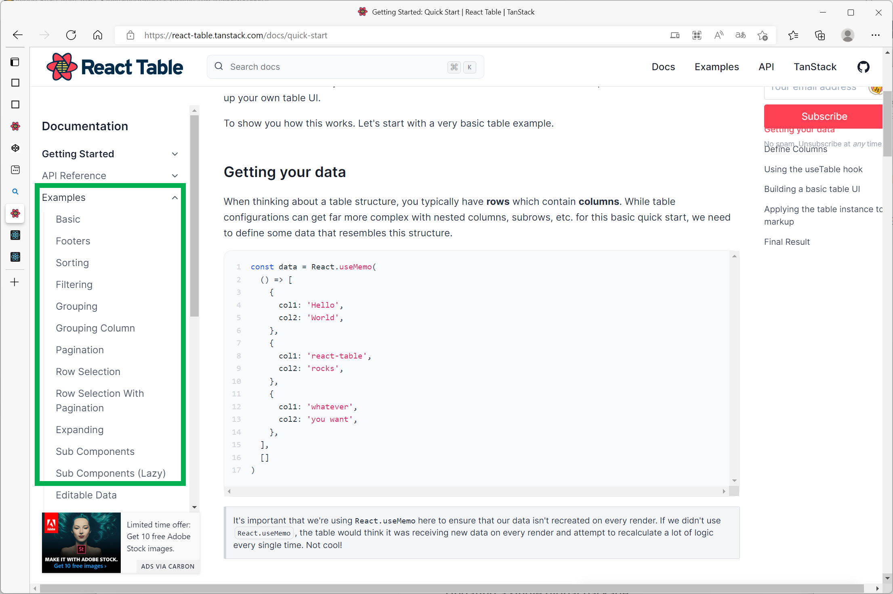

# 그리드 라이브러리 조사 - react-table

<br>

## 설치

```bash
npm install --force --save-dev react-table
```

<br>

## 처음 접할 때 확인하면 좋은 것들

처음 접할때는 가급적 [Getting Started: Quick Start | React Table | TanStack](https://react-table.tanstack.com/docs/quick-start) 에서 간단한 API의 구성이라던가, 문법을 확인하면 편하다. 함수형 컴포넌트가 익숙하지 않으면, 잠시 시간내서 스터디 하자. 내 경우는 출퇴근때 억지로 함수형 컴포넌트 관련 글을 읽고 파악했다.ㅠㅠ<br>

어차피 일하는게 스터디한 것을 적용하는 거고, 스터디하는게 일에 적용하려고 스터디하는 게 개발자의 일상인 것 같다. 그리고 여기에 쁘라스로 결국은 스터디한 것을 어딘가에 꼭 적어두게 된다. 나중에 삽질하게 되서..<br>

그리고 예제들은 다음 캡처사진처럼 왼쪽 사이드바에 매우 많아서 소규모 기능들만 골라가면서 적용이 가능하다.<br>

<br>



<br>

## 기본적인 형식

아주 직관적으로 단순한 예제로 예를 들어본 예제다.

### column 명과 테이블이 사용할 데이터 지정

```jsx
// 테이블 컴포넌트 정의 
// (Table 이라는 이름 대신 다른 이름을 사용해도 된다. 대신 이렇게 하면 아래의 JustSampleTable 내의 <Table> 태그도 수정해줘야 한다.)
function Table({columns, data}) {
    // 컴포넌트 정의 
}

const JustSampleTable = () => {

	const playerColumns = [
		{Header : 'player', accessor: 'playerName'},
		{Header : 'age', accessor: 'playerAge'},
		{Header : 'team', accessor: 'playerTeam'}
	]

	const playerData = [
		{playerName: 'Jordan', playerAge: 53, playerTeam: 'Bulls'},
		{playerName: 'Iverson', playerAge: 39, playerTeam: 'Sixers'},
		{playerName: 'Mbape', playerAge: 21, playerTeam: 'Paris'}
	]

	return (
		<div>
			<Table columns={playerColumns} data={playerData}/>
		</div>
	);
};
```

`accessor` 라는 컬럼에는 `data` 라는 `props` 로 전달될 데이터.. 나머지 설명들은 내일 점심시간에...으... 시간이 압도적으로 부족하군,.<br>

<br>

## 첫번째 예제

> 참고자료: 
>
> - [Examples: Basic | React Table | TanStack](https://react-table.tanstack.com/docs/examples/basic)
> - [tannerlinsley/react-table - CodeSandbox](https://codesandbox.io/s/github/tannerlinsley/react-table/tree/v7/examples/basic?file=/src/makeData.js)

<br>

가장 기본적인 예제다. 

**JustSampleTable.jsx**<br>

```jsx
import React from 'react'
import { useTable } from 'react-table'


function Table({columns, data}) {
	const{
		getTableProps, getTableBodyProps, headerGroups, rows, prepareRow
	} = useTable({columns, data,})

	return (
		<table {...getTableProps()}>
			<thead>
				{headerGroups.map(headerGroup => (
					<tr {...headerGroup.getHeaderGroupProps()}>
						{headerGroup.headers.map(column => (
							<th {...column.getHeaderProps()}>
								{column.render('Header')}
							</th>
						))}
					</tr>
				))}
			</thead>
			<tbody {...getTableBodyProps()}>
				{rows.map((row, i) => {
					prepareRow(row)
					return (
						<tr {...row.getRowProps()}>
						  {row.cells.map(cell => {
							return <td {...cell.getCellProps()}>{cell.render('Cell')}</td>
						  })}
						</tr>
					  )
				})}
			</tbody>
		</table>
	)
}

const JustSampleTable = () => {

	const playerColumns = [
		{Header : 'player', accessor: 'playerName'},
		{Header : 'age', accessor: 'playerAge'},
		{Header : 'team', accessor: 'playerTeam'}
	]

	const playerData = [
		{playerName: 'Jordan', playerAge: 53, playerTeam: 'Bulls'},
		{playerName: 'Iverson', playerAge: 39, playerTeam: 'Sixers'},
		{playerName: 'Mbape', playerAge: 21, playerTeam: 'Paris'}
	]

	return (
		<div>
			<Table columns={playerColumns} data={playerData}/>
		</div>
	);
};

export default JustSampleTable;
```

