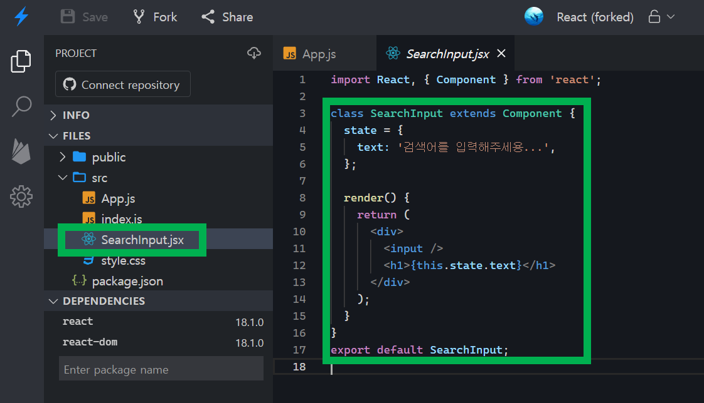
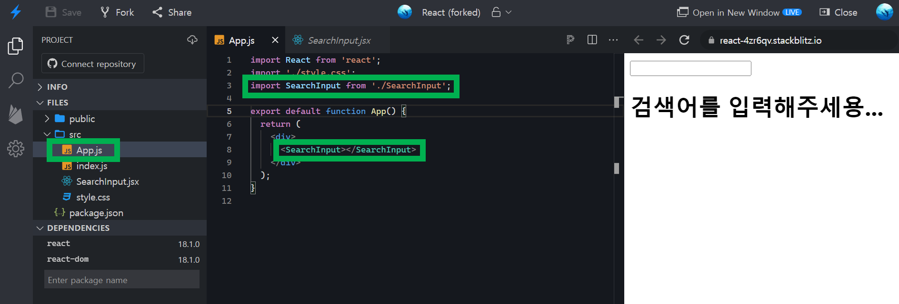
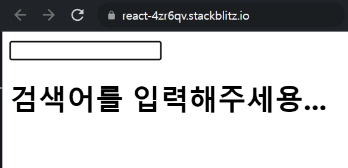
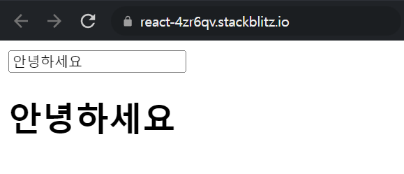
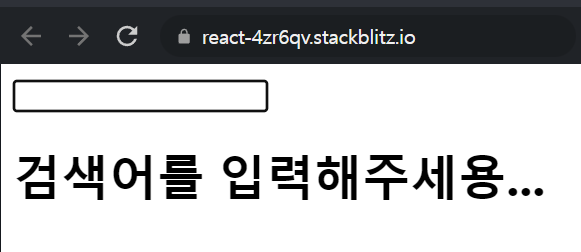

# 리액트에서 INPUT 태그 다루기

작성한 코드는 https://stackblitz.com/edit/react-4zr6qv?file=src/SearchInput.jsx 에서 확인할 수 있다.<br>

<br>

# 프로젝트 세팅

input 태그 용도의 컴포넌트 작성<br>

`SearchInput.jsx` 라는 파일을 만들고 아래와 같이 코드를 작성한다.<br>



<br>

코드는 아래와 같다.

```jsx
import React, { Component } from 'react';

class SearchInput extends Component {
  state = {
    text: '검색어를 입력해주세용...',
  };

  render() {
    return (
      <div>
        <input />
        <h1>{this.state.text}</h1>
      </div>
    );
  }
}
export default SearchInput;
```

<br>

App.js 는 아래와 같이 코드를 작성해주자.<br>

App.js 의 위치를 캡처로 남겨놓으면 좋을 것 같아서 캡처로 남겨두었다.<br>

> 뒤에서부터는 코드 캡처를 가급적 생략 예정



<br>

App.js 의 코드는 아래와 같다.

```jsx
import React from 'react';
import './style.css';
import SearchInput from './SearchInput';

export default function App() {
  return (
    <div>
      <SearchInput></SearchInput>
    </div>
  );
}
```

<br>

# SearchInput 엘리먼트 코드 작성

input 태그에 대한 event 핸들러는 react 에서 onChange 라는 props에 매핑해주면 된다.<br>

예를 들면 아래와 같이 작성한다.<br>

`onChange` 이벤트가 발생하면, `handleInputChange` 라는 함수를 호출한다.<br>

이 `handleInputChange` 함수는 `state.text` 를 input 태그의 text로 세팅하게끔 바꿔둔 상태다.<br>

그리고 h1 태그의 텍스트는 `state.text` 를 바인딩 해줬다.<br>

따라서 `state.text` 가 변경될 때마다 h1에 변경된 텍스트의 내용이 반영된다.<br>

<br>

```jsx
<div>
  <input onChange={this.handleInputChange} />
  <h1>{this.state.text}</h1>
</div>
```

<br>

그러면 이제 handleInputChange 함수를 구현해줘야, onChange 이벤트가 발생할 때에 대한 동작을 정의할 수 있다.<br>

```jsx
state = {
  text: '검색어를 입력해주세용...',
};

handleInputChange = (e) => {
    if (e.target.value === '') {
      this.setState({
        text: '검색어를 입력해주세용...',
      });
      return;
    }
    this.setState({
      text: e.target.value,
    });
  };
```

<br>

input 이벤트가 발생할 때마다 state 를 변경시켜주는 코드다. state가 변경되었을 경우에 대해 h1 태그에 위에서 이미 state 내의 text 속성인 `state.text` 를 바인딩해줬었다.<br>

<br>

```jsx
import React, { Component } from 'react';

class SearchInput extends Component {
  state = {
    text: '검색어를 입력해주세용...',
  };

  handleInputChange = (e) => {
    if (e.target.value === '') {
      this.setState({
        text: '검색어를 입력해주세용...',
      });
      return;
    }
    this.setState({
      text: e.target.value,
    });
  };

  render() {
    return (
      <div>
        <input onChange={this.handleInputChange} />
        <h1>{this.state.text}</h1>
      </div>
    );
  }
}
export default SearchInput;
```

<br>

초기상태



<br>

검색어를 입력하면 아래와 같이 h1 텍스트가 함께 변한다.<br>



<br>

검색어를 지우면 아래와 같이 초기상태가 된다.<br>



<br>

자세한 코드는 https://stackblitz.com/edit/react-4zr6qv?file=src/SearchInput.jsx 에서 확인가능하다 오바<br>

알았다 오바<br>

<br>