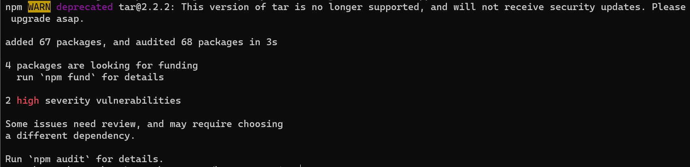
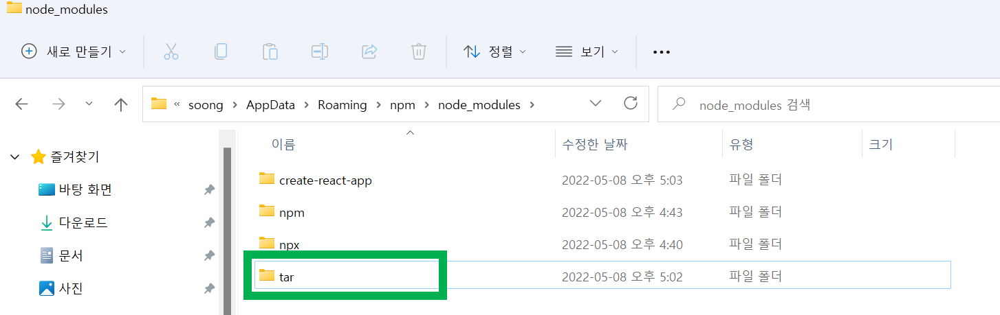
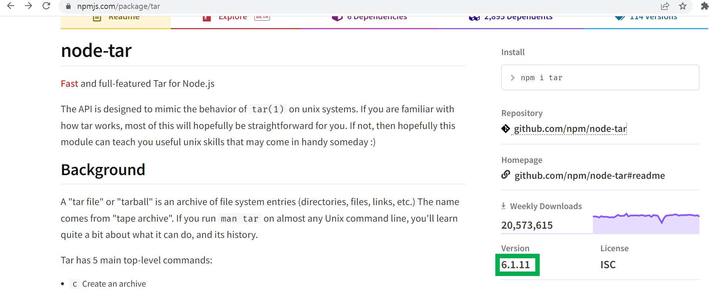
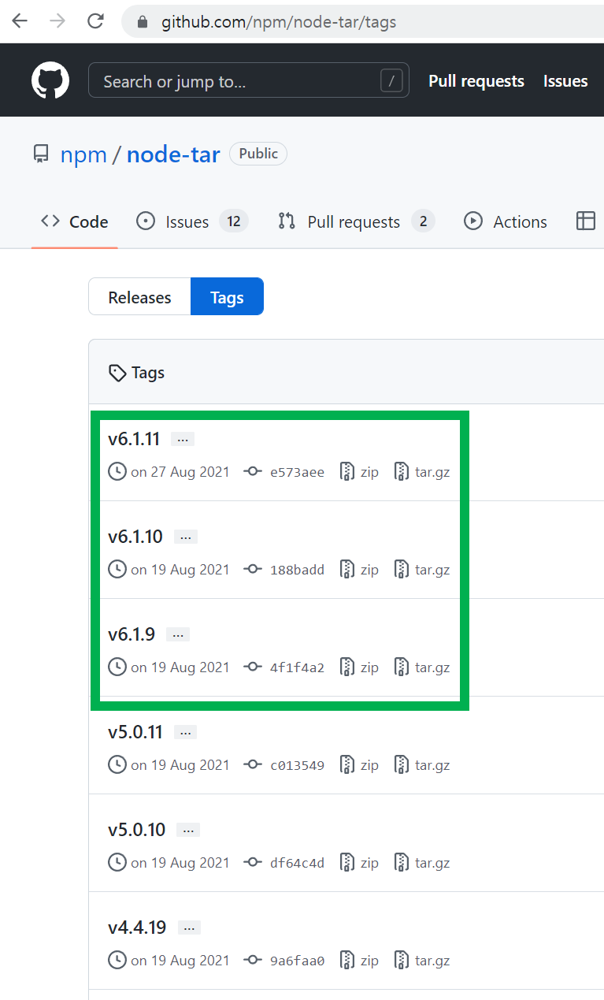

# Node.js 설치, NPM 업그레이드, NPX 최신버전 설치, Create-React-App 설치

## node.js 설치

https://nodejs.org/ko/ 을 방문해서 가급적 LTS 버전으로 다운로드, 설치 진행<br>

<br>

## NPM 최신 버전 업그레이드

NPM 을 최신버전으로 업그레이드 하는 것이 개발시의 정신건강에 좋다.(협박아님)<br>

```bash
npm install -g npm
```

<br>

## NPX 설치

NPM 을 최신버전으로 업그레이드 하면 NPX 역시도 그에 맞는 버전으로 맞춰져 있기에 이것은 패스<br>

<br>

## NPX 로 CREATE-REACT-APP 을 활용해 리액트 앱 생성

NPM의 TAR 패키지 관련 이슈가 있기도 하고, 가급적 최신 버전으로 앱을 생성하고 싶으면 create-react-app 을 npm 으로 생성하면 된다.<br>

> npx 로 react 를 다운로드 받을 때 `create-react-app` 이라는 패키지를 임시로 다운로드 받은 후에 임시로 다운받았던 `create-react-app` 을 이용해서 리액티 앱을 생성한다.<br>

<br>

## NPM 으로 CREATE-REACT-APP 설치

> 참고 : [Create-React-App](https://create-react-app.dev/ )<br>

<br>

```bash
npm instsall -g create-react-app
```

<br>

## 리액트 앱 만들기

```bash
# 아래와 같이 하면 최신버전의 react로 hello-world1 이라는 이름의 프로젝트가 생성된다.
npx craete-react-app hello-world1
# 아래와 같이 하면 전역으로 설치해둔 npm 버전을 이용해서 hello-world2 라는 이름의 프로젝트가 생성된다.
npm craete-react-app hello-world2
```

<br>

내 경우는 `npx craete-react-app hello-world` 와 같은 형식으로 설치했다.<br>

<br>

## 참고) tar 최신버전 설치

> 참고자료
>
> - [tar 2.2.2 관련 이슈](https://joylee-developer.tistory.com/118 )

NPM 을 이용해서 `create-react-app` 을 설치하다 보면 아래와 같은 에러메시지를 접하게 된다. 



<br>

개발PC 내에 설치된 `tar` 패키지를 삭제 후에 tar 버전을 6대로 올리면 되기는 한데, 이게 조금 고질적인 문제이기는 한것 같다. 내 경우는 끝까지 WARN 메시지가 사라지지 않았다.<br>

삭제 후에는 아래와 같이 6.x 버전을 설치해준다.<br>

```bash
npm install -g tar@6
또는
npm i tar
```

<br>

**tar 패키지 삭제 방법(윈도우)**<br>

`window` 의 경우 `C:\Users\soong\AppData\Roaming\npm\node_modules` 가 node 모듈들의 경로다. 아래 그림에 보이는 tar 디렉터리를 삭제한다.<br>



<br>

**tar 버전을 6으로 설치하는 이유**<br>

tar 의 최신 버전은 `6.x` 대이다. 더 많은 버전은 [https://github.com/npm/node-tar/tags](https://github.com/npm/node-tar/tags) 에서 확인 가능하다.<br>

<br>



<br>

그리고 자세한 여러가지 버전들은 github 리포지터리에서 확인가능하다.<br>

[https://github.com/npm/node-tar/tags](https://github.com/npm/node-tar/tags) 을 방문하면 아래와 같이 `6.x` 대의 버전들이 최신 버전임을 확인할 수 있다.<br>




