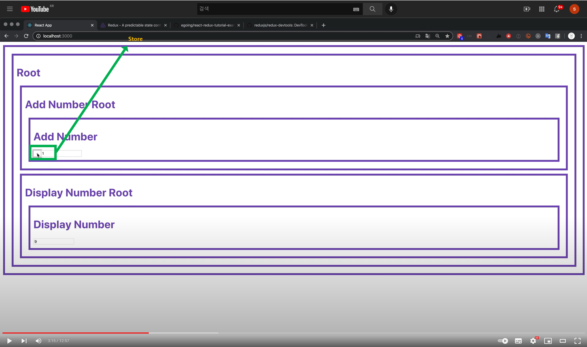

# 4. 순수 Redux 사용하기


# 참고강의

[(56) React Redux - 4. redux를 도입 - YouTube](https://www.youtube.com/watch?v=SaXgXcgJ5xg) <br>

<br>

# props 사용 vs redux 사용시의 차이점

참고로 아래의 컴포넌트 들간의 협력방식은 컴포넌트의 props 를 이용했을 경우에 대한 협력방식이다.


<br>

반면 store 를 이용하는 방식은 아래와 같이 개별 컴포넌트가 store라는 컴포넌트에 데이터를 쌓아두고 이 store 내의 데이터가 변경되는지를 subscribe 하게끔 하는 방식이다.



<br>

# redux 의존성 설치, 환경 셋업

npm install redux 를 한다.


<br>

# store.js

/src 아래에 store.js 생성


<br>

store.js 파일에는 아래와 같이 redux 라이브러리의 createStore(function callback) 함수를 import 한다. 그리고, 이것을 사용할 있도록 export default 로 선언해둔다.

```javascript
createStore(function (state, action){…})
```

createStore 내의 인자로 들어오는 function 은 reducer 라고 부른다. 이 reducer는 state, action 을 인자로 받는다. state 는 데이터, action 은 이 데이터에 취해져야 하는 동작을 의미한다.


<br>

# dev tools 세팅

DEV Tools 추가


<br>

# AddNumber : store로 이벤트 방출(dispatch)

이벤트를 방출하기 위해서는 아래와 같이 store.dispatch(…) 메서드를 사용한다.<br>

props로 이벤트를 위로 올려보내던 부분들을 store.dispatch(…) 메서드를 onClick 메서드 내에서 실행할 수 있도록 변경해줬다.<br>


<br>

store에 dispatch만 하는 것은 store.js 내에 아무 로직도 작성하지 않으면 아래 그림과 같이 아무일도 일어나지 않는다.


<br>

# store.js : state, action 처리 로직 추가

store.js 내의 createStore() 메서드 내의 callback 함수인 reducer 내에 state 관련 로직을 작성해준다.

- state 가 undefined 일 경우에는 {number:0} 이라는 초기값을 지정해준다.
- action.type == ‘INCREMENT’ 일 경우는 기존 state에 state.number 에 action.size 를 더한 값으로 업데이트해준다.


<br>

아래와 같이 store 의 state 에 값이 업데이트 되었음을 볼 수 있다.


<br>

# AddNumber : props 로직 제거 & state 로직으로 전환

이제 아래와 같이 props.number로 세팅하던 부분을 삭제해준다.


<br>

props를 사용하던 부분을 아래와 같이 this.state.number 를 사용하도록 변경해줬다.


<br>

# DisplayNumber 측 코딩 - subscribe (store 이벤트 리슨)

아직까지는 이벤트 핸들러에서 UI이벤트가 발생했을 때 Store를 변경해두는 동작만을 해둔 상태다.<br>

아직은 subscribe로 store가 변경됐을 때에 대한 동작을 지정하지 않았기 때문에 DisplayNumber 컴포넌트의 텍스트의 값은 변경되지 않았다.<br>


<br>

store의 값이 변경되었을 때 아래의 render() 메서드가 호출되어야 하는데, 이 render() 메서드를 호출시켜줄만한 마땅한 방법이 아직은 없다.<br>

store에서 값이 변경받았음을 통지 받아야 render를 리런데링할 수 있게끔 해줄 수 있다.<br>


<br>

constructor 로 컴포넌트가 초기화 될 때에<br>

store 가 지금 현재 컴포넌트 내의 state를 구독할 수 있도록 subscribe메서드를 호출한다. 이때 호출하는 subscribe()메서드 내에 들어가는 function 에서는 현재 컴포넌트 내의 state 값을 업데이트하는 역할을 한다.<br>

store.subscribe를 호출해서 지금 컴포넌트와 연결(bind(this)) 해준다. 그리고 subscribe 할 때 사용할 콜백 함수를 등록한다.<br>

store.subscribe를 하면 store가 변경되었을 때 callback 함수가 호출된다. 이 callback 함수에서는 state 값을 store의 state 값으로 업데이트해주는 작업을 수행한다.<br>


<br>

subscribe로 연결해준 후에는 아래와 같이 업데이트가 잘 되는 것을 볼 수 있다.


<br>

# DisplayNumber : props 로직 제거

**props 관련 코드 제거 작업**

아래는 props 관련 코드가 존재하는 이전의 코드다.

이제는 DisplayNumber 컴포넌트의 상위컴포넌트인 DisplayNumberRoot 컴포넌트 내에서는 props 관련 코드들을 제거해도 된다.


<br>

아래는 props 관련 코드를 제거한 코드다.


<br>

아래는 AddNumber 컴포넌트에서 props 관련 코드를 제거하자.


<br>

아래는 AddNumber 컴포넌트에서 pops 를 제거한 코드다.


<br>

DisplayNumber 컴포넌트에서도 props 를 제거해줘야 한다.


<br>

DisplayNumber 컴포넌트에서 props 를 제거해줬다.


<br>

상위 컴포넌트로 props를 전파하고 그 아래로 또 이벤트를 전파하던 이전의 코드에서 props 를 이용한 데이터 전파 로직들을 모두 제거한 이후에도 아래와 같이 정상적으로 동작함을 알 수 있다.


