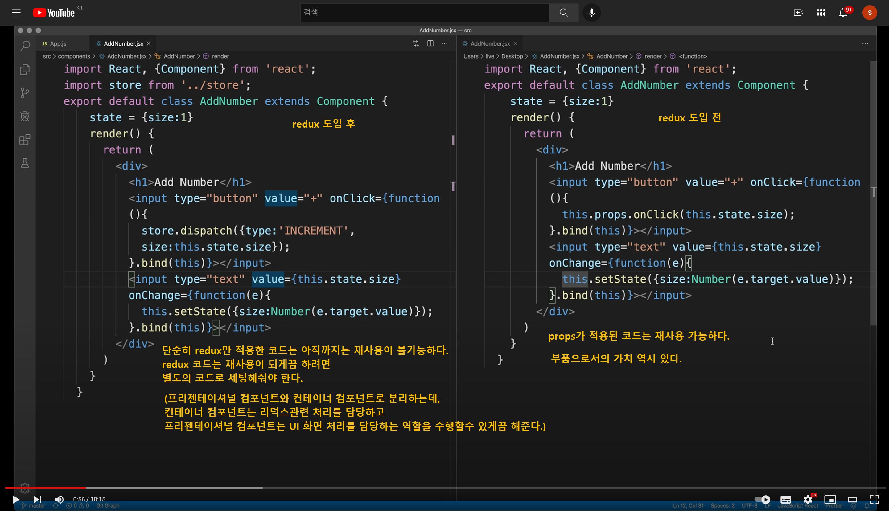
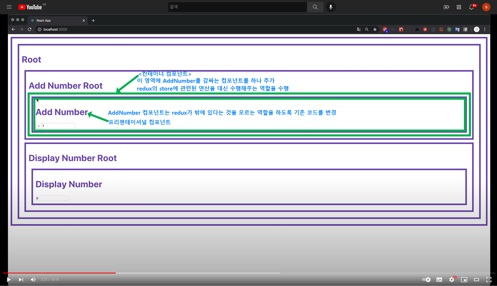
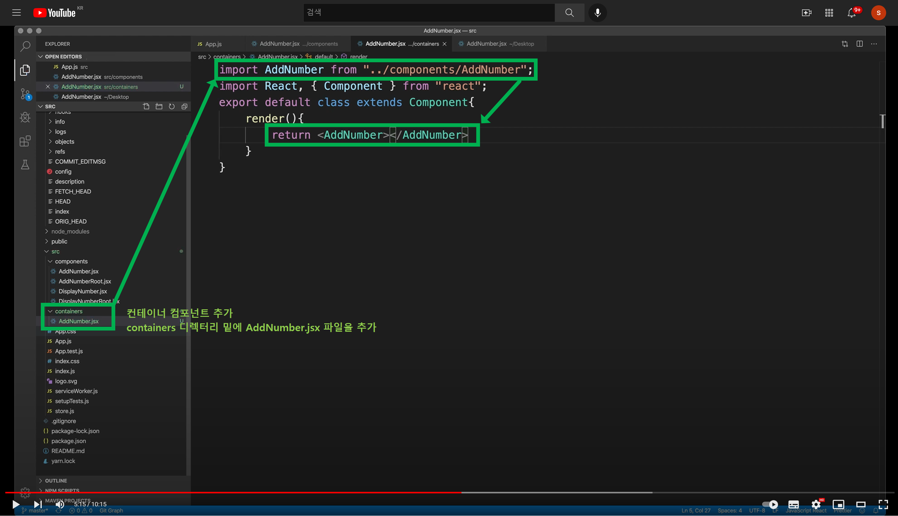
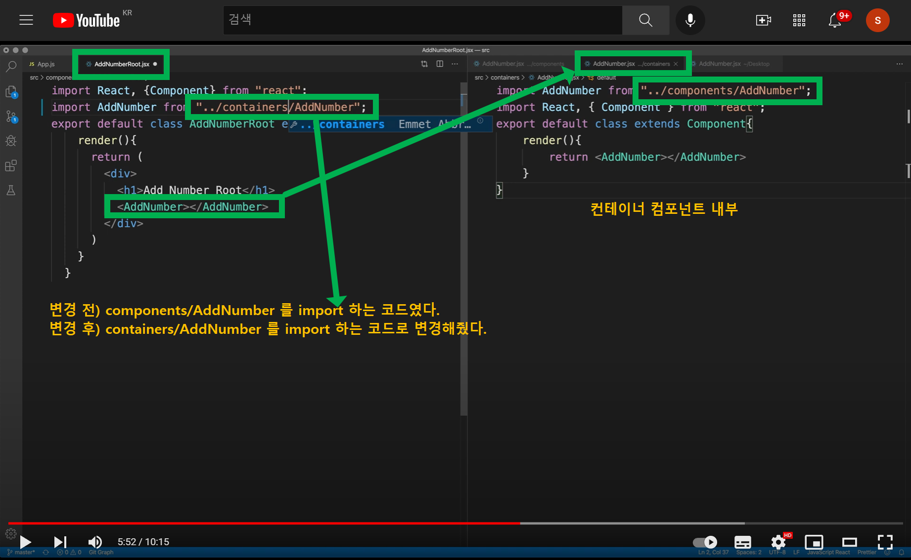
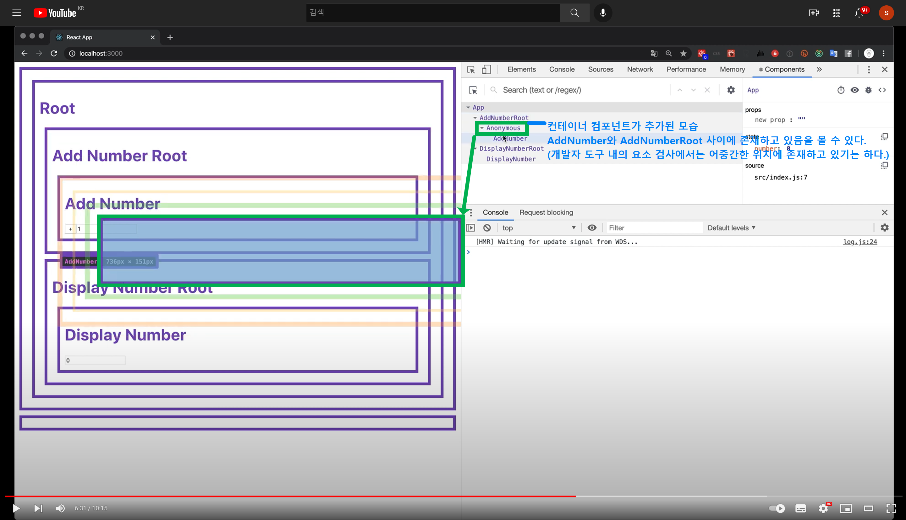
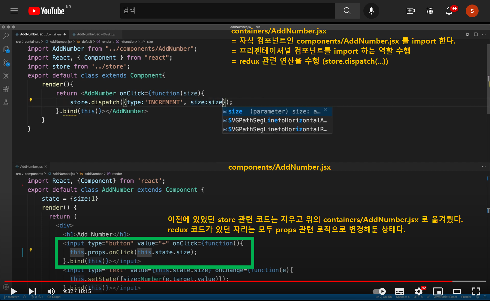
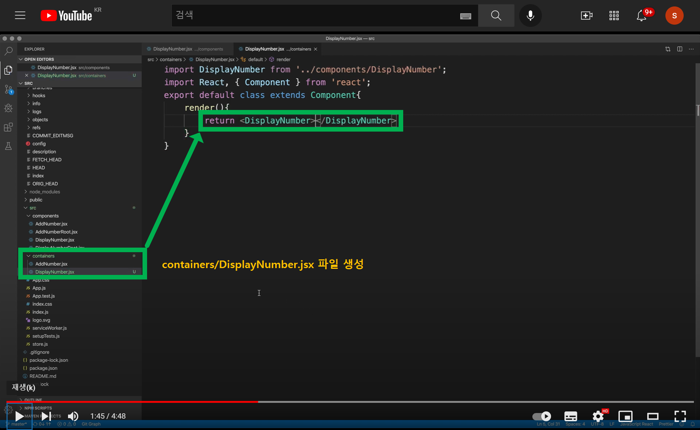
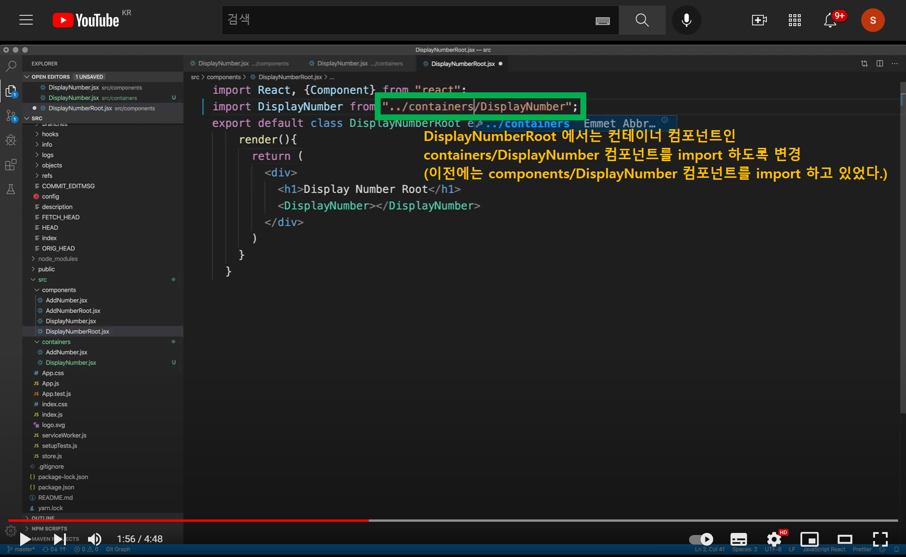
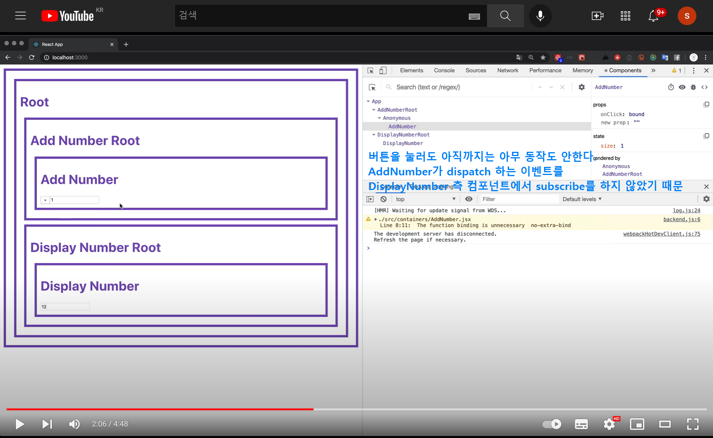
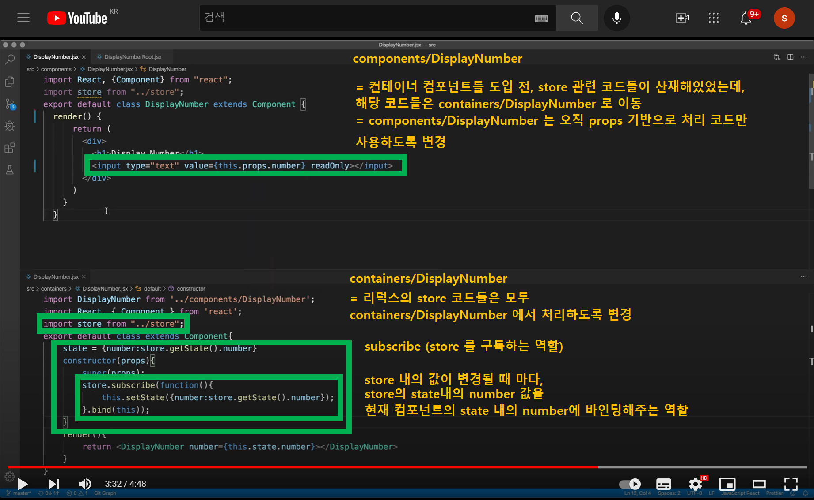

# 5. redux 기능과 react 기능이 분리된 컴포넌트 구조로 전환

단순히 redux 만 적용한 코드는 아직까지는 재사용이 불가능하다. 그 자체로 쓸모가 있는 코드이지만, 이 컴포넌트를 껍데기로 해서 다른 컴포넌트에 그 껍데기를 가져다 쓰기 힘들다. 쉽게 이야기하면, UI에 적용된 스타일과 앨리먼트의 배치들을 그대로 복제해서 쓸수 있어야 하는데, 얼마 전 작성한 redux 코드는 redux와 UI 로직이 혼재해있기에 UI 배치 코드/props 관련 코드만 떼어내어 재사용하기 쉽지 않은 구조의 코드다. 

 

# 참고강의

- [(56) React Redux - 5.1. react 컴포넌트에서 redux에 종속된 기능을 제거 - YouTube](https://www.youtube.com/watch?v=ObCKEaKFRac)
- [(60) React Redux - 5.2. 컴포넌트의 재사용성을 높이기 위해서 container 컴포넌트 도입 - YouTube](https://www.youtube.com/watch?v=ZmM4JSpIh6E)

 

# 5.1 AddNumber 컴포넌트를 Container, Components 계층으로 용도 분리

아래는 Redux 도입 후의 AddNumber 컴포넌트의 코드와 Redux 도입 후의 AddNumber 컴포넌트의 코드를 비교한 캡처다.

 

Redux가 적용된 코드는 아래의 그림에서 보이는 컨테이너 컴포넌트 영역에 분리해두고, 순수한 UI/앨리먼트/props 관련 로직들은 프리젠테이셔널 컴포넌트 영역으로 분리하면 좋다. 이때 컨테이너 컴포넌트는 프리젠테이셔널 컴포넌트를 import 해서 사용하게 된다.

 

이제 containers/AddNumber 컴포넌트를 생성하자. containers/AddNumber 컴포넌트는 흔히 컨테이너 컴포넌트라고 부른다. 반면 components/AddNumber 컴포넌트는 흔히 프리젠테이셔널 컴포넌트라고 부른다. 

containers/AddNumber.jsx 코드의 초기 구성 코드는 아래와 같다. 

- components/AddNumber 컴포넌트를 import 한다.
- compnenets/AddNumber 컴포넌트를 render 한다.
- components/AddNumber 컴포넌트를 흔히 프리젠테이셔널 컴포넌트라고 부른다.

 

아래는 AddNumberRoot 컴포넌트와 containers/AddNumber 컴포넌트 사이으이 관계를 정리해둔 코드다. 

AddNumber 컴포넌트 입장에서는 import 할 컴포넌트가 이전 까지는 components/AddNumber 컴포넌트를 import 했었지만, 이제는 containers/AddNumber 컴포넌트를 import 하게끔 해준다. 

즉, 부모 역할의 상위 컴포넌트에서는 컨테이너 컴포넌트를 import 하고, 컨테이너 컴포넌트는 프리젠테이셔널 컴포넌트를 import 하게끔 해주는 것. 

 

위의 코드가 적용된 후의 모습은 아래와 같다. 개발자 도구에서 확인해보면, 컨테이너 컴포넌트는 개발자 도구에서 Anonymous 컴포넌트로 표기된다. 

컨테이너 컴포넌트가 AddNumber와 AddNumberRoot 사이에 존재하고 있다.

 

**containers/AddNumber 컴포넌트** 

이렇게 AnonymousComponent 로 추가된 containers/AddNumber 는 redux로 수행해야 하는 동작들을 이곳에 기술해준다. 

그리고 기존에 있던 components/AddNumber는 다시 props 관련 코드로 바꿔서, 재사용이 가능하도록 변경해준다.

 

# 5.2 DisplayNumber 컴포넌트를 Container, Componets 계층으로 용도 분리

5 .1 에서 살펴봤던 작업을 동일하게 DisplayNumber 에서도 수행해주자.

containers/DisplayNumber.jsx 파일을 생성하고, 이 컨테이너 컴포넌트 내에 아래와 같이 코드를 작성해보자.

 

DisplayNumberRoot 컴포넌트는 컨테이너 컴포넌트인 containers/DisplayNumber 를 import 하도록 변경해주자. (이전 코드는 프리젠테이셔널 컴포넌트읜 components/DisplayNumber 컴포넌트를 바로 import 해서 사용하는 코드였다.)

 

아직까지는 버튼을 눌러도 아무 동작도 안한다. 

AddNumber가 dispatch 하는 이벤트를 DisplayNumber 컴포넌트에서 subscribe 하지 않았기 때문이다.

 

components/DisplayNumber, containers/DisplayNumber 컴포넌트에 추가해준 내용들은 모두 그림에 텍스트로 설명을 추가해뒀다.

