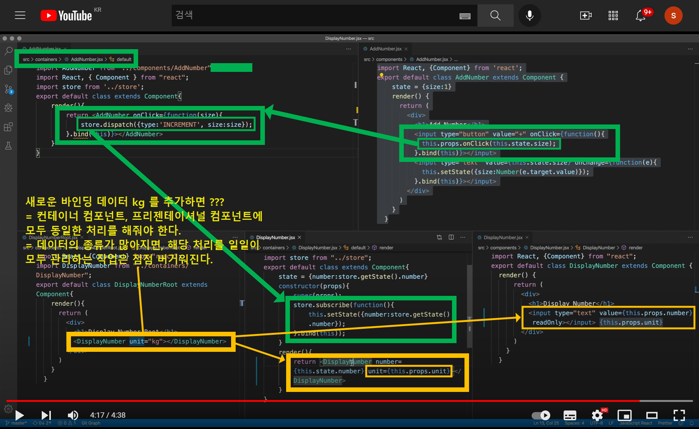

# 6.1 React-Redux 를 도입하면 좋은 점

[5 .redux기능과 react 기능이 분리된 컴포넌트 구조로 전환](https://github.com/soon-good/kr-stock-calculator/blob/main/study/FRONTEND/%5B%EC%83%9D%ED%99%9C%EC%BD%94%EB%94%A9%20%EA%B0%95%EC%9D%98%20%ED%95%84%EA%B8%B0%5D%20React/%5BFRONTEND%5D-%EC%83%9D%ED%99%9C%EC%BD%94%EB%94%A9-5.%20redux%EA%B8%B0%EB%8A%A5%EA%B3%BC-react%EA%B8%B0%EB%8A%A5%EC%9D%B4-%EB%B6%84%EB%A6%AC%EB%90%9C-%EC%BB%B4%ED%8F%AC%EB%84%8C%ED%8A%B8-%EA%B5%AC%EC%A1%B0%EB%A1%9C-%EC%A0%84%ED%99%98.md) 문서에서는 redux와 react의 기능을 분리했다. 컴포넌트 내에 적용된 스타일, UI 배치, props 관련 코드와 같은 UI관련 코드는 재사용되면 좋다. 특히 CSS 스타일관련 코드들은 재사용되야 정신건강에 이롭다. 이런 이유로 redux 관련 코드들은 컨테이너 컴포넌트(e.g. container/AddNumber.jsx)에 따로 모아둔 후에 프리젠테이셔널 컴포넌트(components/AddNumber.jsx) 를 import 하도록 해서 계층을 분리해줬었다.<br>

<br>

그런데, 이렇게 용도분리를 해둬도, 불편한점이 하나 더 있다. 새로 처리해야 하는 데이터 바인딩이 있을 때 컨테이너 컴포넌트와 프리젠테이셔널 컴포넌트에 모두 props를 추가해서 별도의 코드들을 일일이 작성해줘야 한다는 점이다. 데이터를 바인딩할 props 의 종류가 적다면, 그렇게 문제가 되지는 않는다. 하지만, 바인딩할 데이터의 종류가 많아질 수록 갈수록 코드관리가 복잡해진다. <br>

이런 이유로 순수 redux 보다는 react-redux를 사용하는 것이 좋다. react-redux 는 조금 쉽게 설명하면 redux 관련 코드들을 react 에서 사용하기 편리하도록 공통된 내용들을 잘 추상화해둔 라이브러리 라고 이해하면 쉽다.<br>

# 참고) 약칭정의

**connect 함수의 원형**

문서 곳곳에서 connect 함수를 언급할 때 인자값의 약칭을 사용해 아래의 표현으로 connect() 함수를 지칭하기로 했다.

```jsx
connect(m1,m2)(WrappedComponent);
// m1 : mapStateToProps
// m2 : mapDispatchToPRops
// WrappedComponent : 전달해줄 프리젠테이셔널 컴포넌트
```

<br>

<br>

# 참고강의

[(194) React Redux - 6.1. React Redux - 필요한 이유 - YouTube](https://www.youtube.com/watch?v=ygMmY_Q-6HQ)<br>

<br>

# 내용 요약

이번 강의에서는 순수 Redux를 사용하던 코드를 `react-redux` 를 사용하는 코드로 전환한다.


<br>

순수 redux를 컴포넌트에 혼용해서 사용하면 제품에 바인딩할 데이터가 추가되어 새로운 props를 추가해줄 때마다 컨테이너 컴포넌트와, 프리젠테이셔널 컴포넌트에 각각 props 처리 코드들을 추가해줘야 한다. 작성할 props 코드들이 많지 않다면 금방 할 수 있겠지만, 경험상 처리해야 할 props의 종류가 늘어나면 늘어날 수록 컴포넌트나 파일 사이에 왔다갔다 하면서 꽤 헷갈리게 된다.



<br>

<br>