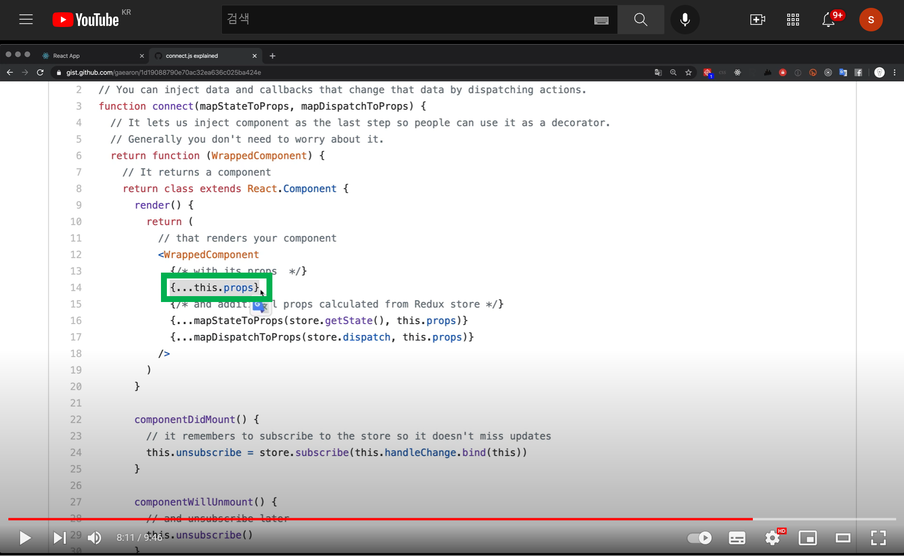
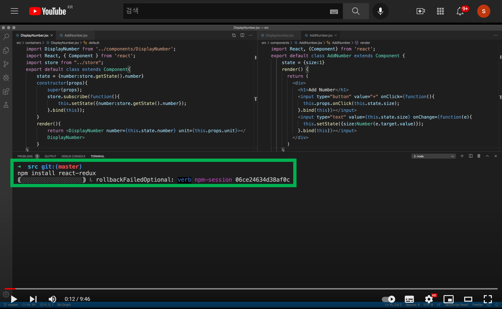
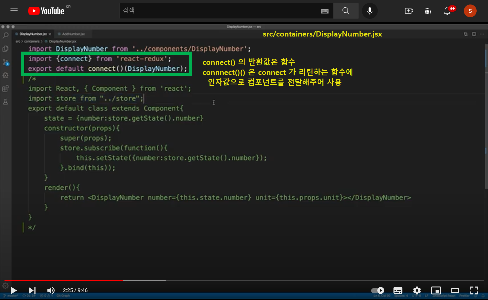
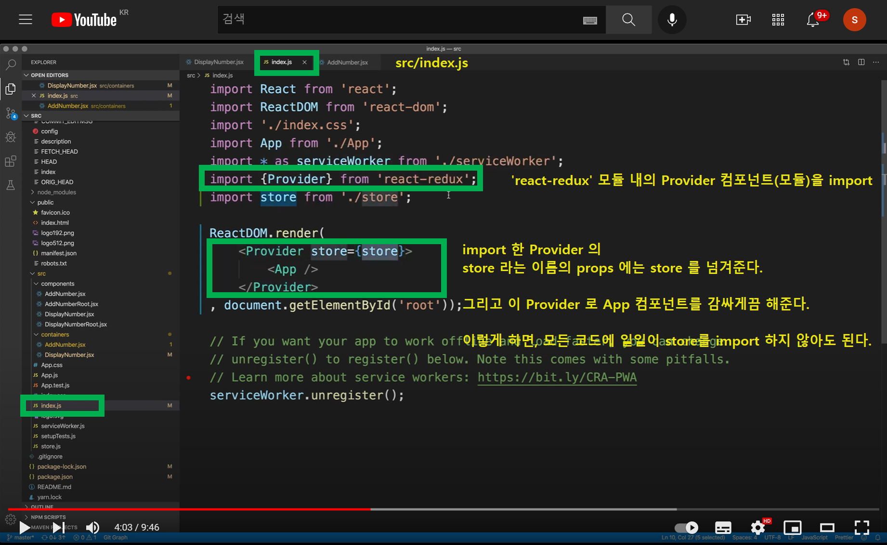
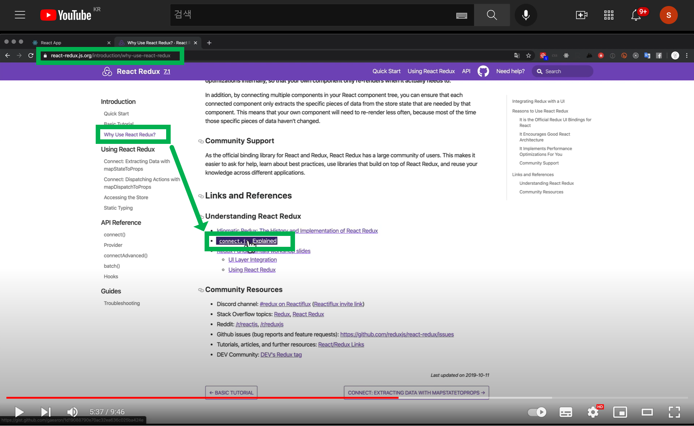
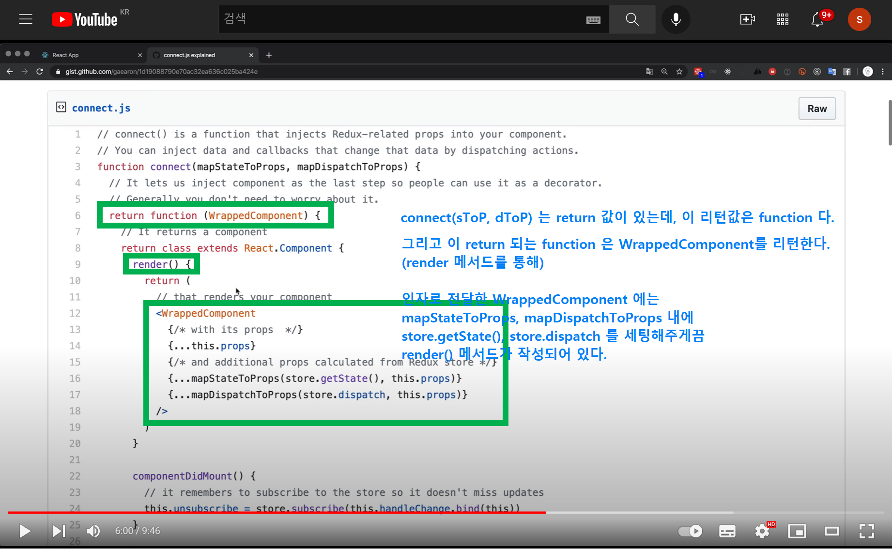
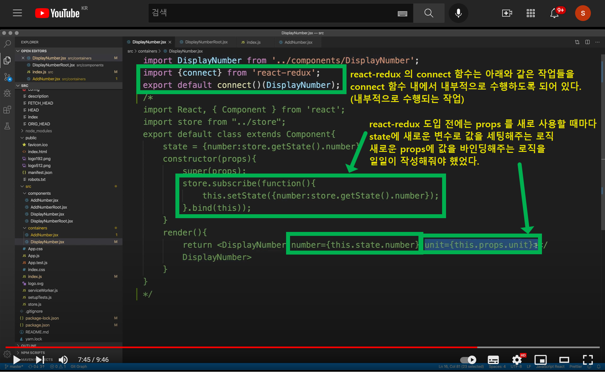
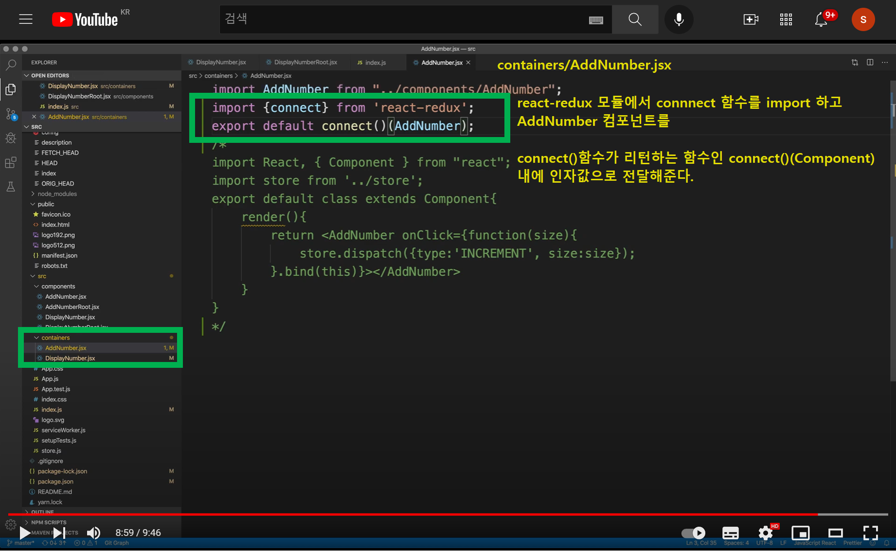

# 6.2 React Redux 도입 - connect, provider

> `react-redux` 가 도입되게 된 배경과 장점은 마치 스프링의 트랜잭션 추상화, 트랜잭션 템플릿, @Transactional 이 도입되게 된 배경과 유사한 점 이 있는 것 같다. 공통화, 추상화, 템플릿화 하여 외부로 공개 등등 이런 점이 꽤 매력있게 다가왔다.<br>
>
> 조금 더 간단하게 설명할 수 있을 것 같은데 지금 당장은 쉽게 정리가 안된다. 한번 더 정리가 필요하기는 한데, 이번 글은 일단 초벌 문서라고 생각하고 정리를 계속 진행하게 됐다<br>

<br>

react redux 는 컨테이너 컴포넌트에 적용한다. 컨테이너 컴포넌트와 프리젠테이셔널 컴포넌트로 계층을 분리하는 것은  [5 .redux기능과-react기능이-분리된 컴포넌트 구조로 전환](https://github.com/soon-good/kr-stock-calculator/blob/main/study/FRONTEND/%5B%EC%83%9D%ED%99%9C%EC%BD%94%EB%94%A9%20%EA%B0%95%EC%9D%98%20%ED%95%84%EA%B8%B0%5D%20React/%5BFRONTEND%5D-%EC%83%9D%ED%99%9C%EC%BD%94%EB%94%A9-5.%20redux%EA%B8%B0%EB%8A%A5%EA%B3%BC-react%EA%B8%B0%EB%8A%A5%EC%9D%B4-%EB%B6%84%EB%A6%AC%EB%90%9C-%EC%BB%B4%ED%8F%AC%EB%84%8C%ED%8A%B8-%EA%B5%AC%EC%A1%B0%EB%A1%9C-%EC%A0%84%ED%99%98.md) 에서 개념과 예제를 정리했었다. <br>

컨테이너 컴포넌트는 아래의 두가지 역할을 수행했었다.

- 프리젠테이셔널 컴포넌트를 import 하고 render() 함수를 통해 리턴하는 역할
- redux 관련 코드로 store 관련 코드들을 수행하는 역할

<br>

이번 문서에서부터는 react-redux를 이용해서 컨테이너 컴포넌트에 적용된 순수 redux 코드를 조금 더 공통화된 코드인 react-redux 기반의 store 처리 코드로 변경해주는 작업을 수행하는 과정을 정리할 예정이다.<br>

이렇게 할 수 있는 이유는 `connect(m1, m2)(WrappedComponent)` 함수 덕분이다. `connect(m1, m2)(WrappedComponent)` 함수는 아래와 같이 render() 를 하는 로직과 props 를 세팅하는 로직을 수행하는 함수인 function(WrappedComponent) 를 리턴한다. (함수를 리턴한다!!!)<br>



그리고 `react-redux` 의 외부에서 사용자(=개발자)는 이 함수에 컴포넌트를 전달해주는 방식으로 이러한 처리를 내재화하는 것이 가능하게 된다.<br>

<br>

# 참고) 약칭정의

**connect 함수의 원형**

문서 곳곳에서 connect 함수를 언급할 때 인자값의 약칭을 사용해 아래의 표현으로 connect() 함수를 지칭하기로 했다.

```jsx
connect(m1,m2)(WrappedComponent);
// m1 : mapStateToProps
// m2 : mapDispatchToPRops
// WrappedComponent : 전달해줄 프리젠테이셔널 컴포넌트
```

<br>

# 참고 강의

- [(194) React Redux - 6.2. React Redux - connect & provider - YouTube](https://www.youtube.com/watch?v=h5Trjjra50E) 

<br>

# 참고자료

- [React Redux | React Redux (react-redux.js.org)](https://react-redux.js.org/)
- [Why Use React Redux? | React Redux (react-redux.js.org)](https://react-redux.js.org/introduction/why-use-react-redux)
- [connect.js explained (github.com)](https://gist.github.com/gaearon/1d19088790e70ac32ea636c025ba424e)

<br>

# 의존성 설치

npm install react-redux<br>

순수 redux가 아닌 react-redux를 사용하기 위해서는 `react-redux` 모듈을 설치해야 한다.



<br>

# containers/DisplayNumber

아래와 같이 코드를 변경해준다.<br>

아직까지는 아무 동작이 없다. 컴포넌트의 내용도 지웠고, store에 관련된 내용도 따로 정의해줘야 하기 때문이다.



<br>

# src/index.js

index.js 에 아래와 같이 별도의 작업을 해준다. 프로젝트 최상위 컴포넌트 내에 ‘react-redux’ 의 Provider 컴포넌트를 import 하고, 이 Provider 컴포넌트 내의 store 라는 props 에는 store 객체를 결합해준다.<br>

이렇게 store 객체를 바인딩한 Props 컴포넌트가 App 컴포넌트를 감싸게끔 해서, 프로젝트 전역의 모든 코드에서 store 를 사용할 수 있게끔 해준다.<br>



<br>

# connect(m1, m2)(WrappedComponent) 의 의미

[React Redux | React Redux (react-redux.js.org)](https://react-redux.js.org/) 에 방문해서 Why Use React Redux? ([Why Use React Redux? | React Redux (react-redux.js.org)](https://react-redux.js.org/introduction/why-use-react-redux))라는 좌측 메뉴를 클릭하자. 그러면 나타나는 페이지에서  오른쪽에 ‘connect.js Explained’ 라고 하는 링크가 보인다. 이 링크를 클릭하자.<br>

> 또는 [connect.js explained (github.com)](https://gist.github.com/gaearon/1d19088790e70ac32ea636c025ba424e) 이 링크를 눌러서 바로 이동하자.



<br>

redux를 처음으로 만들었던 사람이 gaearon 이라는 분인데, 이 분이 설명하는 react-redux 의 초창기 코드에 대한 위키 코드가 나타난다. (react-redux에 여러가지 잡다한 코드가 추가되기 전의 초창기 코드)



<br>

이번 문서의 예제에서는 `src/containers/DisplayNumber.jsx` 내에 모든 store 코드와 컴포넌트 코드를 지우고, 아래와 같은 코드를 작성했었다.

```javascript
import DisplayNumber from '../components/DisplayNumber';
import {connect} from 'react-redux';
export default connect()(DisplayNumber);
```

`react-redux` 모듈을 사용하지 않고 순수 리덕스를 사용할때는 subscribe, dispatch 하는 로직에 대한 state와 컴포넌트 내의 props 를 따로 전달해주는 여러가지 코드들을 일일이 작성해줬었다. 이 경우 수정사항이 발생할 때마다. subscribe 측의 프리젠테이셔널 컴포넌트, 컨테이너 컴포넌트, dispatch 측의 프리젠테이셔널 컴포넌트, 컨테이너 컴포넌트 이렇게 4개 부분의 코드를 고쳐줘야 하는 불편함이 생긴다.<br>

만약 `react-redux` 모듈의 connect(m1, m2)(WrappedComponent) 메서드를 사용하면, 이렇게 유지보수시에 여러개의 코드를 여러번 자주 검사해야 하는 불편함이 간소화된다. 이런 것이 가능한 이유는 `react-redux` 모듈이 모듈 내에 react 프레임워크를 사용할 때의 요구사항들을 잘 조합해서 추상화해서 내재화했기 때문이다.<br>



<br>

이렇게 자동으로 props에 값을 바인딩해주는 부분에 대한 코드는 connect.js 내의 코드에서 아래에 하이라이트로 처리한 부분이다.


<br>

# containers/AddNumber

이번에는 AddNumber 에도 동일하게 처리를 해보자. AddNumber 에서는 store에 이벤트를 발생시켰었다. 즉 dispatch 관련 코드가 있었다. 이 component 관련 코드와 dispatch 관련 코드를 모두 주석처리한다.<br>

그리고 아래와 같이 connect()(WrappedComponent)의 인자값 WrappedComponent 인자값의 위치에 components/AddNumber 컴포넌트를 인자값으로 전달해준다.




