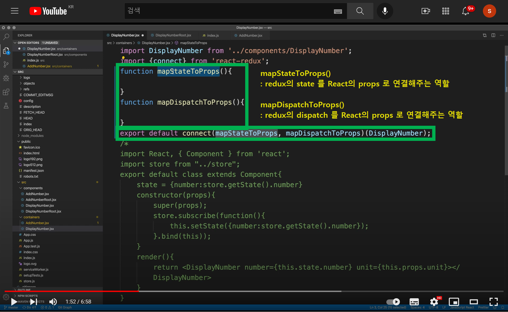
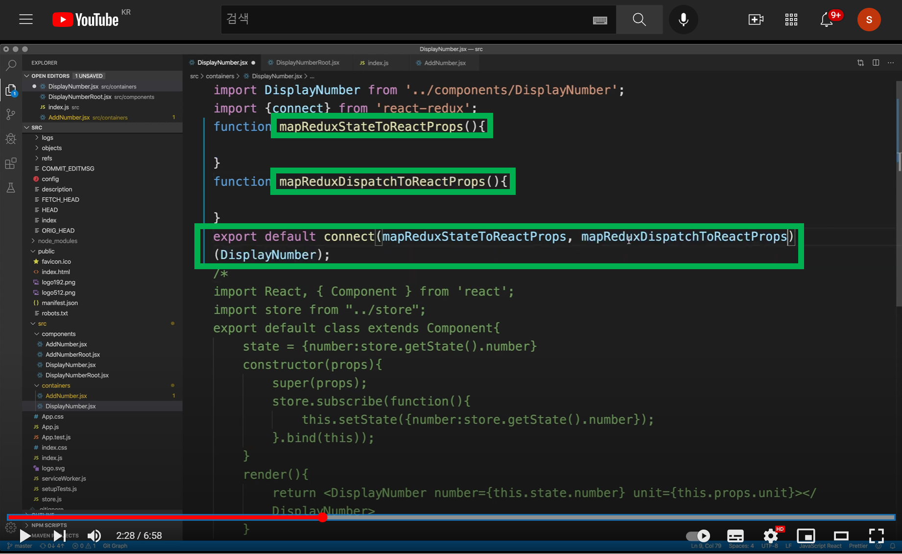
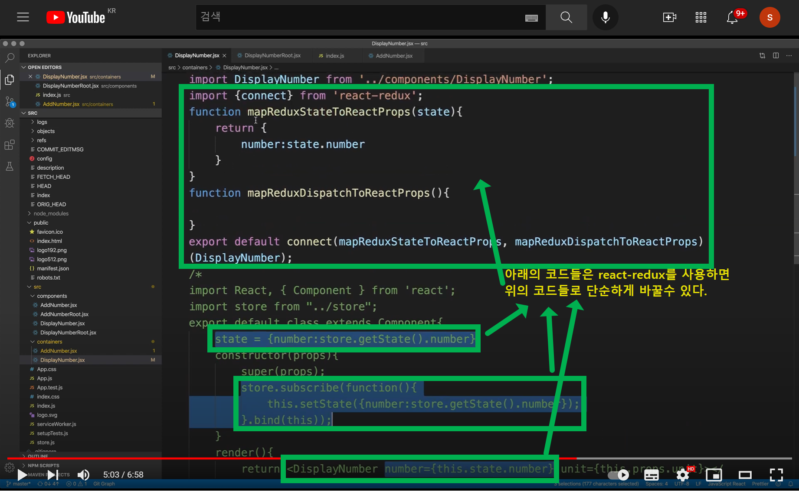
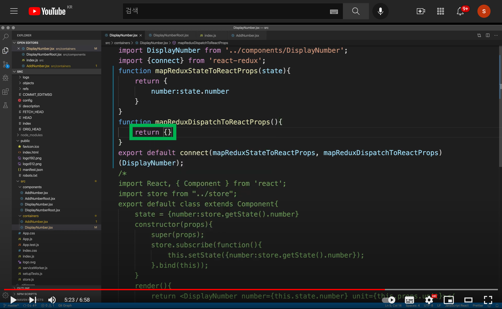

# 6.3 React Redux - mapStateToProps

**mapStateToProps, mapDispatchToProps**<br>



<br>

**mapStateToProps, (생산자역할)** <br>

`mapStateToProps` 는 리덕스의 state를 props로 전달해주는 코드다. 이렇게해서 props 로 전달된 코드는 다시 store의 상태를 변경시켜주도록 해줘야 한다. 그래야 subscribe측에서 구독해서 변경을 감지할 수 있다.<br>

**mapDispatchToProps, (소비자역할)**<br>

`mapDispatchToProps` 는 이벤트를 dispatch 하는 코드 즉, 이벤트를 생성해서 발동시키는 코드에서 사용하는 함수다. 따라서 DisplayNumber 측에서는 필요가 없다.<br>

이번문서에서는 mapDispatchToProps 를 사용하는 방법에 대해 정리한다.<br>

<br>

**connect(m1, m2)(WrappedComponent) 내의 인자값들**<br>

사실 6.1, 6.2 까지는 connect 함수의 첫번째 함수의 인자값 두개를 생략했었다.<br>

redux의 connect 메서드의 첫번째 함수의 인자값들은 아래의 두 가지이다.<br>

- mapStateToProps
  - = mapReduxStateToProps
- mapDispatchToProps
  - = mapReduxDispatchToProps

이 인자값들을 사용하는 것들을 정리해볼 예정이다. 이번 문서는 mapStateToProps 를 사용하는 예제다.<br>

<br>

# 참고) 약칭정의

**connect 함수의 원형**

문서 곳곳에서 connect 함수를 언급할 때 인자값의 약칭을 사용해 아래의 표현으로 connect() 함수를 지칭하기로 했다.

```jsx
connect(m1,m2)(WrappedComponent);
// m1 : mapStateToProps
// m2 : mapDispatchToPRops
// WrappedComponent : 전달해줄 프리젠테이셔널 컴포넌트
```

<br>

# 참고강의

- [(194) React Redux - 6.3. React Redux - mapStateToProps - YouTube](https://www.youtube.com/watch?v=Q1CmuPDUK3Q) <br>

<br>

# 참고자료

- [Connect: Extracting Data with mapStateToProps | React Redux](https://react-redux.js.org/using-react-redux/connect-mapstate)
- [Connect: Dispatching Actions with mapDispatchToProps | React Redux](https://react-redux.js.org/using-react-redux/connect-mapdispatch)

<br>

# mapStateToProps

> mapStateToProps 는 redux의 state 를 react 의 props 로 매핑해주는 역할을 하는 function 이다. 이름은 사용자(=개발자)가 직접 정해도 되지만, 일반적으로 `mapStateToProps` 라는 이름으로 정의한다.<br>
>
> 이 `mapStateToProps` 함수는 `connect(m1, m2)(WrappedComponent)` 내의 m1 인자값으로 전달되는 함수다.<br>

<br>

이 `mapStateToProps`, `mapDispatchToProps` 는 초반에 접할때 또는, 오랫동안 다른일을 하다가 다시 접하면서 많은 내용을 까먹은 상태에서 접할때에는 redux의 state를 props로 매핑하는지, react 의 state를 props로 매핑하는지 등이 굉장히 모호하다.<br>

이런 이유로 이번 문서에서만 아래와 같이 connect 함수의 인자로 전달해줄때 인자값으로 전달되는 변수의 변수명을 아래와 같이 변경해줬다.<br>



<br>

위와 같이 수정해주고, 이제 `mapReduxStateToReactProps` 를 사용할 수 있도록 변경해주는 작업을 시작한다.<br>

`mapReduxStateToReactProps` 메서드는 아래와 같이 state라는 인자값을 받도록 수정해준다. 이 state는 redux의 state 를 의미한다. react-redux 를 사용할 때 mapToReduxStateToReactProps(state)의 모양은 아래와 같은 모양이 된다.<br>



> 설명 추가해야 하는 것) 어떤 점이 달라졌고, 어떤 점이 편해진 것인지.<br>

<br>

connect 함수의 시그니처는 connect(m1,m2)(WrappedComponent) 함수 모양이다. 그리고 여기에서 m1에 들어가는 함수를 mapReduxStateToReactProps 메서들르 지정해줬다. 그리고 이 mapReduxStateToReactProps 메서드의 원형은 아래와 같이 state를 받도록 지정해줬는데, 이 것은 react-redux의 connect 메서드 내에서 바인딩해주는 redux의 state를 의미한다.

```jsx
function mapReduxStateToReactProps(state){ // redux 의 state. connect()() 내에서 바인딩됨
	// ...
	return number: state.number // state의 number 를 props가 알아들을수 있는 형태의 number로 변환
}
```

위의 내용 그대로 실행하면 아직은 제대로 실행되지 않기 때문에 추가적으로 아래와 같이 mapReduxDispatchToReactProps 메서드를 아래와 같이 수정해주자.<br>



<br>