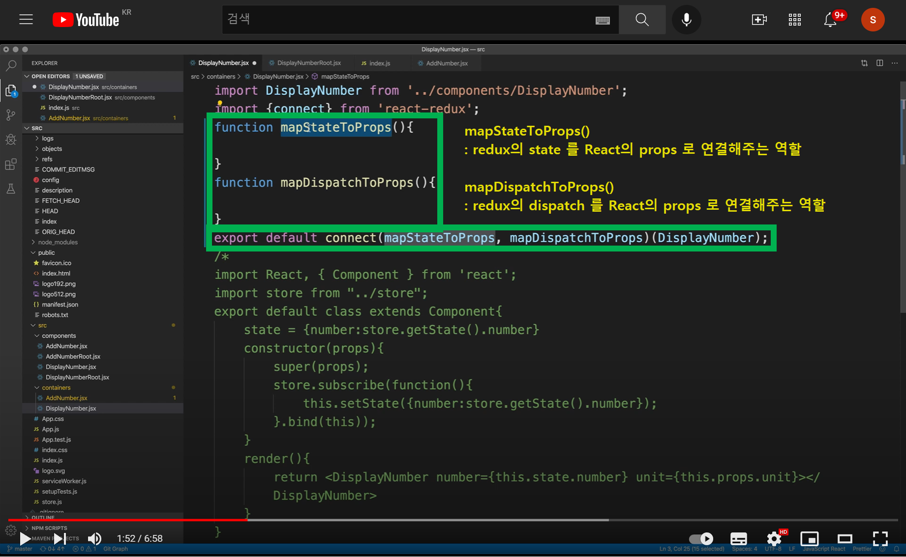
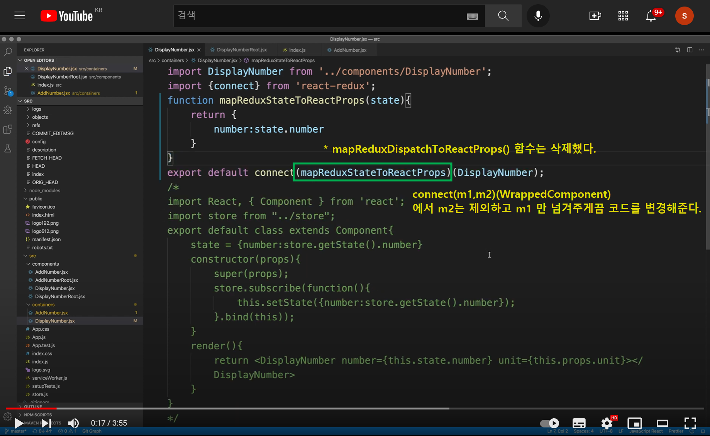
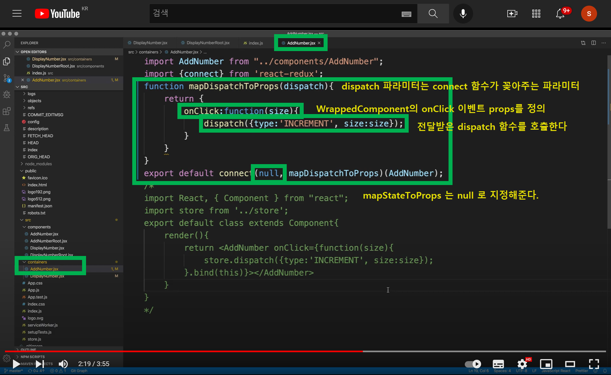

# 6.4 React Redux - mapDispatchToProps

**mapStateToProps, mapDispatchToProps**<br>



<br>

**mapStateToProps, (생산자역할)** <br>

`mapStateToProps` 는 리덕스의 state를 props로 전달해주는 코드다. 이렇게해서 props 로 전달된 코드는 다시 store의 상태를 변경시켜주도록 해줘야 한다. 그래야 subscribe측에서 구독해서 변경을 감지할 수 있다.<br>

<br>

**mapDispatchToProps, (소비자역할)**<br>

`mapDispatchToProps` 는 이벤트를 dispatch 하는 코드 즉, 이벤트를 생성해서 발동시키는 코드에서 사용하는 함수다. 따라서 DisplayNumber 측에서는 필요가 없다.<br>

이번문서에서는 mapDispatchToProps 를 사용하는 방법에 대해 정리한다.<br>

<br>

**connect(m1, m2)(WrappedComponent) 내의 인자값들**<br>

사실 6.1, 6.2 까지는 connect 함수의 첫번째 함수의 인자값 두개를 생략했었다.<br>

redux의 connect 메서드의 첫번째 함수의 인자값들은 아래의 두 가지이다.<br>

- `mapStateToProps`
  - = mapReduxStateToProps
- `mapDispatchToProps`
  - = mapReduxDispatchToProps

이 인자값들을 사용하는 것들을 정리해볼 예정이다. 이번 문서는 `mapDispatchToProps` 를 사용하는 예제다.<br>

<br>

# 참고) 약칭정의

**connect 함수의 원형**

문서 곳곳에서 connect 함수를 언급할 때 인자값의 약칭을 사용해 아래의 표현으로 connect() 함수를 지칭하기로 했다.

```jsx
connect(m1,m2)(WrappedComponent);
// m1 : mapStateToProps
// m2 : mapDispatchToPRops
// WrappedComponent : 전달해줄 프리젠테이셔널 컴포넌트
```

<br>

# containers/DisplayNumber.jsx

containers/DisplayNumber는 store의 state를 변경하하고 props로 변환해주는 역할을 수행하는 코드를 작성한다. 그리고 프리젠테이셔널 콤포넌트는 components/DisplayNumber를 연결해준다.<br>

containers/DisplayNumber 에서는 mapReduxDispatchToReactProps() 코드가 필요없기에 삭제해준다. 아래는 삭제 한 후의 코드이다.(이전문서에서는 비어있는 객체를 리턴하는 mapReduxDispatchToReactProps() 메서드를 구현해뒀었다.)<br>



<br>

# containers/AddNumber.jsx



<br>